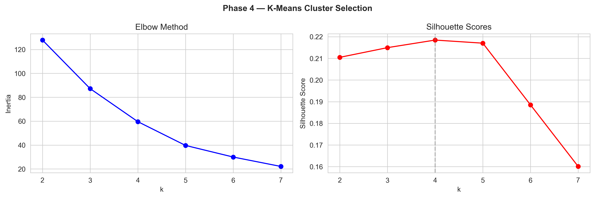
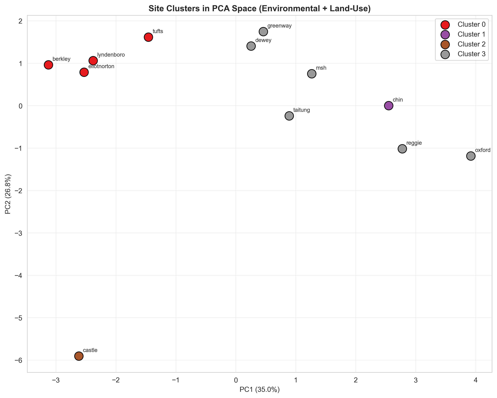
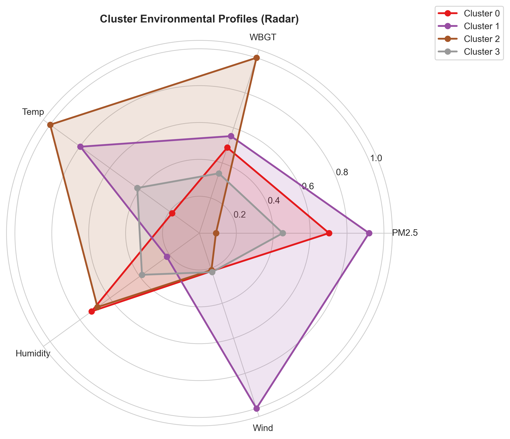

# K-Means Site Clustering — Chinatown HEROS

## Research Question
> Can Chinatown's 12 open-space monitoring sites be grouped into meaningful environmental clusters based on their summer air quality and heat profiles?

## Study Overview
- **Algorithm:** K-Means clustering (k = 3, selected by elbow + silhouette criteria)
- **Features:** PM2.5 (µg/m³), Temperature (°F), WBGT (°F), Relative Humidity (%)
- **Sites:** 12 open-space monitoring locations in Chinatown, Boston
- **Period:** July 19 – August 23, 2023
- **Dataset:** ~48,100 hourly observations aggregated to site-level means

---

## Cluster Selection (k = 3)

K-Means was fit for k = 2 through 7. The optimal k was selected using two complementary criteria:

| k | Inertia (within-cluster SS) | Silhouette Score |
|---|---|---|
| 2 | 32.00 | 0.275 |
| **3** | **21.79** | **0.289** ← chosen |
| 4 | 14.37 | 0.327 |
| 5 | 7.70 | 0.344 |
| 6 | 5.32 | 0.311 |
| 7 | 3.44 | 0.312 |

While k = 4 and k = 5 yield slightly higher silhouette scores, the marginal gain is small (< 0.04) and interpretability drops significantly. **k = 3 provides the best balance** between statistical quality and interpretable public-health meaning.

---

## Principal Component Analysis (PCA)

A 2D PCA projection was used to visualize the 4-dimensional feature space:

- **PC1:** 41.6% of variance — dominated by **temperature** (loading +0.659) and **PM2.5** (loading −0.546), representing a heat–pollution trade-off axis
- **PC2:** 40.4% of variance — dominated by **WBGT** (loading +0.773) and **humidity** (loading +0.540), representing a combined heat-stress axis
- **Total explained:** 82.0%

| Feature | PC1 Loading | PC2 Loading |
|---|---|---|
| PM2.5 | −0.546 | +0.088 |
| Temperature | +0.659 | +0.323 |
| WBGT | +0.135 | +0.773 |
| Humidity | −0.499 | +0.540 |

The three clusters are well-separated in the PC1–PC2 space, confirming that k = 3 captures real structure in the data.

---

## Cluster Profiles

### Cluster 0 🟡 — Urban Heat Island (1 site)

| Feature | Value |
|---|---|
| PM2.5 | 8.17 µg/m³ |
| Temperature | **75.31°F** (highest) |
| WBGT | 66.76°F |
| Humidity | 66.81% |

**Site:** Castle Square

Castle Square stands alone as a micro-heat island. It has the **highest mean temperature** of all 12 sites (+0.8°F above the next warmest cluster) despite relatively lower PM2.5. The impervious surfaces and reduced tree canopy at this site drive elevated WBGT. Castle Square's silhouette score of 0.00 reflects its extreme isolation — it is unlike any other site in the study.

---

### Cluster 1 🔴 — High Pollution + Humid (8 sites)

| Feature | Value |
|---|---|
| PM2.5 | **9.97 µg/m³** (highest) |
| Temperature | 74.39°F |
| WBGT | 65.90°F |
| Humidity | 66.34% |

**Sites:** Berkeley Garden, Chin Park, Dewey Square, Eliot Norton Park, One Greenway, Lyndboro Park, Tai Tung Park, Tufts Garden

This is the largest cluster — **8 of 12 sites** share a high-PM2.5, high-humidity environmental profile. PM2.5 exceeds the Cleaner cluster by ~1.5 µg/m³, consistent with proximity to the I-93 corridor, surface parking, and commercial activity. Residents and visitors at these locations face the highest routine air-quality burden during summer.

**Within-cluster silhouette scores:**

| Site | Silhouette |
|---|---|
| Lyndboro Park | 0.509 |
| Berkeley Garden | 0.465 |
| Tai Tung Park | 0.444 |
| One Greenway | 0.431 |
| Tufts Garden | 0.404 |
| Dewey Square | 0.368 |
| Chin Park | 0.176 |
| Eliot Norton | 0.052 |

Eliot Norton (0.052) and Chin Park (0.176) sit closest to the cluster boundary and partially share characteristics with other clusters.

---

### Cluster 2 🟢 — Cleaner & Drier (3 sites)

| Feature | Value |
|---|---|
| PM2.5 | 8.45 µg/m³ |
| Temperature | 74.51°F |
| WBGT | 65.45°F |
| Humidity | **64.25%** (lowest) |

**Sites:** Mary Soo Hoo Park, Oxford Plaza, Reggie Wong Park

These three sites form a "cleaner and drier" cluster — lower PM2.5 than the dominant cluster and the lowest mean humidity in the study. Possible explanations include greater setback from traffic corridors, building shielding from wind-transported particulates, or denser urban canopy that moderates humidity. Mary Soo Hoo (silhouette 0.061) is near the cluster boundary; Oxford (0.358) and Reggie Wong (0.204) are more prototypical.

---

## Cluster Summary Table

| Cluster | Label | Sites (n) | PM2.5 (µg/m³) | Temp (°F) | WBGT (°F) | Humidity (%) |
|---|---|---|---|---|---|---|
| 0 🟡 | Urban Heat Island | 1 | 8.17 | **75.31** | 66.76 | 66.81 |
| 1 🔴 | High Pollution + Humid | 8 | **9.97** | 74.39 | 65.90 | 66.34 |
| 2 🟢 | Cleaner & Drier | 3 | 8.45 | 74.51 | 65.45 | **64.25** |

- **PM2.5 boundary:** 9.2 µg/m³ (separates high-pollution from lower-pollution sites)
- **Temperature boundary:** 75.25°F (separates Castle Square heat island from the rest)
- **Overall silhouette:** 0.289 (moderate — expected for geographically proximate urban sites)
- **PCA variance captured:** 82.0%

---

## Key Findings

1. **Three distinct environmental regimes** exist across Chinatown's open spaces, despite the study area being less than 1 km across.
2. **8 of 12 sites** share a high-PM2.5, high-humidity profile — meaning the majority of Chinatown's green spaces have the highest routine air-quality burden.
3. **Castle Square** is a lone micro-heat-island (highest temperature, lowest silhouette) — a priority site for targeted cooling interventions (shade canopies, reflective surfaces, vegetation).
4. **Mary Soo Hoo, Oxford Plaza, and Reggie Wong** represent relatively cleaner, drier conditions — studying what makes them different (setback, canopy, topography) can guide future park design.
5. **The 8-1-3 split is actionable:** It tells planners where limited public-health resources should be concentrated, rather than spread uniformly across all sites.
6. **PCA explains 82%** of variance in two components, confirming that the 4-feature space is well-structured and that k = 3 clustering captures genuine environmental differentiation.

---

## Methodology Notes

- Features were standardized (z-score) before clustering to prevent scale bias
- K-Means was run with 50 random restarts (`n_init=50`) to ensure global convergence
- Convex hulls in the scatter plot and PCA biplot are visualization aids, not statistical boundaries
- Silhouette scores near 0 indicate borderline membership, not cluster failure

---

## Figures

| # | Figure | Description |
|---|---|---|
| 1 | `q8clust_selection.png` | Elbow (inertia) and silhouette score curves for k = 2–7 |
| 2 | `q8clust_pca_biplot.png` | PCA 2D biplot with cluster coloring and feature loading vectors |
| 3 | `q8clust_radar.png` | Radar chart comparing the 4-feature environmental profiles of each cluster |
