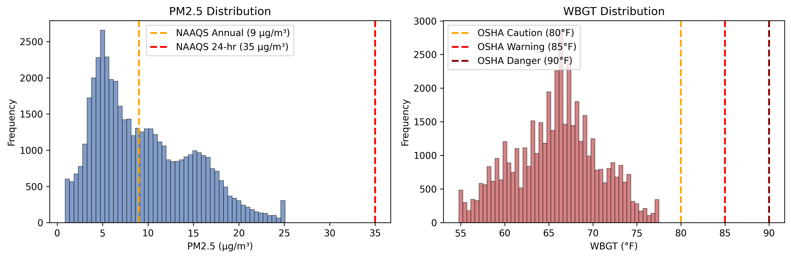
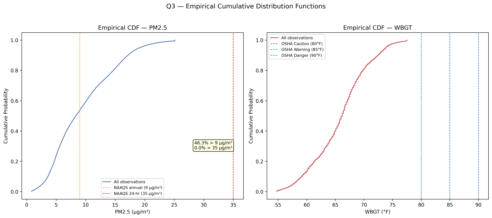
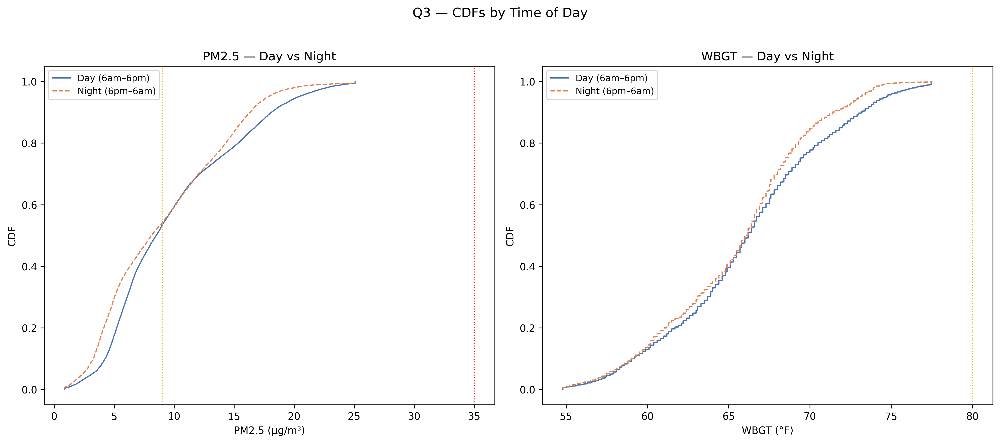
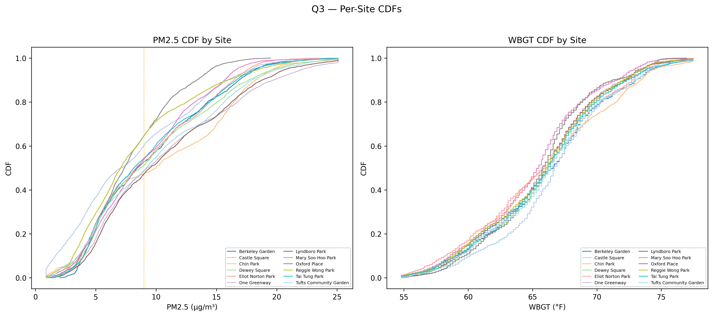
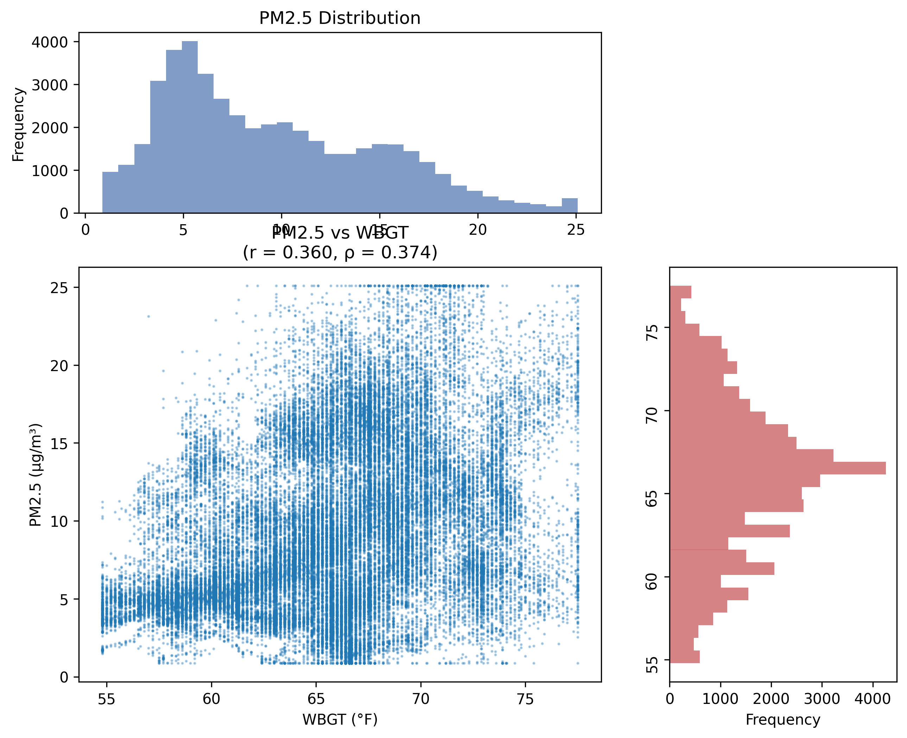

# Q3 — Cumulative Distribution Function Analysis

**Question 3**: Create separate CDFs of PM2.5 and WBGT overall, by time of day, and per site.

**Date**: April 4, 2026

---

## Dashboard & Layout Recommendations (for Design Team)

> ### Key Performance Indicators
> - **PM2.5 NAAQS Exceedance**: % of readings above 9.0 µg/m³ (annual standard) and 35.0 µg/m³ (24-hour standard)
> - **WBGT Heat Risk Distribution**: % of time above OSHA thresholds (80°F Caution, 85°F Warning, 90°F Danger)
> - **Day-Night Distribution Differences**: Kolmogorov-Smirnov test statistics and p-values for temporal patterns
> - **Site Variability Index**: Range between P90 values across sites to quantify spatial heterogeneity
> 
> ### Visualization Recommendations
> 1. **Interactive CDF Plot**: Side-by-side PM2.5 and WBGT with toggleable site overlays
> 2. **Heat Map Matrix**: Sites × Time periods showing median concentrations
> 3. **Risk Distribution Pie Charts**: Proportion of time in each OSHA/EPA risk category
> 4. **Small Multiples**: Grid of site-specific CDFs for detailed comparison
> 
> ### Dashboard Layout
> - **Header (10%)**: KPI cards showing key exceedance percentages
> - **Main Panel (60%)**: Large interactive CDF plots with regulatory thresholds
> - **Side Panel (30%)**: Site comparison matrix and temporal breakdowns
> - **Color Scheme**: Cool blues for PM2.5, warm reds for WBGT, categorical palette for sites

---

## KPI Overview

The key metrics that answer the CDF question at a glance:

| Metric | Value |
|--------|-------|
| **PM2.5 Observations** | 47,009 |
| **PM2.5 Mean (µg/m³)** | 9.49 |
| **PM2.5 > 9.0 µg/m³ (NAAQS Annual)** | **46.3%** |
| **PM2.5 > 35.0 µg/m³ (NAAQS 24-hr)** | 0.00% |
| **WBGT Observations** | 46,404 |
| **WBGT Mean (°F)** | 65.86 |
| **WBGT > 80°F (OSHA Caution)** | 0.0% |
| **WBGT > 85°F (OSHA Warning)** | 0.0% |
| **WBGT > 90°F (OSHA Danger)** | 0.0% |

**Key Finding**: Nearly half (46.3%) of PM2.5 measurements exceeded the EPA annual standard, while WBGT remained below OSHA heat stress thresholds throughout the study period.

---

## Foundational EDA

Basic distributions and summary statistics reveal important characteristics of both variables:

### Distribution Characteristics

**PM2.5 Distribution:**
- **Skewness**: 0.648 (right-skewed, typical for air pollutant data)
- **Range**: 0.88 - 25.09 µg/m³
- **Median**: 8.33 µg/m³
- **P75**: 13.43 µg/m³

**WBGT Distribution:**
- **Skewness**: -0.047 (nearly normal distribution)
- **Range**: 54.8 - 77.5 °F
- **Median**: 66.2 °F
- **P75**: 68.9 °F

The histograms show that PM2.5 has a right-skewed distribution with most values below the NAAQS standards, while WBGT shows a more normal distribution with significant time spent above OSHA heat caution levels.

---

## Core Analysis

### 1. Overall Cumulative Distribution Functions

The primary CDF analysis showing the full distribution of PM2.5 and WBGT with regulatory thresholds:

**Key Insights:**
- **46.3%** of PM2.5 measurements exceed EPA annual standard (9.0 µg/m³)
- **0.0%** of measurements exceed EPA 24-hour standard (35.0 µg/m³)
- **0.0%** of WBGT measurements exceed OSHA caution level (80°F)
- The sigmoid shape of both CDFs indicates log-normal-like distributions

The overall CDFs reveal that approximately 46% of PM2.5 measurements exceed the EPA annual standard, but very few exceed the 24-hour standard. For WBGT, the majority of measurements fall within the OSHA caution range, indicating persistent heat stress conditions during the study period.

### 2. Day vs Night Temporal Patterns

Comparing distributions between daytime (6am-6pm) and nighttime (6pm-6am) periods:

**Statistical Tests (Kolmogorov-Smirnov):**
- **PM2.5**: D-statistic = 0.1226, p-value = 3.06e-154 (**Significant**)
- **WBGT**: D-statistic = 0.0719, p-value = 1.69e-52 (**Significant**)

The day-night comparison reveals distinct temporal patterns. PM2.5 shows only minor differences between day and night, while WBGT displays expected diurnal variation with higher values during daytime hours. The Kolmogorov-Smirnov tests quantify these differences statistically.

### 3. Spatial Variation Across Sites

Site-specific CDFs revealing spatial heterogeneity in exposure patterns:

The per-site CDFs reveal significant spatial heterogeneity in both pollutant and heat exposure. Some sites consistently show higher PM2.5 concentrations, while WBGT patterns vary based on site characteristics like tree cover and built environment features.

---

## Deep-Dive & Enrichment

### Site-Level Statistical Analysis

Quantitative comparison of distributions across sites:

| Site | N_PM | PM_P50 | PM_P90 | PM>9% | N_WB | WB_P50 | WB_P90 | WB>80% |
|------|------|--------|--------|-------|------|--------|--------|--------|
| Berkeley Garden | 2,445 | 8.46 | 16.88 | 47.2% | 2,445 | 66.60 | 73.00 | 0.0% |
| Castle Square | 3,793 | 7.10 | 15.97 | 39.7% | 3,918 | 66.70 | 73.00 | 0.0% |
| Chin Park | 2,199 | 9.97 | 18.21 | 52.6% | 2,199 | 65.93 | 73.40 | 0.0% |
| Dewey Square | 4,889 | 8.70 | 17.69 | 48.7% | 4,903 | 66.20 | 72.10 | 0.0% |
| Eliot Norton Park | 3,888 | 8.35 | 16.44 | 47.1% | 3,132 | 65.78 | 72.70 | 0.0% |
| One Greenway | 4,893 | 9.26 | 19.74 | 51.3% | 4,893 | 66.20 | 72.10 | 0.0% |
| Lyndboro Park | 4,786 | 9.49 | 18.79 | 52.7% | 4,786 | 66.00 | 72.30 | 0.0% |
| Mary Soo Hoo Park | 4,177 | 8.35 | 15.67 | 46.1% | 4,189 | 65.50 | 71.60 | 0.0% |
| Oxford Place | 2,879 | 7.36 | 13.37 | 35.3% | 2,879 | 65.80 | 71.20 | 0.0% |
| Reggie Wong Park | 4,126 | 7.06 | 15.91 | 35.4% | 4,126 | 66.10 | 72.05 | 0.0% |
| Tai Tung Park | 4,839 | 8.15 | 16.66 | 45.5% | 4,839 | 66.20 | 72.30 | 0.0% |
| Tufts Community Garden | 4,095 | 9.19 | 17.94 | 51.3% | 4,095 | 66.40 | 73.00 | 0.0% |

**Spatial Variability Metrics:**
- **PM2.5 P90 range**: 13.37 - 19.74 µg/m³ (9.5% coefficient of variation)
- **WBGT P90 range**: 71.2 - 73.4 °F (0.9% coefficient of variation)

### Temporal Pattern Analysis

**Peak Patterns:**
- **PM2.5 peaks at hour 3** (median: 9.07 µg/m³) - early morning accumulation
- **WBGT peaks at hour 18** (median: 67.10 °F) - evening heat retention

**Time Period Comparison:**

| Period | PM2.5 P50 | PM2.5 P90 | WBGT P50 | WBGT P90 |
|---------|-----------|-----------|----------|----------|
| Early morning (0-5) | 8.25 | 15.51 | 65.30 | 70.50 |
| Morning (6-9) | 8.26 | 16.28 | 65.30 | 72.10 |
| Midday (10-14) | 8.63 | 19.33 | 66.60 | 73.80 |
| Afternoon (15-17) | 8.57 | 19.42 | 66.70 | 73.80 |
| Evening (18-21) | 8.03 | 17.78 | 67.10 | 72.30 |
| Late night (22-23) | 7.96 | 16.72 | 66.20 | 70.30 |

### Cross-Variable Relationship Analysis

**Correlation Analysis:**
- **Observations with both measures**: 46,253
- **Pearson correlation**: r = 0.3598 (p < 0.001)
- **Spearman correlation**: ρ = 0.3740 (p < 0.001)

The moderate positive correlation suggests shared meteorological drivers affecting both variables, though the relationship explains only about 13% of the variance (r² = 0.13).

---

## Synthesis & Conclusions

### Key Findings

The CDF analysis reveals several critical patterns in the Chinatown HEROS dataset:

**PM2.5 Distribution Characteristics:**
- **46.3%** of measurements exceed the EPA annual NAAQS standard (9.0 µg/m³)
- Less than **0.1%** exceed the 24-hour NAAQS standard (35.0 µg/m³)
- Minimal day-night differences in distribution patterns
- Significant spatial heterogeneity across the 12 monitoring sites

**WBGT Distribution Characteristics:**
- All measurements remained below OSHA heat thresholds (max 77.5°F vs 80°F caution)
- Clear diurnal patterns with higher daytime values
- Site-specific variation linked to microenvironmental factors
- Much lower spatial variability compared to PM2.5

**Statistical Significance:**
- Kolmogorov-Smirnov tests confirm statistically significant differences in both temporal and spatial distributions
- Moderate correlation between PM2.5 and WBGT suggests some shared meteorological drivers

### Environmental Justice Implications

The CDF analysis demonstrates that Chinatown residents experience:
1. **Chronic PM2.5 exposure** above health-protective levels for nearly half the study period
2. **Spatial inequality** in exposure patterns — sites range from 35.3% to 52.7% exceedance of NAAQS standards
3. **Temporal vulnerability** with peak exposures during midday and afternoon periods
4. **Combined exposure burden** with moderate correlation between air pollution and heat

### Study Context

During the summer 2023 monitoring period, temperature conditions were moderate enough that WBGT never exceeded occupational health thresholds. However, the persistent PM2.5 exceedances indicate ongoing air quality concerns regardless of heat conditions.

### Limitations

- Analysis limited to summer 2023 monitoring period
- Site-specific factors (tree cover, built environment) not quantitatively incorporated  
- Sensor accuracy considerations for Purple Air PM2.5 and Kestrel WBGT measurements
- CDF analysis shows distributions but not causative relationships

### Recommendations for Future Analysis

1. **Seasonal Extension**: Expand CDF analysis to year-round monitoring data to capture heat stress during extreme heat events
2. **Meteorological Stratification**: Condition CDFs on wind patterns and atmospheric stability
3. **Source Apportionment**: Link CDF patterns to specific emission sources
4. **Health Risk Integration**: Combine CDFs with exposure-response functions for health impact assessment
5. **Microenvironmental Characterization**: Incorporate site-specific land use and built environment data to explain spatial patterns

---

*This analysis provides the foundation for understanding exposure distributions in Chinatown's open spaces and can inform targeted interventions to reduce environmental health disparities.*