# Q5 — Hottest Days: WBGT Differences Across Sites

**Research Question**: Pick the hottest days and visualize potential differences in WBGT across sites.

**Study**: Chinatown HEROS Project — 12 open-space sites, Boston Chinatown, Summer 2023  
**Date**: April 2026  
**Dataset**: 48,123 observations (10-min intervals, Jul 19 – Aug 23, 2023)

---

## Dashboard & Layout Recommendations *(for Design Team)*

> **Key KPIs**:
> 1. **Site Heat Vulnerability Score** — Composite 1-10 scale combining peak WBGT rank, heating rate, and threshold exceedance
> 2. **Dangerous Heat Hours** — % time >74°F per site (Tufts 39.6% vs Mary Soo Hoo 12.3%)
> 3. **Inter-site WBGT Range** — Max difference across sites on hottest days (0.7-1.5°F)
> 4. **Co-exposure Index** — % of hot-day records with PM2.5>9 AND WBGT>70 (47.2%)
>
> **Dashboard layout**: Site heat vulnerability map (top, 35%), diurnal WBGT profiles (center, 30%), site ranking bar chart + threshold exceedance (bottom left, 20%), co-exposure timeline (bottom right, 15%).
>
> **Educational framing**: "On the hottest days, some parks in Chinatown stayed 1.5°F warmer than others — that's the difference between needing a water break every 30 minutes vs every hour. Humidity, not just temperature, is the key driver."

---

## KPI Overview

Headline metrics for the hottest days across Chinatown's open spaces.

| Metric | Value |
|--------|-------|
| Hottest Site | Tufts Garden (73.2°F) |
| Coolest Site | Mary Soo Hoo (71.7°F) |
| Inter-site Range | 1.5°F |
| Effect Size (hottest vs coolest) | Cohen's d = 0.61 (medium) |
| Max WBGT Recorded | 77.5°F (2.5°F below OSHA Caution) |
| Dual Exposure (PM2.5>9 & WBGT>70) | 47.2% of hot-day records |
| Hours > 74°F (Tufts) | 39.6% |
| Hours > 74°F (Mary Soo Hoo) | 12.3% |

---

## Foundational EDA

### Hot Day Identification

The 5 hottest days were selected by highest daily mean WBGT across all 12 sites. Three form part of a 6-day heat wave (Jul 24-29), while Aug 8 and Aug 13 were isolated hot events.

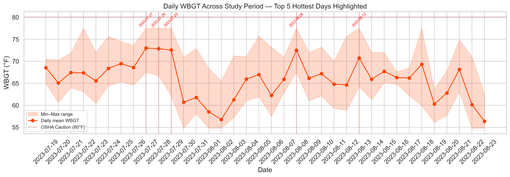

The study period experienced two distinct warm spells: a sustained heat wave in late July (Jul 24-29) and isolated hot days in August. The maximum daily mean WBGT of 73.0°F on Jul 27 was still 7°F below OSHA's Caution threshold, though heat index values exceeded 120°F.

### Hot Day Summary

| Date | WBGT Mean (°F) | WBGT Max (°F) | Temp Mean (°F) | Humidity (%) | Heat Index Max (°F) | N Sites Active |
|------|----------------|---------------|----------------|-------------|---------------------|----------------|
| 2023-07-27 | 73.0 | 77.5 | 79.3 | 76 | 108.0 | 12 |
| 2023-07-28 | 72.8 | 77.5 | 82.2 | 66 | 113.4 | 12 |
| 2023-07-29 | 72.5 | 77.5 | 76.9 | 83 | 109.2 | 12 |
| 2023-08-08 | 72.5 | 77.5 | 76.5 | 84 | 120.7 | 10 |
| 2023-08-13 | 70.7 | 77.5 | 79.0 | 69 | 106.2 | 9 |

**Key observation**: Jul 28 had the highest ambient temperature (82.2°F) but NOT the highest WBGT — because Jul 27 and Jul 29 had higher humidity (76-83%), which drives WBGT up. This illustrates why WBGT is a more complete heat stress indicator than temperature alone.

### Site-Level WBGT Distributions on Hot Days

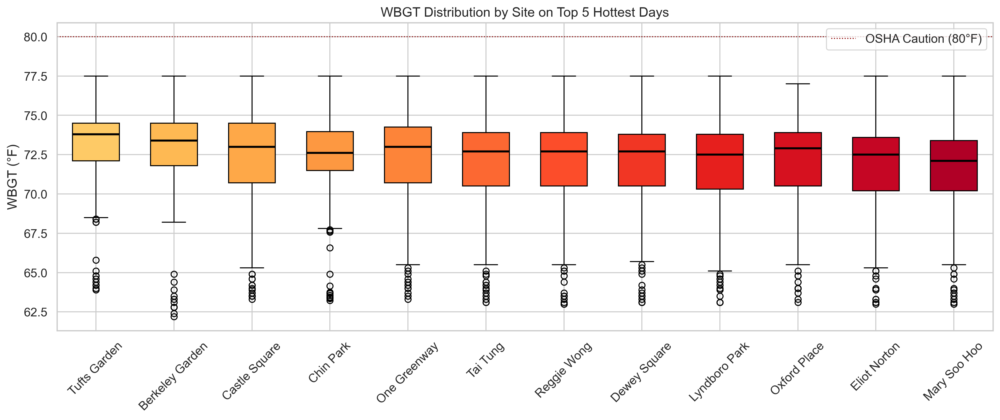

| Site | Mean WBGT (°F) | Median | IQR |
|------|---------------|--------|-----|
| Tufts Garden | 73.20 | 73.8 | 72.1–74.5 |
| Berkeley Garden | 72.99 | 73.4 | 71.8–74.5 |
| Castle Square | 72.73 | 73.0 | 70.7–74.5 |
| Chin Park | 72.60 | 72.6 | 71.5–74.0 |
| One Greenway | 72.47 | 73.0 | 70.7–74.2 |
| Tai Tung | 72.45 | 72.7 | 70.5–73.9 |
| Reggie Wong | 72.20 | 72.7 | 70.5–73.9 |
| Dewey Square | 72.20 | 72.7 | 70.5–73.8 |
| Lyndboro Park | 72.13 | 72.5 | 70.3–73.8 |
| Oxford Place | 72.12 | 72.9 | 70.5–73.9 |
| Eliot Norton | 71.89 | 72.5 | 70.2–73.6 |
| Mary Soo Hoo | 71.65 | 72.1 | 70.2–73.4 |

Tufts Garden is consistently the warmest site (73.2°F mean WBGT), while Mary Soo Hoo Park is the coolest (71.6°F). The 1.6°F gap is a medium effect size (Cohen's d = 0.61). All sites stay well below the OSHA Caution level of 80°F.

---

## Core Analysis

### Site × Hour Heatmap

The core visualization for Q5: how WBGT varies across both space (12 sites) and time (24 hours) during the hottest days.

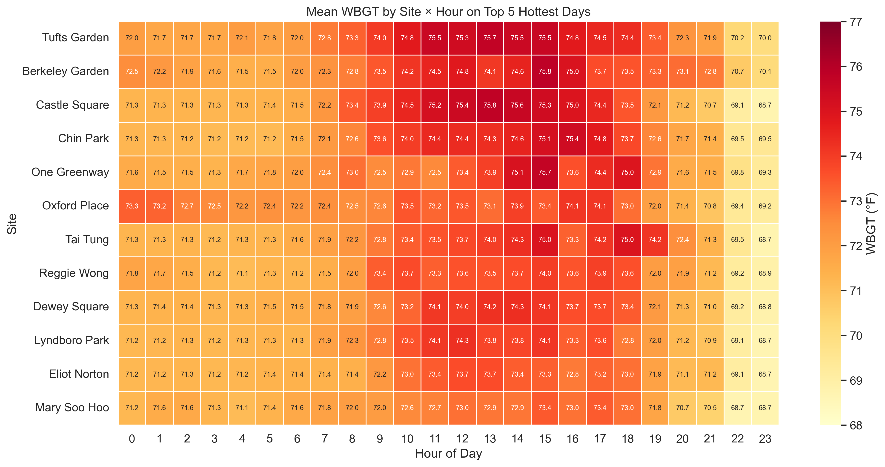

The heatmap reveals two key patterns:
1. **Temporal**: All sites peak between 12-3pm, with Tufts and Castle Square reaching 75-76°F
2. **Spatial**: The hottest sites (Tufts, Berkeley, Castle) remain warmer even at night, suggesting better heat retention in those microclimates

### Statistical Tests: Inter-Site Differences

**Kruskal-Wallis test**: H = 213.31, p = 1.28×10⁻³⁹ — highly significant differences across sites.

**Pairwise Mann-Whitney U** with Bonferroni correction (α = 0.00076):
- **32 of 66 pairs** significant after correction

| Site 1 | Site 2 | p-value | Significant? |
|--------|--------|---------|-------------|
| Mary Soo Hoo | Tufts Garden | 2.25×10⁻²⁸ | Yes |
| Eliot Norton | Tufts Garden | 1.28×10⁻²² | Yes |
| Berkeley Garden | Mary Soo Hoo | 7.92×10⁻²⁰ | Yes |
| Lyndboro Park | Tufts Garden | 2.66×10⁻¹⁶ | Yes |
| Castle Square | Mary Soo Hoo | 4.89×10⁻¹⁵ | Yes |
| Berkeley Garden | Eliot Norton | 9.17×10⁻¹⁵ | Yes |
| Dewey Square | Tufts Garden | 7.12×10⁻¹⁴ | Yes |
| Reggie Wong | Tufts Garden | 3.52×10⁻¹² | Yes |
| Castle Square | Eliot Norton | 1.09×10⁻¹⁰ | Yes |
| Berkeley Garden | Lyndboro Park | 4.37×10⁻¹⁰ | Yes |

The Kruskal-Wallis test confirms highly significant differences across sites (H=213.3, p<1e-39). After Bonferroni correction for 66 pairwise comparisons, many pairs remain significant — the inter-site variation is not just noise.

---

## Deep-Dive & Enrichment

### Diurnal WBGT Profiles by Site

How does each site's temperature trajectory differ throughout the hot days?

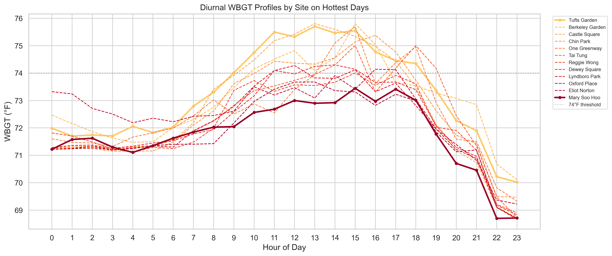

The diurnal profiles reveal that:
- **Tufts Garden** (bold line) stays consistently above other sites at nearly every hour
- **Mary Soo Hoo** (bold) is consistently the coolest
- The gap widens during peak afternoon hours (12-4pm) and narrows at night
- All sites follow a similar daily trajectory, but with persistent offsets

### Morning Heating Rates

How quickly do sites warm up in the morning? This matters for scheduling outdoor activities.

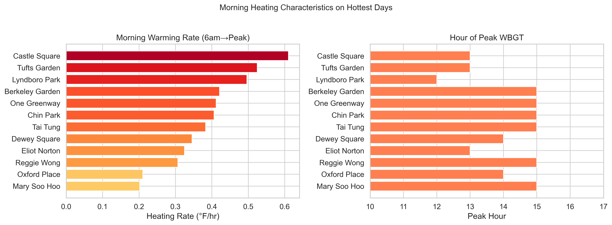

| Site | Rise (°F) | Peak Hour | Rate (°F/hr) |
|------|----------|-----------|-------------|
| Castle Square | 4.27 | 1pm | 0.61 |
| Tufts Garden | 3.67 | 1pm | 0.52 |
| Lyndboro Park | 2.98 | 12pm | 0.50 |
| Berkeley Garden | 3.79 | 3pm | 0.42 |
| One Greenway | 3.70 | 3pm | 0.41 |
| Chin Park | 3.65 | 3pm | 0.41 |
| Tai Tung | 3.44 | 3pm | 0.38 |
| Dewey Square | 2.76 | 2pm | 0.35 |
| Eliot Norton | 2.27 | 1pm | 0.32 |
| Reggie Wong | 2.76 | 3pm | 0.31 |
| Oxford Place | 1.68 | 2pm | 0.21 |
| Mary Soo Hoo | 1.82 | 3pm | 0.20 |

**Castle Square heats up 3× faster than Mary Soo Hoo** (0.61 vs 0.20°F/hr). Sites that peak earlier (Lyndboro at noon, Castle/Tufts at 1pm) tend to have more thermal mass. Later-peaking sites (Oxford, Chin Park at 3pm) may benefit from afternoon shading.

### Temperature vs WBGT: The Humidity Factor

A critical finding: site rankings differ substantially between ambient temperature and WBGT because humidity varies by site.

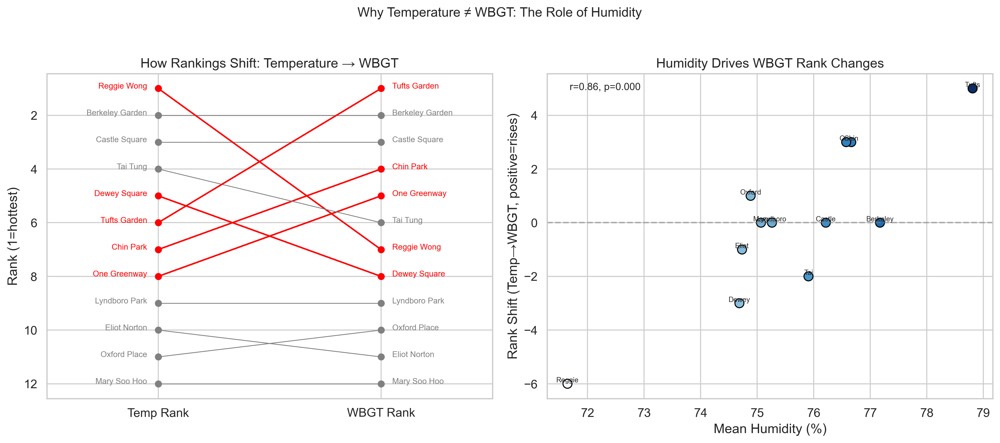

| Site | Temp (°F) | Temp Rank | WBGT (°F) | WBGT Rank | Humidity (%) | Rank Shift |
|------|----------|-----------|----------|-----------|-------------|-----------|
| Tufts Garden | 78.8 | 6 | 73.2 | 1 | 78.8 | +5 |
| Chin Park | 78.8 | 7 | 72.6 | 4 | 76.7 | +3 |
| One Greenway | 78.8 | 8 | 72.5 | 5 | 76.6 | +3 |
| Oxford Place | 78.5 | 11 | 72.1 | 10 | 74.9 | +1 |
| Berkeley Garden | 79.2 | 2 | 73.0 | 2 | 77.2 | 0 |
| Castle Square | 79.1 | 3 | 72.7 | 3 | 76.2 | 0 |
| Tai Tung | 79.0 | 4 | 72.4 | 6 | 75.9 | −2 |
| Dewey Square | 78.9 | 5 | 72.2 | 8 | 74.7 | −3 |
| Reggie Wong | 79.9 | 1 | 72.2 | 7 | 71.6 | −6 |

Correlation: r = 0.86, p < 0.001 — humidity strongly predicts rank changes.

**Reggie Wong** is the hottest site by temperature (79.9°F) but only 7th by WBGT (72.2°F) — its low humidity (71.6%) makes it feel less oppressive. **Tufts Garden** is the opposite: rank 6 in temperature but #1 in WBGT due to the highest humidity (78.8%). This demonstrates why WBGT, not temperature, should guide heat safety decisions.

### Nighttime Heat Retention

Do sites cool down equally at night? Persistent nighttime heat prevents physiological recovery.

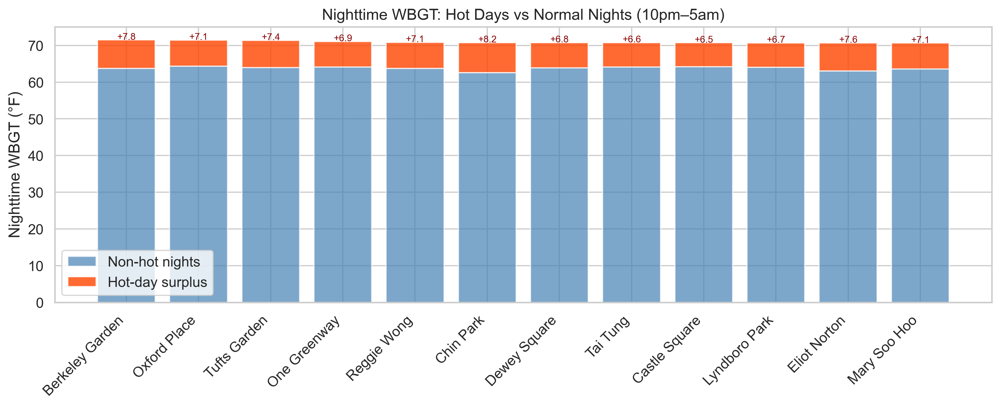

| Site | Night WBGT (hot) | Night WBGT (non-hot) | Retention (°F) |
|------|-----------------|---------------------|---------------|
| Berkeley Garden | 71.49 | 63.70 | +7.78 |
| Oxford Place | 71.45 | 64.33 | +7.12 |
| Tufts Garden | 71.40 | 63.96 | +7.44 |
| One Greenway | 71.06 | 64.13 | +6.93 |
| Reggie Wong | 70.85 | 63.75 | +7.09 |
| Chin Park | 70.77 | 62.60 | +8.17 |
| Dewey Square | 70.76 | 63.91 | +6.85 |
| Tai Tung | 70.74 | 64.10 | +6.64 |
| Castle Square | 70.72 | 64.21 | +6.51 |
| Lyndboro Park | 70.68 | 64.01 | +6.67 |
| Eliot Norton | 70.66 | 63.03 | +7.63 |
| Mary Soo Hoo | 70.63 | 63.57 | +7.06 |

Nighttime WBGT is ~7°F higher on hot days than normal nights — a substantial urban heat island effect. Berkeley Garden retains the most nighttime heat (71.5°F), while Mary Soo Hoo cools most effectively (70.6°F). This 0.9°F nighttime difference matters because continuous heat exposure without relief increases heat-related health risk.

### Site Ranking Consistency Across Hot Days

Are the same sites always hottest, or do rankings shift between events?

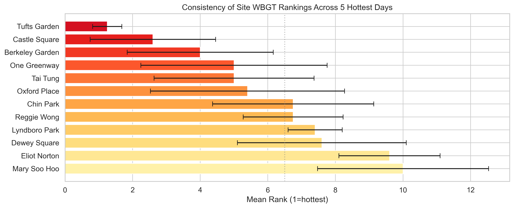

| Site | Mean Rank | Std | Best | Worst |
|------|----------|-----|------|-------|
| Tufts Garden | 1.25 | 0.43 | 1 | 2 |
| Castle Square | 2.60 | 1.85 | 1 | 6 |
| Berkeley Garden | 4.00 | 2.16 | 2 | 7 |
| One Greenway | 5.00 | 2.76 | 2 | 10 |
| Tai Tung | 5.00 | 2.37 | 2 | 9 |
| Oxford Place | 5.40 | 2.87 | 3 | 11 |
| Chin Park | 6.75 | 2.38 | 4 | 10 |
| Reggie Wong | 6.75 | 1.48 | 5 | 9 |
| Lyndboro Park | 7.40 | 0.80 | 6 | 8 |
| Dewey Square | 7.60 | 2.50 | 3 | 10 |
| Eliot Norton | 9.60 | 1.50 | 7 | 11 |
| Mary Soo Hoo | 10.00 | 2.53 | 6 | 12 |

**Tufts Garden** is the most consistently hot site (mean rank 1.2, std=0.4 — always #1 or #2). **Mary Soo Hoo** is most consistently cool (mean rank 10.0). The low standard deviations for these sites suggest stable microclimate effects rather than random variation.

### Heat Wave vs Isolated Hot Days

The Jul 27-29 consecutive heat wave vs the isolated Aug 8 and Aug 13 events.

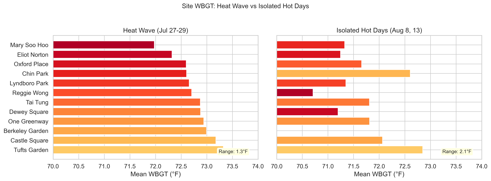

- **Heat wave (Jul 27-29)**: Mean WBGT = 72.78°F, inter-site range = 1.3°F
- **Isolated days (Aug 8, 13)**: Mean WBGT = 71.64°F, inter-site range = 2.1°F
- Mann-Whitney U: p = 2.57×10⁻⁸⁵ — highly significant difference

The heat wave shows higher absolute WBGT values, while isolated hot days show wider inter-site variation. During the sustained heat wave, urban heat island effects have more time to accumulate, amplifying microclimate differences.

### Dual Exposure: Heat + Air Pollution

On the hottest days, are residents also exposed to elevated PM2.5?

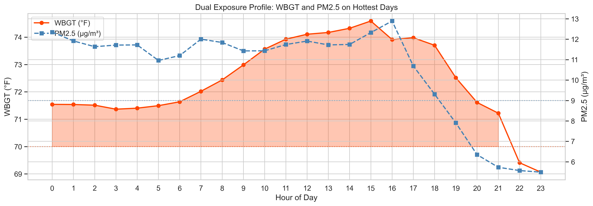

| Site | Dual Exposure Records | % of Records |
|------|----------------------|-------------|
| Berkeley Garden | 269 | 62.3% |
| Tufts Garden | 313 | 55.1% |
| Chin Park | 312 | 54.2% |
| Lyndboro Park | 356 | 49.5% |
| One Greenway | 337 | 48.6% |
| Reggie Wong | 273 | 47.4% |
| Dewey Square | 338 | 47.3% |
| Tai Tung | 326 | 45.3% |
| Eliot Norton | 318 | 44.4% |
| Mary Soo Hoo | 234 | 41.9% |
| Castle Square | 264 | 38.3% |
| Oxford Place | 150 | 37.8% |

PM2.5 peaks later than WBGT (2-4pm vs 12-3pm), but there's substantial overlap during the afternoon. On hot days, 47% of records show simultaneous PM2.5 >9 µg/m³ and WBGT >70°F — a compounded health risk, particularly for children and elderly using these open spaces.

### Threshold Exceedance: Time Above Critical WBGT Levels

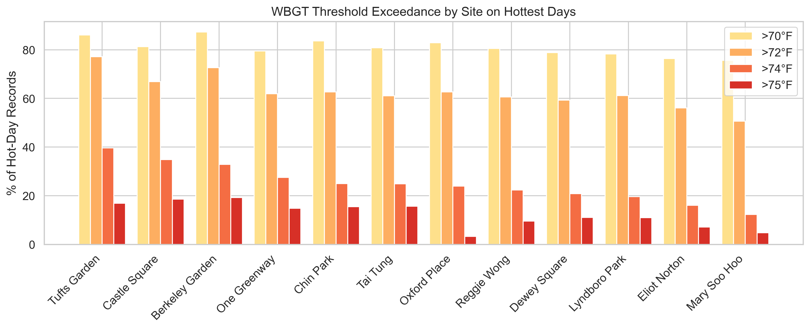

| Site | >70°F | >72°F | >74°F | >75°F |
|------|-------|-------|-------|-------|
| Tufts Garden | 86.1% | 77.1% | 39.6% | 16.9% |
| Castle Square | 81.3% | 66.9% | 34.9% | 18.6% |
| Berkeley Garden | 87.3% | 72.7% | 32.9% | 19.2% |
| One Greenway | 79.5% | 62.0% | 27.5% | 14.8% |
| Chin Park | 83.7% | 62.7% | 25.0% | 15.5% |
| Tai Tung | 80.8% | 61.1% | 24.9% | 15.7% |
| Oxford Place | 82.9% | 62.7% | 23.9% | 3.3% |
| Reggie Wong | 80.6% | 60.6% | 22.4% | 9.5% |
| Dewey Square | 78.9% | 59.3% | 20.8% | 11.1% |
| Lyndboro Park | 78.3% | 61.2% | 19.6% | 11.0% |
| Eliot Norton | 76.4% | 56.1% | 16.0% | 7.1% |
| Mary Soo Hoo | 75.7% | 50.6% | 12.3% | 4.8% |

**Tufts Garden** spends 40% of hot-day hours above 74°F, while **Mary Soo Hoo** only exceeds this threshold 12% of the time — a 3.3× difference. This means a person spending an afternoon in Tufts Garden would experience high heat stress for roughly 3 hours, compared to about 55 minutes at Mary Soo Hoo.

### Day-by-Day Site Comparison

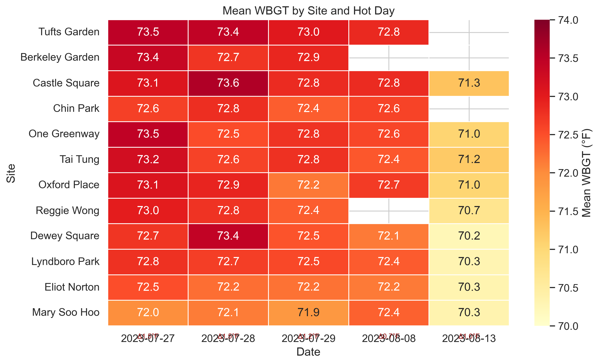

The day×site heatmap shows that inter-site differences are largest on Jul 27 (Δ1.5°F) and smallest on Aug 8 (Δ0.7°F). Sites with missing data (e.g., Berkeley on Aug 8, 13) had sensor gaps during these periods.

### Heat Index vs WBGT Divergence

Heat Index and WBGT measure different things — Heat Index doesn't account for wind and solar radiation. How do they compare on hot days?

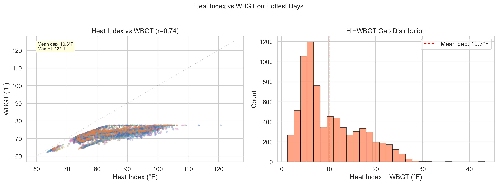

- Correlation: r = 0.74
- Mean HI–WBGT gap: 10.3°F (median: 7.9°F, max: 43.2°F)
- Records where Heat Index > 100°F: 210 (2.8%)

The Heat Index averages 10°F above WBGT on hot days, reaching a maximum of 120.7°F. This means that while WBGT stays below OSHA thresholds, the Heat Index — which the public is more familiar with — frequently exceeds danger levels. The gap between HI and WBGT is largest during hot, humid afternoon hours when the two metrics diverge most.

### Site Heat Vulnerability Score

A composite score combining multiple heat stress indicators to rank sites.

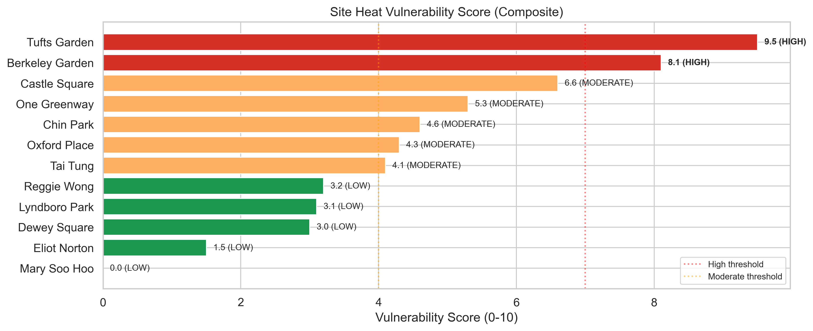

| Site | Mean WBGT | Pct >74°F | Night WBGT | Rise Rate | Score | Category |
|------|----------|----------|-----------|----------|-------|----------|
| Tufts Garden | 73.2 | 39.6% | 71.4 | 0.52 | 9.5 | HIGH |
| Berkeley Garden | 73.0 | 32.9% | 71.5 | 0.42 | 8.1 | HIGH |
| Castle Square | 72.7 | 34.9% | 70.7 | 0.61 | 6.6 | MODERATE |
| One Greenway | 72.5 | 27.5% | 71.1 | 0.41 | 5.3 | MODERATE |
| Chin Park | 72.6 | 25.0% | 70.8 | 0.41 | 4.6 | MODERATE |
| Oxford Place | 72.1 | 23.9% | 71.5 | 0.21 | 4.3 | MODERATE |
| Tai Tung | 72.4 | 24.9% | 70.7 | 0.38 | 4.1 | MODERATE |
| Reggie Wong | 72.2 | 22.4% | 70.8 | 0.31 | 3.2 | LOW |
| Lyndboro Park | 72.1 | 19.6% | 70.7 | 0.50 | 3.1 | LOW |
| Dewey Square | 72.2 | 20.8% | 70.8 | 0.35 | 3.0 | LOW |
| Eliot Norton | 71.9 | 16.0% | 70.7 | 0.32 | 1.5 | LOW |
| Mary Soo Hoo | 71.6 | 12.3% | 70.6 | 0.20 | 0.0 | LOW |

Weights: 35% mean WBGT, 30% threshold exceedance, 20% nighttime retention, 15% heating rate.

The composite score classifies sites into three tiers:
- **HIGH**: Tufts Garden (9.5), Berkeley Garden (8.1) — consistently hot with high threshold exceedance and nighttime heat retention
- **MODERATE**: Castle Square through Tai Tung (4.1–6.6) — mid-range heat stress
- **LOW**: Reggie Wong through Mary Soo Hoo (0.0–3.2) — benefit from more effective cooling

This distills complex heat stress data into actionable guidance: **prioritize heat mitigation interventions at high-vulnerability sites**.

---

## Synthesis & Conclusions

### Key Findings

1. **WBGT never reached OSHA Caution (80°F)** — the hottest reading was 77.5°F. However, Heat Index exceeded 120°F, suggesting the occupational threshold may understate perceived heat risk for outdoor activities.

2. **Tufts Garden is the most consistently hot site** (mean rank 1.2 across all 5 hot days), driven primarily by its high humidity (78.8%) rather than the highest temperature. Mary Soo Hoo is consistently the coolest.

3. **Humidity, not temperature, drives WBGT rankings**. Reggie Wong is the warmest site by temperature (79.9°F) but only 7th by WBGT because it has the lowest humidity (71.6%). This finding has policy implications: reducing humidity through improved drainage and air circulation may be more effective than simply adding shade.

4. **47% of hot-day records show dual exposure** to elevated PM2.5 AND WBGT — compounding health risks during the hours when people are most likely to be outdoors (noon-4pm).

5. **Site-level differences are statistically robust**: Kruskal-Wallis H=213.3 (p<1e-39), with 32 of 66 pairwise comparisons significant after Bonferroni correction. The 1.6°F range between Tufts and Mary Soo Hoo represents a medium effect size (Cohen's d = 0.61).

6. **Nighttime heat retention is substantial**: Hot-day nighttime WBGT is ~7°F above normal, with Berkeley Garden retaining the most heat — preventing physiological recovery between peak heat events.

### Limitations

- WBGT sensors may be capped at 77.5°F (all sites show this maximum)
- Only 5 hot days analyzed; a longer study would capture more extreme events
- No OSHA-level events occurred; results may not extrapolate to more severe heat waves
- Land-use characteristics showed no significant correlation with hot-day WBGT (sample size N=12 sites)

### Implications for Community Action

- **Heat advisories** should consider site-specific microclimate data, not just city-wide temperature
- **Activity scheduling**: Avoid outdoor activities at high-vulnerability sites between 12-4pm on hot days
- **Infrastructure**: Prioritize misting stations, shade structures, and improved ventilation at Tufts Garden, Castle Square, and Berkeley Garden
- **Air quality co-exposure**: Heat warnings should be paired with PM2.5 advisories for Chinatown open spaces
