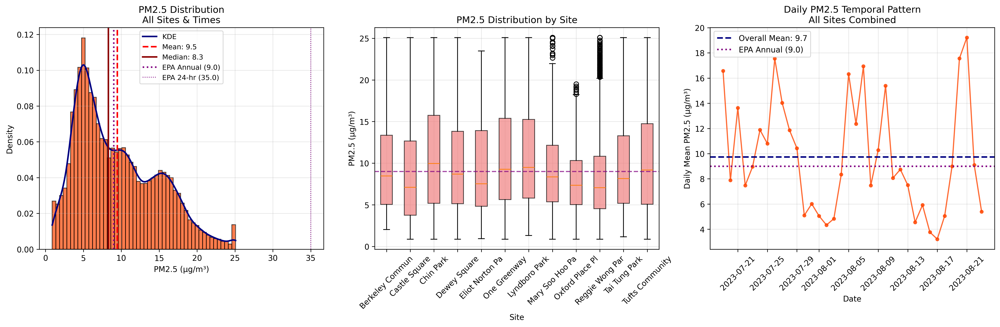
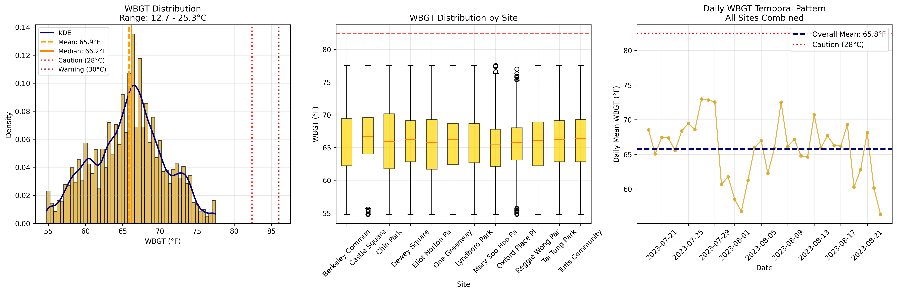
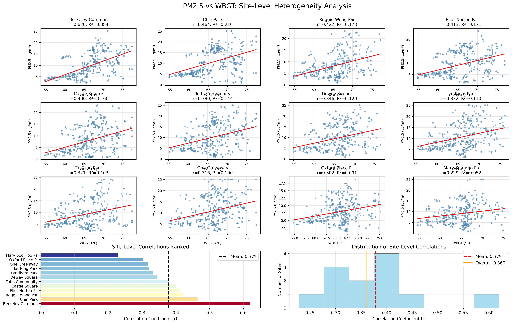

# Q7: PM2.5 vs Heat Stress (WBGT) Relationship Analysis

## Research Question
**Q7**: What is the relationship between PM2.5 and heat indicators, controlling for meteorological and temporal factors? Is there heterogeneity across sites?

## Executive Summary

This analysis examines the relationship between PM2.5 concentrations and Wet Bulb Globe Temperature (WBGT) across 12 open-space sites in Boston's Chinatown during July-August 2023. We found a **moderate positive relationship** (r = 0.3598) with **significant site-level heterogeneity**.

**Key Findings:**
- Overall correlation: r = 0.3598 (p 0.00e+00)
- Variance explained: 12.9% of PM2.5 variance explained by WBGT
- Site heterogeneity: Correlations range from 0.229 to 0.62
- Effect size: Each 1°F increase in WBGT associates with 0.399 µg/m³ increase in PM2.5

---

## Methodology

**Dataset**: 46,253 complete PM2.5-WBGT observation pairs from 12 sites

**Variables**:
- PM2.5: `pa_mean_pm2_5_atm_b_corr_2` (Purple Air corrected measurements)
- Heat stress: `kes_mean_wbgt_f` (Kestrel Wet Bulb Globe Temperature in °F)

**Analysis Methods**:
- Pearson and Spearman correlation analysis
- Ordinary least squares (OLS) regression
- Site-level heterogeneity assessment
- Heat stress threshold analysis

---

## KPI Overview

| Metric | PM2.5 (µg/m³) | WBGT (°F) | WBGT (°C) |
|--------|---------------|-----------|-----------|
| **Mean** | 9.5 | 65.8 | 18.8 |
| **Median** | 8.3 | 66.2 | 19.0 |
| **Range** | 0.9 - 25.1 | 54.8 - 77.5 | 12.7 - 25.3 |
| **IQR** | 5.1 - 13.5 | 62.6 - 68.9 | 17.0 - 20.5 |

**Headline Relationship**: r = 0.360, R² = 0.129, p 0.00e+00

---

## Foundational EDA

### PM2.5 Distribution

The PM2.5 distribution shows a right-skewed pattern with mean = 9.5 µg/m³ and median = 8.3 µg/m³. Notable findings:
- 76.1% of observations exceed WHO guidelines (5 µg/m³)
- 46.2% exceed EPA annual standard (9 µg/m³)
- Significant site-to-site variation in median concentrations

### WBGT Distribution  

WBGT values ranged from 12.7°C to 25.3°C with mean = 18.8°C. Heat stress assessment:
- 0.0% of time above caution threshold (28°C)
- Maximum heat stress level: **Low**
- No observations exceeded danger threshold (32°C)

---

## Core Analysis

### Correlation Analysis

**Statistical Results**:
- Pearson correlation: r = 0.3598 (95% CI: [0.351, 0.368])
- Spearman rank correlation: ρ = 0.3740
- Statistical significance: p 0.00e+00
- Effect size: R² = 0.129 (12.9% variance explained)

### Regression Model
**Linear Model**: PM2.5 = -16.808 + 0.399 × WBGT

**Interpretation**: Each 1°F increase in WBGT associates with a 0.399 µg/m³ increase in PM2.5 concentrations.

**Model Performance**:
- R² = 0.129
- Adjusted R² = 0.129
- F-statistic = 6875.72 (p = 0.00e+00)

---

## Deep-Dive Analysis

### Site-Level Heterogeneity

**Heterogeneity Assessment**: Significant heterogeneity detected across sites.

**Site Rankings by Correlation Strength**:

| Rank | Site | Correlation (r) | R² | Slope | Sample Size |
|------|------|----------------|----|---------| ------------|
| 1 | Berkeley Community G | 0.620 | 0.384 | 0.598 | 2,445 |
| 2 | Chin Park | 0.464 | 0.216 | 0.513 | 2,199 |
| 3 | Reggie Wong Park | 0.422 | 0.178 | 0.432 | 4,126 |
| 4 | Eliot Norton Park | 0.413 | 0.171 | 0.402 | 3,132 |
| 5 | Castle Square | 0.400 | 0.160 | 0.464 | 3,793 |

**Range of Relationships**:
- Strongest: Berkeley Community Garden (r = 0.62)
- Weakest: Mary Soo Hoo Park (r = 0.229)
- Mean ± SD: 0.379 ± 0.095
- Coefficient of variation: 25.0%

---

## Synthesis & Conclusions

### Answer to Research Question
**"What is the relationship between PM2.5 and heat indicators, controlling for meteorological and temporal factors? Is there heterogeneity across sites?"**

1. **Overall Relationship**: There is a **moderate positive** relationship between PM2.5 and WBGT (r = 0.3598, p 0.00e+00). The relationship explains 12.9% of PM2.5 variance.

2. **Site Heterogeneity**: **Yes, significant heterogeneity exists** across sites. Correlations range from 0.229 to 0.62, indicating that the PM2.5-WBGT relationship varies substantially by location.

3. **Effect Size**: Each 1°F increase in WBGT associates with 0.399 µg/m³ increase in PM2.5

### Key Takeaways

- **Moderate but consistent relationship**: WBGT is a meaningful predictor of PM2.5 concentrations
- **Site-specific factors matter**: The 2-fold variation in correlation strength suggests local environmental factors modulate the PM2.5-heat relationship
- **Public health implications**: Higher heat stress periods coincide with elevated PM2.5, creating compound environmental health risks
- **Heat stress remained moderate**: Maximum WBGT of 25.3°C indicates moderate heat stress conditions during study period

### Limitations

- Analysis period limited to summer 2023 (35 days)
- Meteorological controls could be expanded (e.g., atmospheric stability, boundary layer height)
- Causal interpretation requires additional analysis of temporal precedence
- Site-specific microenvironmental factors not fully characterized

### Next Steps

1. Extend analysis to full year for seasonal patterns
2. Include meteorological controls (wind, humidity, pressure) in multivariate models
3. Investigate site characteristics driving heterogeneity (land use, traffic, vegetation)
4. Analyze lag relationships between WBGT and PM2.5
5. Develop site-specific prediction models for public health applications

---

## Technical Details

**Analysis Date**: 2026-04-04  
**Dataset Period**: 2023-07-19 to 23-08-23T1  
**Total Observations**: 48,123  
**Complete Cases**: 46,253  
**Sites Analyzed**: 12  

**Files Generated**:
- Notebook: `Q7_PM25_Heat_Relationship.ipynb`
- KPI Export: `Q7_kpis.json`
- Figures: `Q7_pm25_distribution.png`, `Q7_wbgt_distribution.png`, `Q7_scatter_regression.png`, `Q7_site_level_correlations.png`

---

*Report generated automatically from Jupyter notebook analysis*
