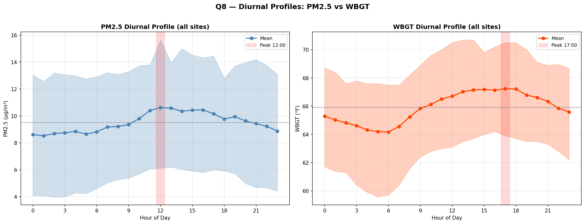
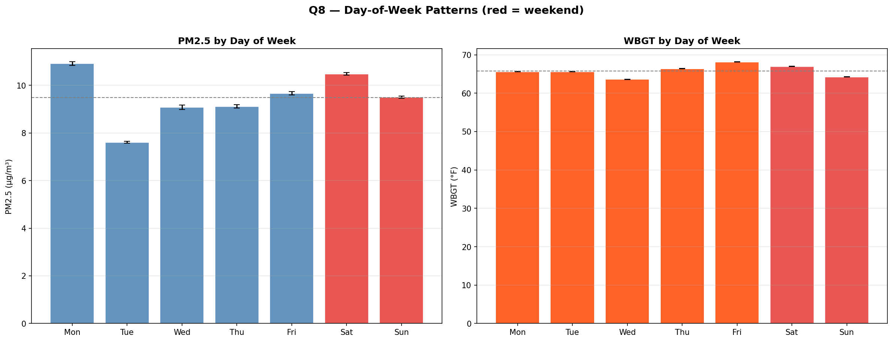
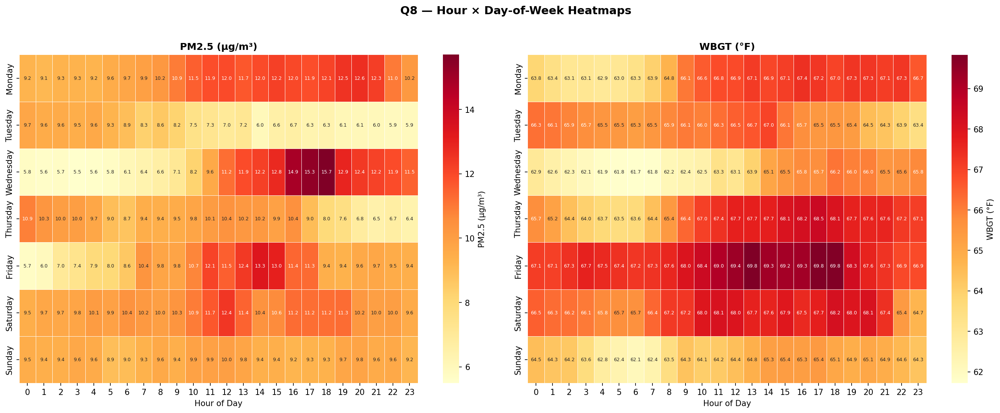
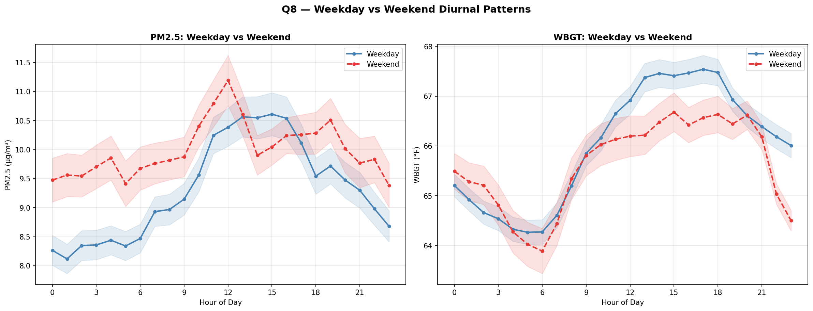
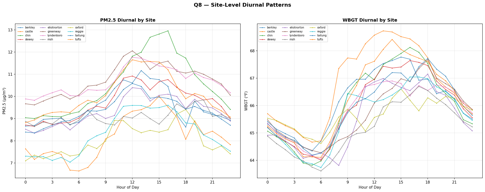
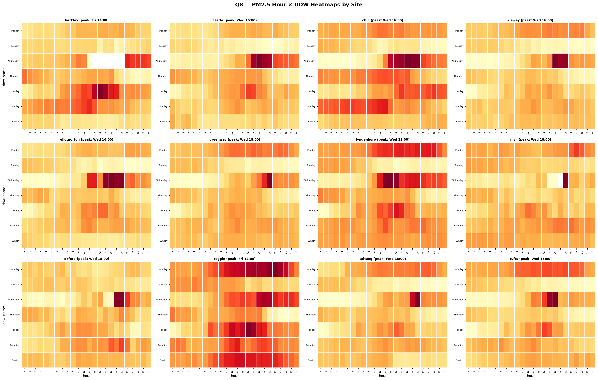
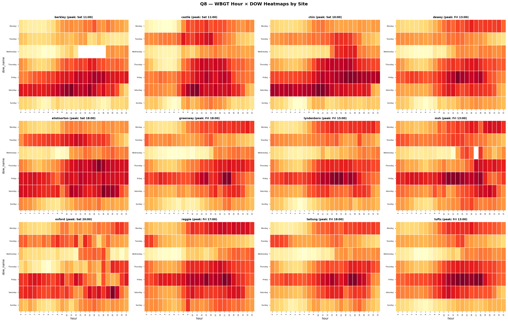

# Q8 — Temporal Patterns of PM2.5 and WBGT

## Research Question
> What time(s) of day and day(s) of week are associated with the highest wet bulb globe temperatures and PM2.5 overall and for each open space site?

## Study Overview
- **Period:** July 19 – August 23, 2023 (36 days)
- **Sites:** 12 open-space monitoring locations in Chinatown
- **Observations:** 48,123 rows (10-min intervals); PM2.5 98% valid, WBGT 96% valid
- **Statistical test:** Kruskal-Wallis H-test for non-parametric group differences

---

## Key Performance Indicators

| Metric | PM2.5 (µg/m³) | WBGT (°F) |
|---|---|---|
| **Peak hour** | 12:00 (10.6) | 17:00 (67.2) |
| **Trough hour** | 01:00 (8.5) | 06:00 (64.2) |
| **Diurnal amplitude** | 2.1 | 3.1 |
| **Peak day-of-week** | Monday (10.9) | Friday (68.1) |
| **Weekday mean** | 9.3 | 66.0 |
| **Weekend mean** | 10.0 | 65.6 |
| **Hour effect (K-W)** | H=743, p=3.87e-142 | H=1,896, p≈0 |
| **DOW effect (K-W)** | H=1,812, p≈0 | H=3,614, p≈0 |

---

## Diurnal Patterns (Hour-of-Day)

PM2.5 and WBGT exhibit **opposite diurnal cycles**:

- **PM2.5** rises through the morning, peaking at **noon (12:00)** at 10.6 µg/m³, and falls to a trough at **1:00 AM** (8.5 µg/m³). The 2.1 µg/m³ diurnal amplitude reflects daytime traffic/activity emissions modulated by boundary-layer mixing.
- **WBGT** follows a classic solar-heating curve, peaking at **5:00 PM (17:00)** at 67.2 °F and bottoming out at **6:00 AM** (64.2 °F) with a 3.1 °F amplitude.

The ~5-hour offset between PM2.5 and WBGT peaks means **compound exposure (high PM2.5 + high heat) is concentrated during the late-afternoon transition (3–6 PM)**.

---

## Day-of-Week Patterns

Both pollutants show highly significant day-of-week effects:

- **PM2.5** peaks on **Monday** (10.9 µg/m³) and is lowest on **Tuesday** (7.6 µg/m³). Weekend PM2.5 (10.0 µg/m³) slightly exceeds weekday PM2.5 (9.3 µg/m³).
- **WBGT** peaks on **Friday** (68.1 °F), consistent with end-of-week heat accumulation during this summer period. Weekday WBGT (66.0 °F) slightly exceeds weekend (65.6 °F).

Note: DOW effects in a 36-day study are confounded with synoptic weather — specific hot or smoky days falling on particular weekdays drive these patterns.

---

## Hour × Day-of-Week Interaction

The heatmaps reveal fine-grained temporal hotspots:

- **PM2.5:** The darkest cell is **Wednesday 15:00–17:00** (15.3–15.7 µg/m³), coinciding with a mid-study wildfire-smoke event (Aug 16). Monday daytime also runs consistently high.
- **WBGT:** Friday afternoon (13:00–18:00) is the warmest sustained block (69–70 °F), followed by Saturday.

---

## Weekday vs Weekend Diurnal Patterns

- **PM2.5:** Weekend diurnal curve is shifted ~1 µg/m³ higher than weekday at almost all hours, with both peaking near noon. Weekend shows a sharper midday spike.
- **WBGT:** Weekday and weekend curves are similar in shape but weekday runs slightly warmer in the afternoon (15:00–20:00), consistent with urban heat island intensification on workdays.

---

## Site-Level Heterogeneity

### Diurnal Patterns by Site

| Site | PM2.5 Peak Hr | PM2.5 Trough | PM2.5 Amp | PM2.5 Peak DOW | WBGT Peak Hr | WBGT Trough | WBGT Amp | WBGT Peak DOW |
|---|---|---|---|---|---|---|---|---|
| Berkley | 13:00 | 18:00 | 2.5 | Fri | 15:00 | 05:00 | 3.4 | Sat |
| Castle | 15:00 | 06:00 | 3.4 | Fri | 13:00 | 05:00 | 4.1 | Sat |
| Chin | 16:00 | 01:00 | 3.9 | Sat | 16:00 | 05:00 | 4.3 | Sat |
| Dewey | 12:00 | 01:00 | 2.3 | Mon | 16:00 | 06:00 | 3.6 | Fri |
| Eliot Norton | 12:00 | 01:00 | 2.1 | Sat | 18:00 | 08:00 | 3.3 | Fri |
| Greenway | 12:00 | 01:00 | 2.4 | Mon | 18:00 | 06:00 | 3.4 | Fri |
| Lyndenboro | 12:00 | 01:00 | 1.9 | Mon | 14:00 | 06:00 | 2.9 | Fri |
| Mary Soo Hoo | 20:00 | 01:00 | 1.2 | Mon | 17:00 | 06:00 | 3.1 | Fri |
| Oxford | 18:00 | 00:00 | 2.3 | Sat | 15:00 | 06:00 | 2.0 | Sat |
| Reggie Wong | 16:00 | 05:00 | 2.6 | Mon | 17:00 | 06:00 | 3.3 | Fri |
| Tai Tung | 12:00 | 01:00 | 2.2 | Mon | 18:00 | 05:00 | 3.5 | Fri |
| Tufts | 12:00 | 00:00 | 2.8 | Mon | 14:00 | 06:00 | 4.3 | Fri |

**PM2.5 peak-hour consensus:** 12:00 (6 of 12 sites). Remaining sites show later peaks (13:00–20:00), suggesting local source influences (traffic corridors, restaurant emissions).

**WBGT peak-hour consensus:** More dispersed (13:00–18:00), with 3 sites peaking at 18:00. Oxford has the smallest WBGT amplitude (2.0 °F), likely due to greater shading or proximity to water.

**Chin Park** stands out with the largest PM2.5 amplitude (3.9 µg/m³) and WBGT amplitude (4.3 °F) — the most temporally variable site. **Mary Soo Hoo** has the smallest PM2.5 amplitude (1.2 µg/m³) and a late peak (20:00), suggesting sheltered conditions.

---

## Key Findings

1. **PM2.5 and WBGT peak at different times** — noon vs. late afternoon — creating a compound-exposure window during 3–6 PM when both are elevated.
2. **All temporal effects are highly significant** (Kruskal-Wallis p ≈ 0), with hour-of-day being the dominant temporal driver.
3. **Day-of-week patterns are confounded with weather** in this 36-day study, but the Wednesday smoke event creates a clear PM2.5 hotspot in the hour×DOW heatmaps.
4. **Site-level heterogeneity is substantial** — PM2.5 peak hours range from 12:00 to 20:00, and diurnal amplitudes vary 3-fold (1.2–3.9 µg/m³), reflecting local microenvironment differences.
5. **Weekend PM2.5 slightly exceeds weekday** (10.0 vs. 9.3 µg/m³), possibly driven by weekend recreational activity or meteorological coincidence.
6. **Chin Park** is the most temporally variable site for both pollutants; **Mary Soo Hoo** is the most stable.

---

## Figures

| # | Figure | Description |
|---|---|---|
| 1 | `q8_diurnal_profiles.png` | PM2.5 and WBGT mean ± SD diurnal curves (all sites) |
| 2 | `q8_dow_profiles.png` | Day-of-week bar charts with weekday/weekend coloring |
| 3 | `q8_hour_dow_heatmap.png` | Hour × DOW annotated heatmaps for both pollutants |
| 4 | `q8_weekday_weekend.png` | Weekday vs weekend diurnal overlays with CI bands |
| 5 | `q8_site_diurnal.png` | 12-site diurnal overlay (PM2.5 and WBGT) |
| 6 | `q8_site_pm25_heatmaps.png` | Per-site PM2.5 hour × DOW heatmaps (4×3 grid) |
| 7 | `q8_site_wbgt_heatmaps.png` | Per-site WBGT hour × DOW heatmaps (4×3 grid) |
