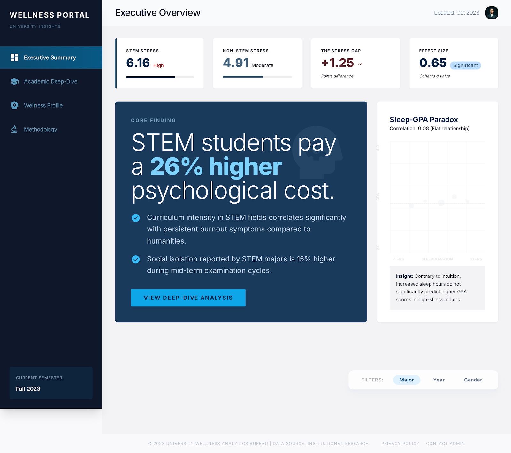
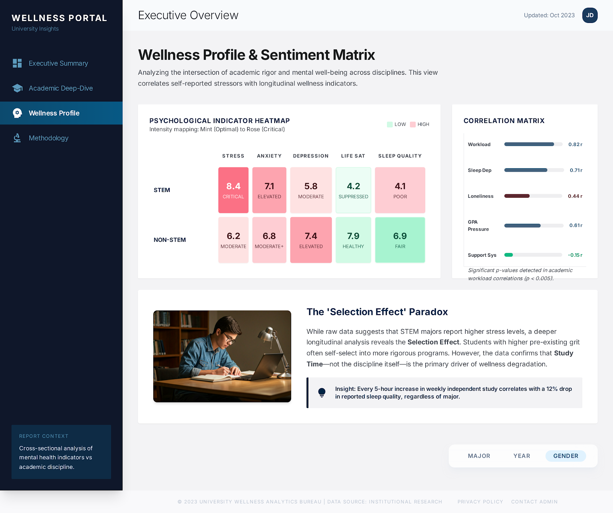
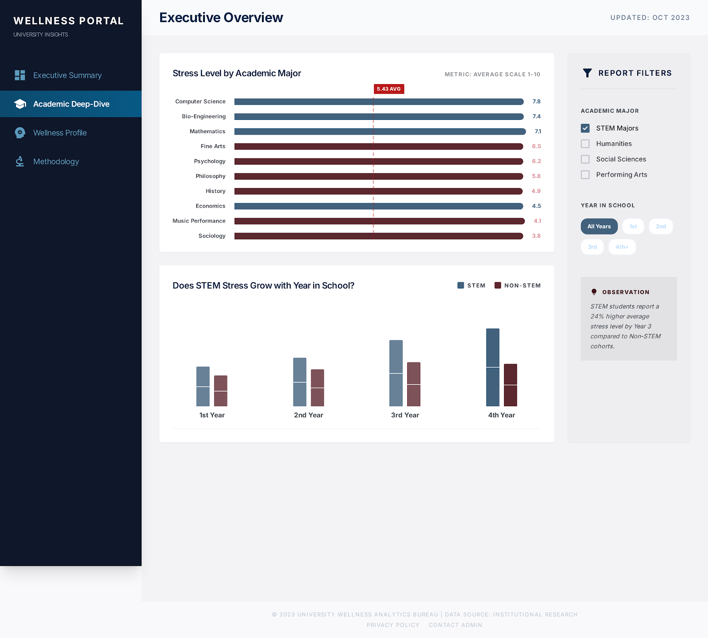

# EDA Lab with AI Agents — Full Instructor Proposal

**Version:** 1.0  
**Author:** Instructor Reference Document  
**Date:** 2026-04-11  
**Dataset:** Student Wellness & Academic Performance (`dataset/student_wellness.csv`)  
**Duration:** 3–4 sessions of 90 minutes each (or self-paced over 1–2 weeks)

---

## Overview

This lab teaches students how to perform structured Exploratory Data Analysis (EDA) using AI agents as collaborative partners. Students work through six phases — from environment setup and data cleaning through hypothesis testing and professional dashboard design — while learning how to prompt, direct, and critically evaluate AI-generated analysis.

**What students will be able to do after this lab:**
1. Set up a reproducible Python data analysis environment
2. Systematically diagnose and clean a real-world messy dataset
3. Conduct univariate and bivariate EDA using AI-assisted Python scripting
4. Formulate data-driven hypotheses and select the strongest for investigation
5. Write research-quality analytical reports using AI as a writing collaborator
6. Design professional-grade data dashboards using AI design tools

**What makes this lab different from a standard EDA lab:**
- Students don't just run code — they direct an AI agent through the entire analysis
- Every phase requires a decision (not just execution), building real analytical judgment
- The AI suggests, but the student drives. The lab trains students to evaluate AI output critically
- Output is professional-quality: real Python scripts, structured markdown reports, dashboard designs

---

## Prerequisites

**Python knowledge:** Students should be comfortable reading and modifying Python (pandas, plotting). They do not need to write scripts from scratch — the agent handles that.

**No prior AI agent experience needed** — the lab teaches it from Phase 0.

---

## Environment Setup (Required Before Phase 0)

### Step 1 — Navigate to the lab folder

```bash
cd reports/eda_lab
```

### Step 2 — Create the virtual environment

```bash
python3 -m venv venv
```

### Step 3 — Activate the virtual environment

```bash
# macOS / Linux
source venv/bin/activate

# Windows (PowerShell)
venv\Scripts\Activate.ps1
```

You should see `(venv)` appear at the start of your terminal prompt.

### Step 4 — Install dependencies

```bash
pip install -r requirements.txt
```

This installs: `pandas`, `numpy`, `plotly`, `scipy`, `scikit-learn`, `matplotlib`, `seaborn`, `nbformat`, `kaleido`, `statsmodels`.

### Step 5 — Verify installation

```bash
python3 -c "import pandas, plotly, scipy; print('All good!')"
```

### Step 6 — Open Claude Code (the AI agent)

```bash
# Navigate to the lab folder in your terminal, then:
claude
```

**Important:** Always activate the virtual environment before running any scripts.

---

## How the Agent + Skills System Works

### The Lab Agent (`agent/agent.md`)

This file defines how the AI agent should behave throughout this lab. It specifies:
- **Plotly-first** visualization (pastel palette, white background, Inter font)
- Script standards (self-contained, all outputs saved, docstrings required)
- Report writing standards ("So what?" sentences required)
- Context management rules (update `context/context.md` at end of each phase)

**When to reference it:** At the start of every session, students attach `agent/agent.md` to the Claude Code context using the `@` syntax:

```
@agent/agent.md
```

This loads the agent's operating manual into context. Tell students: *"If the agent produces a chart in the wrong palette or writes an incomplete script, point it back to `@agent/agent.md` and ask it to re-check its own standards."*

### Phase Skill Files (`skills/`)

Each phase has a dedicated skill file. Students invoke it by attaching it with `@` at the start of every phase session:

```
@skills/skill_phase0_diagnostic.md
```

The skill file contains the full workflow, prompts, and teaching points for that phase. Attaching it ensures the agent understands the phase structure and expected outputs without the student having to re-explain everything.

**How to tell students to use them:**
> At the start of each phase, attach the skill file with `@skills/skill_phaseN_xxx.md`. Read it yourself too — it's your map. The prompts inside are ready to copy-paste. Once you're comfortable, you can deviate and write your own.

### Context Accumulation (`context/context.md`)

This file is the **shared memory of the lab**. Attach it at the start of every phase so the agent knows what was found and decided in all previous phases:

```
@context/context.md
```

At the end of each phase, ask the agent to append its summary to the file. Next session, attaching `@context/context.md` again gives the agent full continuity — it never starts from scratch.

---

## Phase-by-Phase Instructor Guide

---

### Environment Setup Phase

**Objective:** Ensure every student has a working lab environment before touching data.

**Time:** 30 minutes

**Instructor actions:**
1. Walk through the setup steps above together
2. Verify everyone's `pip install` completes without errors
3. Confirm `python3 -c "import pandas, plotly; print('OK')"` works
4. Show students where the `venv/` folder lives and why we don't commit it to git

**Teaching point:** Talk about why we create a virtual environment for each project — isolation of dependencies prevents version conflicts. This is real-world data science practice.

---

### Phase 0 — Data Orientation & Diagnostic

**Objective:** Develop full situational awareness of the raw dataset before any analysis. Identify every quality issue. Document every cleaning decision.

**Time:** 60–75 minutes

**Files for this phase:**
- `skills/skill_phase0_diagnostic.md` — student workflow guide
- `phase0_diagnostic/scripts/diagnostic.py` — full quality audit script
- `phase0_diagnostic/scripts/cleaning.py` — cleaning implementation
- `phase0_diagnostic/report.md` — diagnostic findings and decisions

**[INSTRUCTOR DEMO] — Show this workflow:**

#### Step 1 — Pre-analysis (no agent, 10 minutes)
Ask students to open `dataset/student_wellness.csv` in a spreadsheet or text editor. Have them write down:
- Their guess at which columns have problems
- What the "interesting" relationships might be
They will compare this to the agent's findings later.

#### Step 2 — Invoke the agent for structural overview

In Claude Code, start by attaching the agent config, the skill, and the context file. Then write the prompt. Students should type this exactly:

**Exact prompt to show students:**
```
@agent/agent.md @skills/skill_phase0_diagnostic.md @context/context.md

I'm starting Phase 0 of the EDA lab. The dataset is at dataset/student_wellness.csv.
Give me a structural overview of every column:
- Data type as read by pandas (before any conversion)
- Number of missing values and percentage missing
- Number of unique values
- For numeric columns: min, max, mean, median, std
- For string/object columns: list all unique values (if fewer than 20), or the top 10 most frequent
Do not generate any charts yet. Just give me the data dictionary with these statistics.
```

> **Explain the `@` syntax to students:** In Claude Code, `@filename` attaches a file directly into the agent's context — the agent reads it before processing your message. `@agent/agent.md` loads the lab rules (palette, script standards). `@skills/skill_phase0_diagnostic.md` loads the phase workflow. `@context/context.md` loads everything discovered so far. You should attach all three at the start of every session.

**What students see:** The agent will surface the inconsistencies (12 gender variants, 10 boolean variants for on_campus, text in stress_level). This is the "discovery moment."

#### Step 3 — Run the diagnostic script

**Exact prompt:**
```
@agent/agent.md @context/context.md

Now generate a Python script called diagnostic.py in phase0_diagnostic/scripts/ that:
1. Loads the raw CSV from dataset/student_wellness.csv
2. Prints a full quality report per column
3. Creates diagnostic charts (Plotly, pastel palette) for every column with issues
4. Saves all charts to phase0_diagnostic/figures/
5. Saves a quality_summary.csv with: column, issue_type, affected_rows, recommendation
Follow the agent.md standards: self-contained script, docstring, print summary at end.
```

**Run it:**
```bash
python3 phase0_diagnostic/scripts/diagnostic.py
```

#### Step 4 — Review findings together
For each issue flagged:
- Does the student agree with the recommendation?
- If not, have them tell the agent their preferred approach

**Exact prompt for disagreement:**
```
@agent/agent.md @context/context.md @phase0_diagnostic/quality_summary.csv

For [column], you recommend [action]. I think we should [alternative] because [reason].
Can you update the cleaning script and report to reflect this decision?
```

#### Step 5 — Run the cleaning script

```bash
python3 phase0_diagnostic/scripts/cleaning.py
```

This produces `dataset/student_wellness_clean.csv` — the foundation for all subsequent phases.

#### Step 6 — Write the diagnostic report

**Exact prompt:**
```
@agent/agent.md @context/context.md @phase0_diagnostic/quality_summary.csv @phase0_diagnostic/cleaning_log.csv

Based on the diagnostic results and cleaning decisions we made, write the Phase 0 report.
Save it to phase0_diagnostic/report.md.
Structure: (1) Executive Summary, (2) Column-by-Column Findings with chart embeds,
(3) Cleaning Decision Log as a markdown table, (4) Key Questions Raised.
Then append the Phase 0 summary block to context/context.md.
```

#### Step 7 — Convert scripts to Jupyter notebook

**Exact prompt:**
```
@agent/agent.md @phase0_diagnostic/report.md

Phase 0 is complete. Convert the two scripts (diagnostic.py and cleaning.py) into a single
Jupyter notebook at phase0_diagnostic/notebook.ipynb.
Structure: alternating markdown cells (explaining what each section does and what it found)
and code cells (the script blocks). The notebook should reproduce all outputs when run top-to-bottom.
```

**Teaching Points to Emphasize:**
- Impossible values ≠ outliers. Age=200 is impossible (data entry error). Age=24 might be an outlier (unusual for this population) but is not impossible.
- Missing data has patterns. Ask: is the 12.9% missing in anxiety_score random, or are anxious students less likely to answer?
- Every cleaning decision is a research choice. Document them — future you will need to know.

---

### Phase 1 — Univariate Bootstrap

**Objective:** Describe every variable individually. Build intuition for shape, spread, and character before examining any relationships.

**Time:** 45–60 minutes

**Files for this phase:**
- `skills/skill_phase1_univariate.md`
- `phase1_univariate/scripts/univariate_numeric.py`
- `phase1_univariate/scripts/univariate_categorical.py`
- `phase1_univariate/report.md`

#### Orient the agent

**Exact prompt:**
```
@agent/agent.md @skills/skill_phase1_univariate.md @context/context.md

We are now in Phase 1 of the EDA lab. The clean dataset is at dataset/student_wellness_clean.csv.
We are going to analyze every column individually — one variable at a time, no relationships yet.
Let's start with numeric columns. Ready?
```

#### Generate the numeric sweep script

**Exact prompt:**
```
@agent/agent.md @context/context.md

Generate a self-contained Python script called univariate_numeric.py in phase1_univariate/scripts/ that:
- Loads dataset/student_wellness_clean.csv
- For each numeric column, creates:
  a) A histogram with 30 bins and a KDE overlay
  b) A box plot showing median, IQR, and outliers
- Both charts use Plotly with the pastel palette from agent.md
- Saves each chart to phase1_univariate/figures/ as [col]_hist.png and [col]_box.png
- Annotates the histogram with vertical dashed lines for mean (blue) and median (rose)
- Prints descriptive stats: mean, median, std, skewness, kurtosis for each column
Follow agent.md standards throughout.
```

**Run it:**
```bash
python3 phase1_univariate/scripts/univariate_numeric.py
```

#### Generate the categorical sweep script

**Exact prompt:**
```
@agent/agent.md @context/context.md

Now generate univariate_categorical.py in phase1_univariate/scripts/ that:
- For each categorical column (gender, major, year_in_school, has_part_time_job, on_campus):
  - Creates a bar chart showing frequency sorted descending, using Plotly pastel palette
  - Shows count AND percentage on each bar
- Saves to phase1_univariate/figures/ as [col]_bar.png
- Prints value counts and % breakdown to console
```

**Run it:**
```bash
python3 phase1_univariate/scripts/univariate_categorical.py
```

#### Interpret findings together

For each interesting distribution, have students use this prompt:
```
@context/context.md

The [column] histogram shows [description of what you see].
What does this distribution tell us about the student population?
Is the shape what you'd expect? What are the "so what?" implications?
```

**Teaching Moment — Prompt Specificity:**
Show the difference between:
- Vague: `"Analyze GPA"`
- Specific: `"Create a histogram of GPA with 30 bins, overlay a KDE curve, and annotate the mean and median with vertical dashed lines in different colors"`

Run both and show students the difference in output quality. This is the core skill of Phase 1.

#### Write the univariate report

**Exact prompt:**
```
@agent/agent.md @context/context.md @phase1_univariate/numeric_summary_stats.csv

Write the Phase 1 report to phase1_univariate/report.md.
For each variable include:
- Chart reference (embedded image markdown)
- Key statistics (mean, median, std, or value counts)
- Shape description (normal, left-skewed, right-skewed, bimodal, uniform)
- Notable features (any surprising finding)
- One "So what?" sentence — what does this tell us about this student population?
End with a Phase 1 Summary table identifying the top 3 most analytically interesting variables for Phase 2.
Then append the Phase 1 summary block to context/context.md.
```

**Teaching Points:**
- Skewness is a story. Left-skewed GPA → most students perform well but a minority struggles.
- Bimodality signals hidden subgroups. Two peaks = two different populations.
- "So what?" is not optional. Every chart must earn its place.

---

### Phase 2 — Hypothesis Negotiation

**Objective:** Generate hypotheses before analysis. Compare human intuitions against AI suggestions. Select the three strongest for Phase 3.

**Time:** 45–60 minutes

**Files for this phase:**
- `skills/skill_phase2_hypothesis.md`
- `phase2_hypothesis/scripts/bivariate_preview.py`
- `phase2_hypothesis/report.md`
- `phase2_hypothesis/hypothesis_log.md` (student-generated)

#### Step 1 — Student hypotheses first (10 minutes, no agent)

Students write 5 hypotheses before opening the agent. Required format:
```
H1: [Variable A] is [positively/negatively/not] related to [Variable B]
Because: [reasoning from Phase 1 findings]
Expected finding: [what you think the chart will show]
```

**Why this matters:** If students look at the agent's list first, they'll anchor to it. Writing their own list first builds independent analytical thinking and gives them something to compare against.

#### Step 2 — Ask the agent for its hypotheses

**Exact prompt:**
```
@agent/agent.md @skills/skill_phase2_hypothesis.md @context/context.md @phase1_univariate/report.md

Based on the univariate findings in the report above, generate 7 data-driven hypotheses about relationships in this dataset.
For each hypothesis:
- State it clearly (X is related to Y in what direction)
- Explain the analytical reasoning (not just intuition — what in the univariate data suggests this?)
- Suggest the best chart type to test it
- Rate your confidence: high / medium / low and explain why
Format as a markdown table.
```

#### Step 3 — Compare and negotiate

**Exact prompt:**
```
@agent/agent.md @context/context.md

Here are my hypotheses: [paste student list]
Compare them to your list:
- Which hypotheses overlap? What does the overlap tell us?
- Which are unique to my list? What might I be seeing that you missed?
- Which are unique to your list? What did I overlook?
What does this comparison reveal about how humans and AI approach hypothesis generation differently?
```

**Teaching Moment:** This comparison is the heart of Phase 2. Students should discuss:
- Did the AI catch statistical patterns they missed?
- Did they catch domain knowledge or intuitive connections the AI didn't flag?
- What does this say about how to use AI as a collaborator vs. a replacement?

#### Step 4 — Preview charts

**Exact prompt:**
```
@agent/agent.md @context/context.md

For these 5 hypotheses: [list top 5]
Generate a Python script called bivariate_preview.py in phase2_hypothesis/scripts/ that creates one quick preview chart for each:
- Scatter for continuous×continuous (with OLS trendline)
- Box or violin for continuous×categorical
Use Plotly, pastel palette. Save to phase2_hypothesis/figures/.
Goal: quick and informative, not publication quality.
Print the key statistic (r, t, or group means) for each.
```

**Run it:**
```bash
python3 phase2_hypothesis/scripts/bivariate_preview.py
```

#### Step 5 — Final selection and report

**Exact prompt:**
```
@agent/agent.md @context/context.md @phase2_hypothesis/hypothesis_log.md

Looking at the preview charts, help me select the 3 strongest hypotheses for Phase 3.
For each recommendation:
- What signal did the chart show?
- What analytical angles should we pursue in Phase 3?
- What would "confirmed", "rejected", and "nuanced" look like for this hypothesis?
Write this to phase2_hypothesis/report.md with the full hypothesis log, comparison analysis, and selected 3 with rationale.
Then append Phase 2 summary to context/context.md.
```

#### Step 6 — Convert to Jupyter notebook

**Exact prompt:**
```
@agent/agent.md @phase2_hypothesis/report.md

Phase 2 is complete. Convert bivariate_preview.py into a Jupyter notebook at phase2_hypothesis/notebook.ipynb.
Add markdown cells explaining what each hypothesis preview tests, what the key statistic shows, and why we selected or rejected each for Phase 3.
```

**Teaching Points:**
- Rejecting a hypothesis is a result. "This relationship does not exist" is a finding, not a failure.
- Preview charts reveal: sleep→GPA in this dataset shows a *negative* correlation. Great! Now investigate *why* in Phase 3.
- Hypothesis selection criteria: expected effect size, analytical depth possible, relevance to the audience.

---

### Phase 3 — Targeted Deep Dives

**Objective:** Build thorough analysis for each selected hypothesis using the active collaboration model. Scripts run → figures saved → report grows in real time.

**Time:** 90–120 minutes (most intensive phase)

**Files for this phase:**
- `skills/skill_phase3_deepdive.md`
- `phase3_deepdive/scripts/h1_sleep_gpa.py`, `h2_stress_major.py`, `h3_screen_wellness.py`
- `phase3_deepdive/figures/` (all generated figures)
- `phase3_deepdive/report.md` (growing document)

#### Orient the agent

**Exact prompt:**
```
@agent/agent.md @skills/skill_phase3_deepdive.md @context/context.md @phase2_hypothesis/report.md

We are in Phase 3. Our 3 selected hypotheses are:
H1: [paste]
H2: [paste]
H3: [paste]
We'll tackle them one at a time. Let's start with H1. I'll tell you what I see after each chart and you suggest the next analysis. Ready?
```

#### Mode A — Active Collaboration (recommended for all 3 hypotheses)

**Starting prompt for each hypothesis:**
```
@agent/agent.md @context/context.md

For H[N] ([hypothesis statement]):
Generate a script called h[n]_base.py in phase3_deepdive/scripts/ that creates the most fundamental visualization for this hypothesis.
Use Plotly, pastel palette, save to phase3_deepdive/figures/.
After I run it, append a first-pass interpretation to phase3_deepdive/report.md under H[N].
```

**After reviewing the base chart:**
```
@context/context.md @phase3_deepdive/report.md

The chart shows [describe what you see].
What should we look at next to either confirm or challenge this finding?
Give me 3 options:
1. Go deeper on this finding
2. Look at a related variable we haven't examined
3. Look for counterevidence or challenge the finding
Which do you recommend and why?
```

**Key iterative prompts:**
```
@agent/agent.md @context/context.md @phase3_deepdive/report.md

Generate h[n]_breakdown.py that slices this relationship by [major/year/gender/on_campus].
Create a faceted chart or grouped comparison.
Append the new finding to phase3_deepdive/report.md under H[N].
```

```
@agent/agent.md @context/context.md @phase3_deepdive/report.md

The charts suggest [finding]. Add statistical rigor:
Generate h[n]_stats.py that computes correlation/t-test/ANOVA, prints p-values and effect sizes.
Append a "Statistical Validation" subsection to the report.
```

**Wrap-up prompt for each hypothesis:**
```
@agent/agent.md @context/context.md @phase3_deepdive/report.md

Summarize H[N]. Write a "H[N] Conclusion" section in phase3_deepdive/report.md that states:
- What we hypothesized
- What we actually found (with specific numbers)
- Whether confirmed / rejected / nuanced
- The single most important implication
Then we'll move to H[N+1].
```

**After all 3 hypotheses complete — notebook and context:**
```
@agent/agent.md @phase3_deepdive/report.md

Phase 3 is complete. Convert the three hypothesis scripts (h1_sleep_gpa.py, h2_stress_major.py, h3_screen_wellness.py) into a single Jupyter notebook at phase3_deepdive/notebook.ipynb.
Structure: one section per hypothesis, with markdown cells explaining what each chart reveals and what the finding means.
Then append the Phase 3 summary to context/context.md.
```

**Teaching Moment — The Direction Matters:**
The H1 sleep→GPA finding in this dataset is r = -0.061 (non-significant). Students expecting a positive correlation will be surprised. This is the perfect teaching moment:
1. The data doesn't always confirm our intuitions
2. A non-finding directs us toward a better explanation (study hours as the confounder)
3. The interesting analysis comes *after* the surprise, not before it

**Creative prompts to use when students feel stuck:**
```
We've covered the obvious angles on H[N]. What's a less conventional or more creative way to look at this relationship that might reveal something we'd miss with standard charts?
```

```
What would make this finding wrong? What alternative explanation should we test?
```

---

### Phase 4 — Per-Hypothesis Research Reports

**Objective:** Write a standalone research-quality report for each of the 3 hypotheses. Structure: basic → intermediate → advanced → conclusion → implications.

**Time:** 60–90 minutes

**Files for this phase:**
- `skills/skill_phase4_reports.md`
- `phase4_reports/h1_sleep_gpa/report.md`
- `phase4_reports/h2_stress_major/report.md`
- `phase4_reports/h3_screen_wellness/report.md`

#### Orient the agent

**Exact prompt:**
```
@agent/agent.md @skills/skill_phase4_reports.md @context/context.md @phase3_deepdive/report.md

We are in Phase 4. We are writing a standalone research report for H1: [hypothesis].
The report must follow a logical progression: background → variable definitions → descriptive overview →
relationship exploration → subgroup analysis → statistical evidence → advanced analysis → conclusion → implications.
Start with Sections 1 (Background) and 2 (Variable Definitions). Save to phase4_reports/h1_sleep_gpa/report.md.
```

> **Why these files:** `agent.md` sets writing and visualization standards; `skill_phase4_reports.md` defines the 9-section report structure; `context.md` carries all prior phase findings; `phase3_deepdive/report.md` has the deep-dive data and charts to reference.

#### Build section by section

**Between each section:**
```
@agent/agent.md @context/context.md @phase4_reports/h1_sleep_gpa/report.md

Good. Now draft Section [N+1]. What would be the most valuable content here to build the analytical argument?
Use existing figures from phase3_deepdive/figures/ — don't regenerate. Reference them with markdown image embeds.
```

**For the Advanced Analysis section:**
```
@agent/agent.md @context/context.md @phase4_reports/h1_sleep_gpa/report.md

We're at Section 7 (Advanced Analysis). We've covered the obvious angles.
Give me 3 creative or non-obvious analytical approaches for H[N] that might reveal something surprising.
I'll choose one and we'll implement it together.
```

> **Note for H2 and H3:** Swap `h1_sleep_gpa` for `h2_stress_major` or `h3_screen_wellness` in the file reference. The `@phase3_deepdive/report.md` attachment stays the same — it covers all three hypotheses.

#### Polish pass

**Exact prompt:**
```
@agent/agent.md @phase4_reports/h1_sleep_gpa/report.md

Review the full report above.
Check: (1) does the narrative flow from basic to complex? (2) is every chart referenced? (3) does every statistical claim have a number? (4) is the "so what?" clear? (5) is the conclusion specific and falsifiable?
Make any needed edits in place.
```

**Teaching Points:**
- Structure is persuasion. A report that builds from context to conclusion is more convincing than a chart collection.
- "Sleep is important" is not a conclusion. "Students sleeping fewer than 6 hours show a GPA 0.4 points lower on average (p=0.003), with the strongest effect in first-year STEM students" is a conclusion.
- Advanced analysis should be earned — don't put the fancy technique in Section 2.
- Always ask the agent "what next?" — it will suggest directions you didn't think of.

---

### Phase 5 — Dashboard Design with Google Stitch

**Objective:** Design a PowerBI-style analytics dashboard from your research reports using an AI design tool. Learn how to write effective prompts for AI design generators.

**Time:** 45–60 minutes

**Files for this phase:**
- `skills/skill_phase5_dashboard.md`
- `phase5_dashboard/dashboard_brief.md` — design requirements
- `phase5_dashboard/stitch_prompts.md` — ready-to-use Stitch prompts

**Tool:** Google Stitch (stitch.withgoogle.com)  
**Note:** This is the one phase where you leave the terminal. Open Stitch in your browser.

#### Generate the dashboard brief with the agent (before opening Stitch)

Before going to Stitch, use Claude Code to distill your report into a crisp design brief:

```
@agent/agent.md @skills/skill_phase5_dashboard.md @context/context.md @phase4_reports/h2_stress_major/report.md

We are starting Phase 5. I need to design a PowerBI-style dashboard for H2 (STEM vs. Non-STEM stress).
The audience is university administrators.
Distill the report into a dashboard brief: key message (1 sentence), 3 KPI numbers, 2 main charts, 1 insight callout, and the filter controls needed.
Save to phase5_dashboard/dashboard_brief.md.
```

> Swap the report attachment (`h2_stress_major/report.md`) for the hypothesis you want to design. For an H1 or H3 dashboard, also swap the audience.

Then open `phase5_dashboard/dashboard_brief.md` and use its content to assemble your Stitch prompt.

#### Two approaches to teach

**Approach A — Full Report Dump:**
1. Copy the contents of your H2 report (`phase4_reports/h2_stress_major/report.md`)
2. Paste it into Stitch with the prefix prompt from `stitch_prompts.md`
3. Let the AI decide what to highlight

**Approach B — Curated Brief (recommended):**
1. Run the agent brief prompt above to produce `dashboard_brief.md`
2. Use that brief to fill in the curated Stitch prompt from `stitch_prompts.md`
3. Every element, layout, and filter is specified — nothing left to chance

**Have students try both and compare the results:**
```
What's different between the two outputs?
Which better communicates the key finding?
Which would you trust more for a presentation to university administrators?
```

#### Key teaching on prompt quality

Show this progression:
- **Level 1 (bad):** `"Make a dashboard about student stress"`
- **Level 2 (better):** `"Make a PowerBI dashboard showing STEM vs non-STEM stress"`
- **Level 3 (good):** Use the full prompt from `stitch_prompts.md`

Run Level 1 and Level 3 in Stitch and show the outputs side-by-side. The difference in quality is the lesson.

#### Refinement round

After the first Stitch generation, ask students to write one refinement prompt of their own — based on what they would change. The refinement prompt examples in `stitch_prompts.md` can guide them.

#### Reflection (required deliverable)

Students write answers to these 4 questions and save to `phase5_dashboard/reflection.md`:
1. Does the dashboard immediately communicate the key finding without any text explanation?
2. Is the most important chart the most visually prominent?
3. Would a non-data person understand what action to take?
4. What would you change if you had one more iteration?

**Teaching Point — Dashboards are arguments:**
Every visual element should serve the key message. A chart that doesn't support the main finding should be cut or subordinated. Filters are for exploration, not for the main story. Callouts do analytical work for non-technical readers.

---

#### Instructor Reference: Actual Dashboards Produced

The three dashboards below were generated from this lab's research reports using Google Stitch. Each lives in its own subfolder under `phase5_dashboard/` with a `screen.png` (the visual output) and a `code.html` (the generated layout code).

---

##### Dashboard 1 — Executive Overview
**File:** `phase5_dashboard/executive_overview/screen.png`  
**Hypothesis:** H2 (STEM vs. Non-STEM Stress)  
**Audience:** University administrators, department heads



**What it shows:**
- Four KPI cards: STEM Stress (6.16 / High), Non-STEM Stress (4.91 / Moderate), Stress Gap (+1.25), Effect Size (Cohen's d = 0.65 / Significant)
- A full-width hero panel leading with the key finding in large type: *"STEM students pay a 26% higher psychological cost"* with two supporting bullet points
- A "Sleep–GPA Paradox" callout card on the right: notes that increased sleep hours do not significantly predict higher GPA in high-stress majors — cross-referencing H1's finding
- Filter controls for Major, Year, Gender
- Left navigation sidebar with four views: Executive Summary, Academic Deep-Dive, Wellness Profile, Methodology

**Design decisions worth discussing with students:**
- The hero panel makes the key number (`26%`) the dominant visual element — impossible to miss before reading anything else
- The sidebar navigation pattern means each hypothesis can live in its own "page" within the same dashboard product — a real PowerBI pattern
- The Sleep–GPA callout is a smart cross-reference: it acknowledges the surprising H1 finding without making it the main story

---

##### Dashboard 2 — Wellness Profile & Sentiment Matrix
**File:** `phase5_dashboard/wellness_profile/screen.png`  
**Hypothesis:** H2 + H3 combined (wellness depth)  
**Audience:** Student wellness counselors, health education teams



**What it shows:**
- A 2×5 **Psychological Indicator Heatmap** (STEM vs. Non-STEM × Stress / Anxiety / Depression / Life Satisfaction / Sleep Quality) with color-coded cells (mint = optimal, rose = critical) and clinical labels ("Elevated", "Moderate", "Healthy")
- A **Correlation Matrix** sidebar showing workload, sleep deprivation, loneliness, GPA pressure, and support systems with r values
- A narrative section: *"The Selection Effect Paradox"* — this dashboard synthesizes the H1 insight (study time, not sleep, drives GPA) with the H2 wellness findings in plain prose, with a callout: *"Every 5-hour increase in weekly independent study correlates with a 12% drop in reported sleep quality, regardless of major"*
- Filters: Major, Year, Gender (Gender highlighted as active)

**Design decisions worth discussing with students:**
- The heatmap is more information-dense than a bar chart — it communicates five metrics × two groups in a single glance, which is right for a counselor audience that needs to triage
- The narrative section turns the statistical finding into a story that a non-data reader can act on
- The Correlation Matrix sidebar grounds the visual claims in numbers without cluttering the main panel
- The clinical labels ("Elevated", "Moderate") add immediate interpretive context without requiring the viewer to know the GAD-7 scale

---

##### Dashboard 3 — Academic Deep-Dive
**File:** `phase5_dashboard/academic_deep_dive/screen.png`  
**Hypothesis:** H2 with major-level granularity  
**Audience:** Faculty, academic program directors



**What it shows:**
- A **horizontal bar chart** of stress level by academic major (10 bars, sorted highest to lowest), with STEM bars visually distinguished, a dashed overall mean line, and each bar labeled with its value
- A **grouped bar chart** answering: *"Does STEM Stress Grow with Year in School?"* — STEM vs. Non-STEM side by side for each academic year (1st–4th), confirming the gap doubles from Year 1 to Year 2 and persists
- A **Report Filters** sidebar: checkboxes for Academic Major (STEM Majors, Humanities, Social Sciences, Performing Arts), Year in School slider, and an "All Years" toggle
- An **Observation** callout: *"STEM students report a 28% higher stress level by Year 2 compared to Non-STEM students"*

**Design decisions worth discussing with students:**
- Horizontal bar chart is the right choice for comparing 10+ labeled categories — vertical bars would make major names unreadable
- The filter sidebar uses checkboxes (not dropdowns) because this audience will actively slice the data by major category — they need direct access, not a buried dropdown
- The year-progression chart directly answers the "does it get better or worse?" question, which is what a program director actually needs to decide when to intervene
- The observation callout is placed next to the filter panel, tying the finding to the interactivity: "here's what the filters reveal"

---

#### What to Tell Students About These Three Dashboards

Use the three outputs as a class discussion:

```
Compare the three dashboard designs:
1. Executive Overview — who is this for and what decision should they make after seeing it?
2. Wellness Profile — what does the heatmap communicate that individual bar charts couldn't?
3. Academic Deep-Dive — why is horizontal better than vertical for the major comparison?

Now look at all three together:
- Which one best communicates the single key finding?
- Which has the best balance of data density vs. clarity?
- If you could take one design element from each and combine them, what would you pick?
```

This comparison exercise teaches that dashboards are not universal — **the right design depends on who is reading it and what decision they need to make**.

---

## Jupyter Notebook Generation (Record-Keeping)

After completing each phase's scripts and markdown report, convert the scripts to a Jupyter notebook for archival purposes.

**This is the last step of each phase, not the first.**

**Exact prompt for notebook generation (run at the end of each phase):**

*Phase 0:*
```
@agent/agent.md @phase0_diagnostic/report.md

Phase 0 scripts and report are complete. Convert diagnostic.py and cleaning.py into a single Jupyter notebook at phase0_diagnostic/notebook.ipynb.
Structure: opening markdown → Part 1 (diagnostic.py as one code cell, with markdown before and after) → Part 2 (cleaning.py as one code cell, with markdown before and after) → summary markdown.
The notebook should reproduce all outputs when run top to bottom.
```

*Phase 1:*
```
@agent/agent.md @phase1_univariate/report.md

Phase 1 scripts and report are complete. Convert univariate_numeric.py and univariate_categorical.py into a single Jupyter notebook at phase1_univariate/notebook.ipynb.
Structure: opening markdown → Part 1 (numeric) → Part 2 (categorical) → summary markdown.
```

*Phase 2:*
```
@agent/agent.md @phase2_hypothesis/report.md

Phase 2 script and report are complete. Convert bivariate_preview.py into a Jupyter notebook at phase2_hypothesis/notebook.ipynb.
Structure: opening markdown explaining the 5 hypotheses → code cell → summary markdown with the 3 selected hypotheses and rationale.
```

*Phase 3:*
```
@agent/agent.md @phase3_deepdive/report.md

Phase 3 scripts and report are complete. Convert h1_sleep_gpa.py, h2_stress_major.py, and h3_screen_wellness.py into a single Jupyter notebook at phase3_deepdive/notebook.ipynb.
Structure: one section per hypothesis — opening markdown → code cell → conclusion markdown. Include a final summary table.
```

> **Phase 4 has no notebook.** Phase 4 produces markdown reports only (no scripts). The reports themselves are the archival artifact.

> **Alternative: batch notebook generation.** If you completed all phases and want to generate all four notebooks at once, the instructor-side script `scripts/generate_notebooks.py` does this programmatically using `nbformat`. Run it with `python scripts/generate_notebooks.py` from the `reports/eda_lab/` directory (venv must be active).

**Why notebooks last:**
- Notebooks are execution-order dependent and can hide bugs when run out of order
- Scripts are easier to debug, version control, and modify
- The markdown reports are the primary analytical artifact; notebooks are the reproducible code archive

**Notebooks produced in this lab run:**
| Notebook | Path | Status |
|----------|------|--------|
| Phase 0 | `phase0_diagnostic/notebook.ipynb` | ✓ Generated |
| Phase 1 | `phase1_univariate/notebook.ipynb` | ✓ Generated |
| Phase 2 | `phase2_hypothesis/notebook.ipynb` | ✓ Generated |
| Phase 3 | `phase3_deepdive/notebook.ipynb` | ✓ Generated |

---

## Grading Rubric (Suggested)

| Phase | Deliverable | Points | Criteria |
|-------|------------|--------|---------|
| Phase 0 | `report.md` + cleaning decisions | 15 | All issues identified, all decisions documented with rationale |
| Phase 1 | `report.md` with "So what?" per variable | 10 | Every variable interpreted, not just described |
| Phase 2 | Hypothesis log + 3 selected with rationale | 15 | Pre-agent list exists, comparison done, selection justified |
| Phase 3 | Deep dive report with 3+ charts per hypothesis | 25 | Iterative analysis visible, statistical evidence included |
| Phase 4 | 3 per-hypothesis reports (basic→advanced structure) | 25 | Logical flow, specific conclusions, implication statements |
| Phase 5 | Stitch screenshots + reflection | 10 | Two approaches tried, refinement prompt used, reflection answered |

**Total: 100 points**

---

## Common Student Mistakes & How to Address Them

| Mistake | What to Say |
|---------|-------------|
| Starting with the agent's hypothesis list (not writing their own first) | "Close the chat. Write your list first. I'll check before you open the agent." |
| Accepting all agent outputs without reviewing | "What did you check? Show me one thing you changed after reviewing the output." |
| Writing prompts that are too vague | "What specifically do you want to see? Tell me in English first, then we'll turn it into a prompt." |
| Not updating context.md | "How will the agent know what you found in Phase 2 when you're in Phase 3?" |
| Calling a weak correlation 'strong' | "What's the effect size? Look up what r=0.15 means in your notes." |
| Treating non-findings as failures | "The relationship doesn't exist in this data. That IS a finding. What might explain the absence?" |
| Writing vague conclusions | "Be specific. What exactly did you find, in which population, with what number?" |

---

## Files Reference

```
reports/eda_lab/
├── PROPOSAL.md                        ← this document
├── requirements.txt                   ← pip install -r requirements.txt
├── venv/                              ← virtualenv (not committed to git)
├── dataset/
│   ├── generate_dataset.py            ← dataset generation script (for instructor)
│   ├── student_wellness.csv           ← raw dataset (with intentional issues)
│   └── student_wellness_clean.csv     ← cleaned dataset (produced in Phase 0)
├── agent/
│   └── agent.md                       ← agent operating manual
├── context/
│   └── context.md                     ← accumulating lab memory (grows each phase)
├── skills/
│   ├── skill_phase0_diagnostic.md
│   ├── skill_phase1_univariate.md
│   ├── skill_phase2_hypothesis.md
│   ├── skill_phase3_deepdive.md
│   ├── skill_phase4_reports.md
│   └── skill_phase5_dashboard.md
├── scripts/
│   └── generate_notebooks.py          ← instructor tool: batch-generate all 4 notebooks
├── phase0_diagnostic/
│   ├── scripts/diagnostic.py, cleaning.py
│   ├── figures/                        ← 13 diagnostic + before/after charts
│   ├── quality_summary.csv
│   ├── cleaning_log.csv
│   ├── report.md
│   └── notebook.ipynb                 ← archival notebook (generated last)
├── phase1_univariate/
│   ├── scripts/univariate_numeric.py, univariate_categorical.py
│   ├── figures/                        ← 28 charts (hist + box per numeric, bar per categorical)
│   ├── numeric_summary_stats.csv
│   ├── report.md
│   └── notebook.ipynb                 ← archival notebook (generated last)
├── phase2_hypothesis/
│   ├── scripts/bivariate_preview.py
│   ├── figures/                        ← 7 preview charts
│   ├── report.md
│   └── notebook.ipynb                 ← archival notebook (generated last)
├── phase3_deepdive/
│   ├── scripts/h1_sleep_gpa.py, h2_stress_major.py, h3_screen_wellness.py
│   ├── figures/                        ← 15 deep dive charts (5 per hypothesis)
│   ├── report.md
│   └── notebook.ipynb                 ← archival notebook (generated last)
├── phase4_reports/
│   ├── h1_sleep_gpa/report.md         ← no notebook (markdown-only phase)
│   ├── h2_stress_major/report.md
│   └── h3_screen_wellness/report.md
└── phase5_dashboard/
    ├── dashboard_brief.md             ← per-dashboard design requirements
    ├── stitch_prompts.md              ← 3 full Stitch prompts + refinement prompts
    ├── executive_overview/
    │   ├── screen.png                 ← Dashboard 1: "STEM pays 26% more" (H2, admin audience)
    │   └── code.html                  ← Stitch-generated layout code
    ├── wellness_profile/
    │   ├── screen.png                 ← Dashboard 2: Heatmap + Selection Effect (H2+H3, counselors)
    │   └── code.html
    └── academic_deep_dive/
        ├── screen.png                 ← Dashboard 3: Stress by major + year progression (faculty)
        └── code.html
```

---

## Dataset: Known Issues for Phase 0

Students are expected to find all of these. If they miss any, use them as teaching examples:

| Column | Issue | Severity |
|--------|-------|---------|
| `student_id` | None | — |
| `age` | 6 impossible values: -3, 0, 5, 150, 200, 999 | High |
| `gender` | 12 encoding variants instead of 4 | Medium |
| `gpa` | 8 values > 4.0 or negative + 42 missing (7.9%) | High |
| `study_hours_per_day` | 5 impossible values > 18 or negative | High |
| `attendance_rate` | 10 values > 100% | Medium |
| `sleep_hours_per_night` | 4 impossible values (negative, >16) + 53 missing (9.9%) | High |
| `exercise_days_per_week` | 32 missing (6%) | Low |
| `stress_level` | 20 text labels ("low", "medium", "high") mixed with numeric | Medium |
| `anxiety_score` | 69 missing (12.9%) | Medium |
| `depression_score` | 69 missing (12.9%) | Medium |
| `on_campus` | 10 boolean encoding variants (True/False/1/0/yes/no) | Medium |
| `has_part_time_job` | 26 missing (4.9%) | Low |
| `monthly_spending` | 48 missing (9%) | Low |
| `num_clubs` | 21 missing (3.9%) | Low |
| ALL | 3 exact duplicate rows | Medium |

---

## Key Analytical Findings (Reference for Instructors)

These are the real results from the executed lab run. Use to guide discussions or check student work:

**Phase 1:**
- Sleep mean: 6.81 hrs (below 7-hr recommendation)
- Screen time mean: 7.56 hrs (rivals sleep duration)
- GPA distribution: slightly left-skewed (mean 3.07, median 3.12)

**Phase 2 — Preview results:**
- H1 Sleep→GPA: r = -0.061 (p=0.159, non-significant — surprise!)
- H2 STEM→Stress: t = 7.35 (p < 0.0001 — strongest signal in dataset)
- H3 Screen→Wellness: r = -0.255 (satisfaction), r = +0.305 (stress) — both significant

**Phase 3 — Deep dive results:**
- Study hours → GPA: r = +0.466 (the real driver, not sleep)
- STEM mean stress 6.16 vs Non-STEM 4.91 (+1.25 pts, Cohen's d = 0.648)
- High screen students (>9hrs) report 2.18 pts lower life satisfaction than low screen (<5hrs)
- STEM stress gap doubles from Year 1 to Year 2 and persists
- Screen effect is independent of sleep status

---

*This proposal was generated by running the entire lab end-to-end. All scripts, figures, and reports referenced above are real outputs. Students working through the lab should produce similar (not identical) results, since some analyses involve choices that can vary.*
