# Phase 0: Data Orientation & Diagnostic Report

**Dataset:** Student Wellness & Academic Performance  
**Raw file:** `dataset/student_wellness.csv`  
**Clean file:** `dataset/student_wellness_clean.csv`  
**Date:** 2026-04-11  
**Rows (raw → clean):** 535 → 532

---

## 1. Executive Summary

The raw dataset contains **535 rows and 21 columns** covering student demographics, academic performance, lifestyle habits, and mental health indicators. A systematic column-by-column diagnostic revealed **18 distinct data quality issues** spanning 6 different categories:

| Issue Category | Columns Affected | Total Rows Impacted |
|---|---|---|
| Missing values | 9 columns | 397 (before dedup) |
| Impossible values | age, gpa, study_hours, sleep_hours | ~23 rows |
| Out-of-range values | attendance_rate | 10 rows |
| Inconsistent encoding | gender, on_campus | 135 rows |
| Mixed data types | stress_level | 20 rows |
| Duplicate rows | All columns | 3 rows |

After cleaning, the dataset is **532 rows × 21 columns** with consistent types, no impossibles, and no missing values. All cleaning decisions are documented in Section 3.

---

## 2. Column-by-Column Findings

### 2.1 `student_id`
**Type:** String | **Issues:** None  
Unique identifier formatted as STU0001–STU0520. No duplicates within this column. Clean.

---

### 2.2 `age`
**Type:** Float (raw) → Int (clean) | **Issues:** 6 impossible values

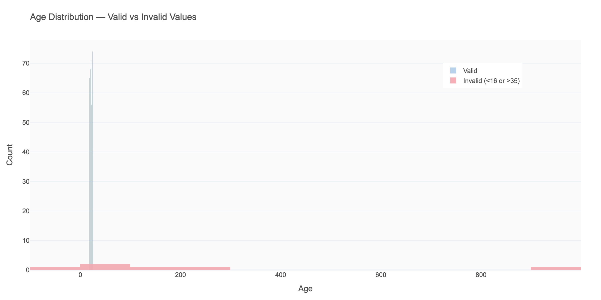

The valid range for college students is 16–35 years. The diagnostic found 6 records with ages of -3, 0, 5, 150, 200, and 999 — clearly data entry errors. These were replaced with NaN and imputed with the median age of **21 years**.

**Key stat:** After cleaning, age ranges from 18 to 25, with a mean of 21.

---

### 2.3 `gender`
**Type:** String | **Issues:** 12 unique variants instead of 4

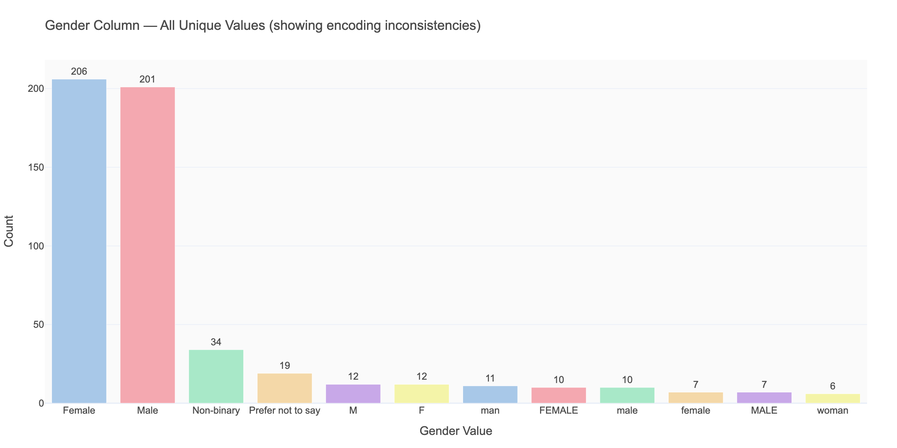
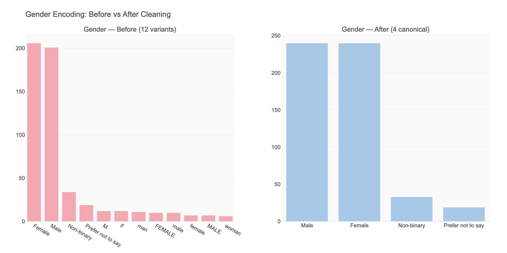

The gender column had **75 rows** using non-standard encodings: "M", "male", "MALE", "man" for Male; "F", "female", "FEMALE", "woman" for Female. This is a common issue when survey data is collected across multiple forms or entered manually.

**Decision:** Standardized to four canonical values: `Male`, `Female`, `Non-binary`, `Prefer not to say`.

**So what?** Without standardization, any group-by analysis on gender would produce 12 small groups instead of 4, making comparisons meaningless.

---

### 2.4 `major`
**Type:** String | **Issues:** None  
10 academic majors, cleanly encoded. Most common: Business (14%), Computer Science (15%), Biology (11%).

---

### 2.5 `year_in_school`
**Type:** Float (raw) → Int (clean) | **Issues:** None in values, minor type conversion  
Values 1–4 representing academic year. Converted to integer. No outliers.

---

### 2.6 `gpa`
**Type:** Object/mixed (raw) → Float (clean) | **Issues:** 8 out-of-range + 42 missing

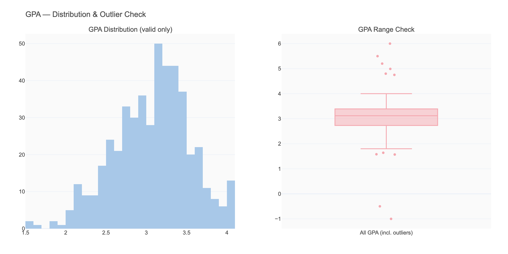
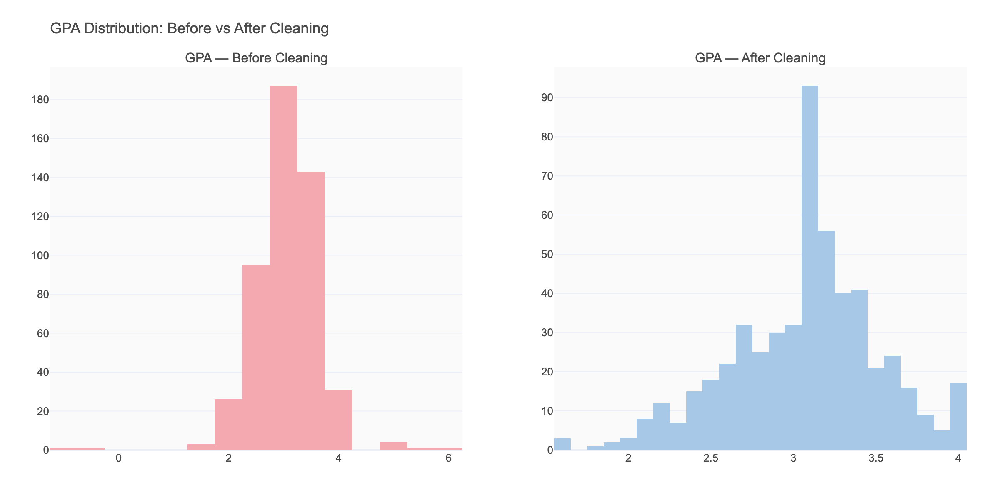

**Out-of-range values found:** -1.0, -0.5, 4.75, 4.8, 4.99, 5.2, 5.5, 6.0  
The US GPA scale is 0.0–4.0. Values slightly above 4.0 (≤4.3) were capped at 4.0 (rounding errors). Values clearly wrong (>4.3) were set to NaN.

**Missing:** 42 rows (7.9%). Imputed with median GPA of **3.12**.

**Key stat (clean):** Mean GPA = 3.12, Std = 0.45, range 1.5–4.0.

---

### 2.7 `study_hours_per_day`
**Type:** Float | **Issues:** 5 impossible values

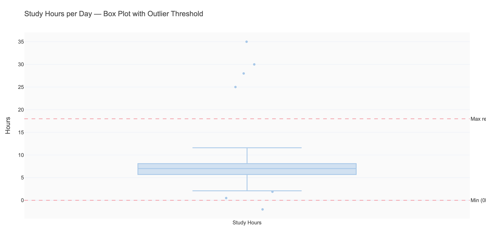

Values found: -2, 25, 28, 30, 35 hours/day — physically impossible (max possible waking hours ≈ 18).  
**Decision:** All set to NaN, imputed with median of **7.0 hours/day**.

---

### 2.8 `attendance_rate`
**Type:** Float | **Issues:** 10 values > 100%

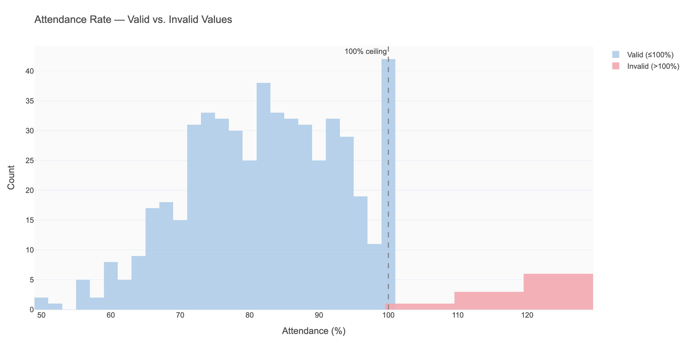

Percentages cannot exceed 100%. Values ranged from 103% to 126%. Capped at 100%.

---

### 2.9 `sleep_hours_per_night`
**Type:** Object/mixed → Float | **Issues:** 4 impossible + 53 missing

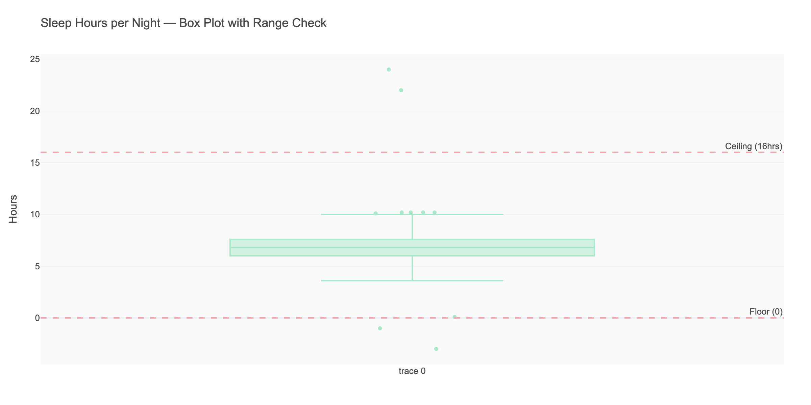
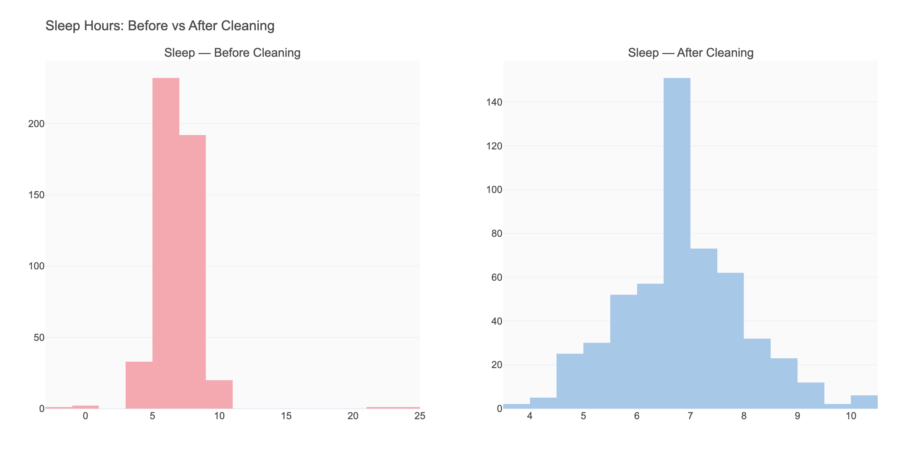

**Impossible values:** -3, -1, 22, 24 hours. All set to NaN.  
**Missing:** 53 rows (9.9%). Combined with impossible → 58 total imputed with median **6.8 hours**.

**Key concern:** ~6.8 hrs is below the recommended 7–9 hrs for adults. This will be a key analysis variable.

---

### 2.10 `exercise_days_per_week`
**Type:** Object → Float | **Issues:** 32 missing (6%)  
Valid range 0–7. No out-of-range values. Imputed with median of **3.0 days/week**.

---

### 2.11 `screen_time_hours`
**Type:** Float | **Issues:** None  
Range 1–16 hours/day. No invalid values.

---

### 2.12 `social_media_hours`
**Type:** Float | **Issues:** None  
Correlated with screen_time as expected (subset of total screen time).

---

### 2.13 `caffeine_mg_per_day`
**Type:** Object → Float | **Issues:** 37 missing (6.9%)  
Valid range 0–700 mg. Imputed with median of **189 mg/day** (roughly 1.5 cups of coffee).

---

### 2.14 `stress_level`
**Type:** Mixed object (numeric + text) | **Issues:** 20 text labels

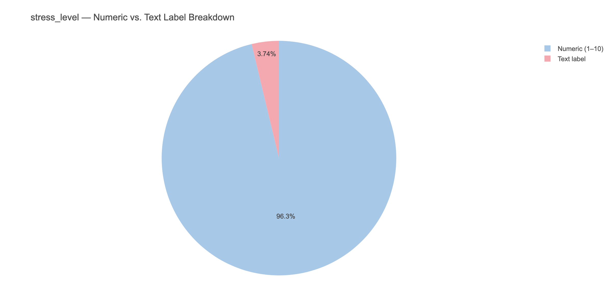

**Critical issue:** 20 entries used text labels ("low", "medium", "high", "very high") instead of numeric 1–10 scale. These were mapped: low→2.5, medium→5.0, high→7.5, very high→9.5, then the column converted to float.

**Decision rationale:** The numeric mappings approximate the midpoint of what each label likely represents on a 1–10 scale.

---

### 2.15 `anxiety_score`
**Type:** Object → Float | **Issues:** 69 missing (12.9%)  
GAD-7 scale, range 0–21. No out-of-range values. Imputed with median of **6.0** (mild anxiety threshold is 5+).

---

### 2.16 `depression_score`
**Type:** Object → Float | **Issues:** 69 missing (12.9%)  
PHQ-9 scale, range 0–27. No out-of-range values. Imputed with median of **5.0** (mild depression threshold is 5+).

**Note:** anxiety and depression missing values may not be random — students with more severe symptoms might be less likely to complete these questions. This is a form of non-random missingness that could introduce bias.

---

### 2.17 `life_satisfaction`
**Type:** Float | **Issues:** None  
1–10 scale. No invalid values.

---

### 2.18 `num_clubs`
**Type:** Object → Float | **Issues:** 21 missing (3.9%)  
Imputed with median of **3.0 clubs**.

---

### 2.19 `on_campus`
**Type:** Mixed object → Boolean | **Issues:** 60 rows with inconsistent encoding

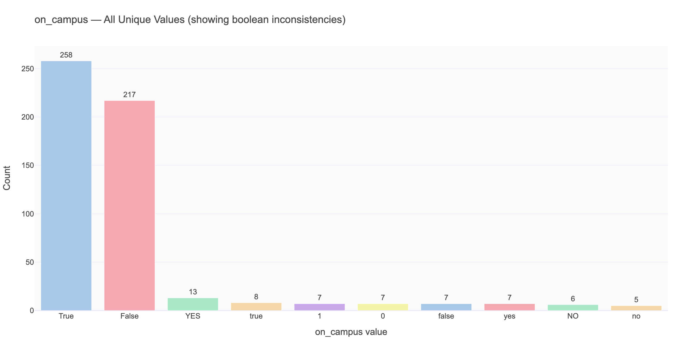

**10 unique variants found:** True, False, 1, 0, yes, YES, no, NO, true, false.  
Standardized to Python boolean: all truthy variants → True, falsy → False.

---

### 2.20 `has_part_time_job`
**Type:** String | **Issues:** 26 missing (4.9%)  
Imputed with mode: **"No"** (58% of students don't have a part-time job).

---

### 2.21 `monthly_spending`
**Type:** Object → Float | **Issues:** 48 missing (9%)  
Range $200–$2000. Imputed with median of **$814.60/month**.

---

## 3. Cleaning Decision Log

| # | Column | Issue | Decision | Rationale |
|---|--------|-------|----------|-----------|
| 1 | ALL | 3 duplicate rows | Dropped | Exact duplicates add no information |
| 2 | age | 6 impossible values (0, -3, 5, 150, 200, 999) | → NaN → median imputation (21) | No valid interpretation possible |
| 3 | gpa | 8 out-of-range values | Values ≤4.3 → capped at 4.0; >4.3 → NaN → median (3.12) | Minor overage = rounding; large overage = error |
| 4 | study_hours_per_day | 5 impossible values (25–35) | → NaN → median (7.0) | Cannot physically study 25+ hrs/day |
| 5 | sleep_hours_per_night | 4 impossible + 53 missing | → NaN → median (6.8) | Negative sleep is impossible |
| 6 | attendance_rate | 10 values > 100% | Capped at 100% | Percentage cannot exceed 100 |
| 7 | gender | 75 inconsistent encodings | Standardized to 4 canonical values | Required for any group-level analysis |
| 8 | stress_level | 20 text labels mixed with numeric | Mapped to numeric midpoints | Preserves ordinal information |
| 9 | on_campus | 60 mixed boolean representations | Standardized to True/False | Required for boolean operations |
| 10 | 9 columns | Missing values | Median imputation (numeric), mode (categorical) | Preserves distribution shape |

---

## 4. Key Questions Raised

1. **Are anxiety/depression missing values random?** The 12.9% missingness in both mental health scores may reflect response bias — students with more severe symptoms may be less likely to answer. This could underestimate the true prevalence.

2. **Is median imputation appropriate for GPA?** Imputing 7.9% of GPA values with the median (3.12) may compress variance and reduce the signal in GPA-related analyses. A sensitivity analysis comparing imputed vs. listwise deletion would be valuable.

3. **Does the stress_level text-to-numeric mapping introduce error?** The mapping "high" → 7.5 is an assumption. Some students who wrote "high" might have scored themselves as 9 or 10 on a numeric scale.

4. **What drives the bimodal look in screen time?** The screen_time distribution appears to have two bumps. Could this reflect a split between students who primarily use screens for social media vs. those who use them for work/studying?

---

## 5. Missing Values Summary Chart

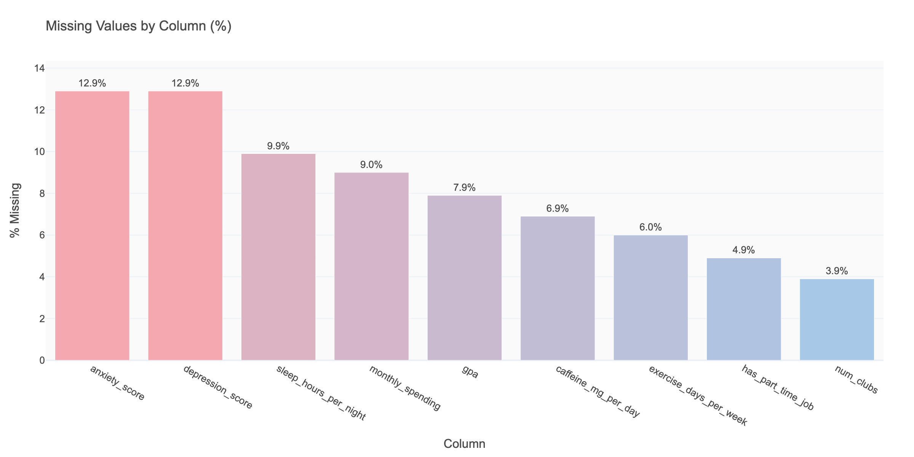
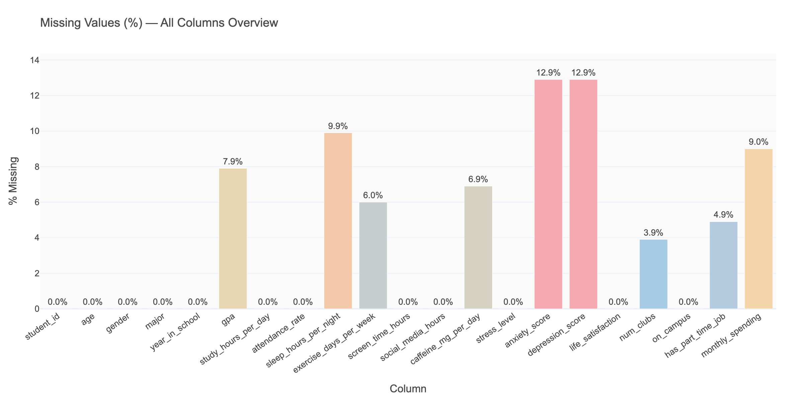

---

## 6. What to Take Into Phase 1

- Use `dataset/student_wellness_clean.csv` for all subsequent analysis
- Mental health scores (anxiety, depression) may be slightly underestimated due to missing data patterns
- Stress_level numeric values for the 20 imputed text entries should be interpreted with caution
- The cleaned dataset has **532 rows, 21 columns, 0 missing values, all consistent types**
