# Phase 1: Univariate Bootstrap Report

**Dataset:** `dataset/student_wellness_clean.csv` (532 rows, 21 columns)  
**Date:** 2026-04-11

---

## Overview

This phase describes every variable individually before examining any relationships. The goal is to understand the shape, spread, and character of each column in isolation. Key statistics for numeric variables are: mean, median, standard deviation, skewness, and kurtosis. Categorical variables are summarized by frequency and proportion.

---

## Numeric Variables

### Age
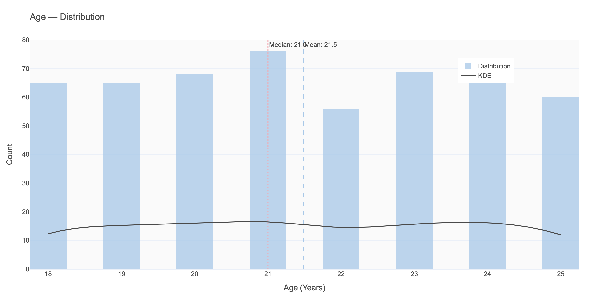
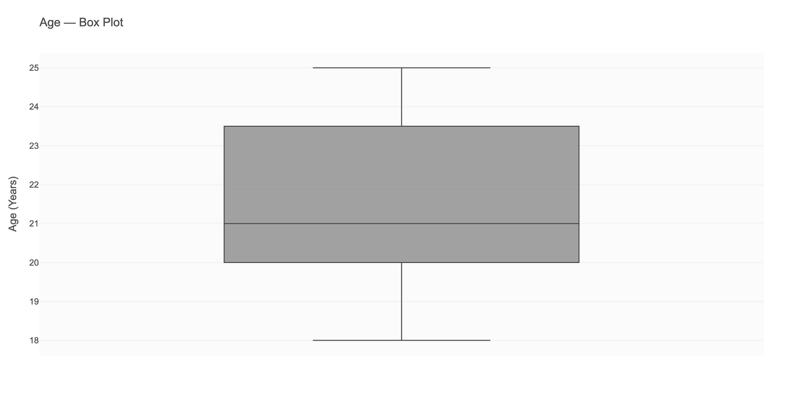

| Stat | Value |
|------|-------|
| Mean | 21.49 |
| Median | 21.0 |
| Std | 2.27 |
| Range | 18–25 |
| Skewness | 0.00 (symmetric) |

**Shape:** Perfectly symmetric and nearly uniform — students are roughly evenly distributed from age 18 to 25, as expected. No remaining outliers after Phase 0 cleaning.

**So what?** Age alone is not very informative (narrow range), but the near-uniform distribution means we can use it as a control variable without worrying about age dominating any analysis.

---

### GPA
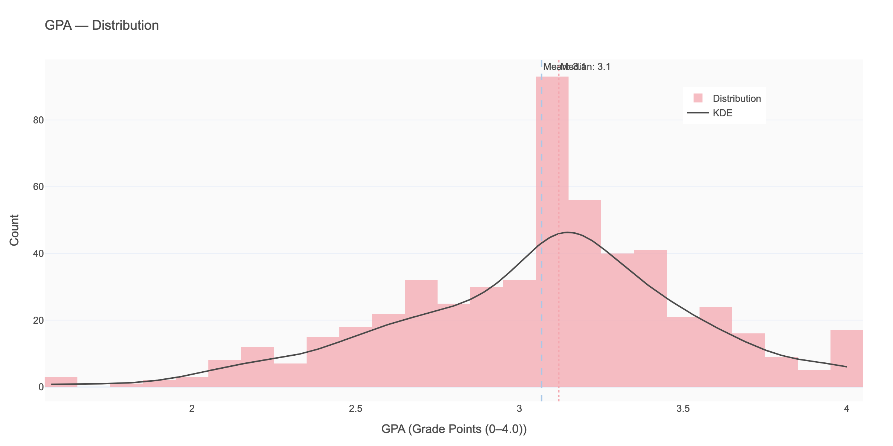
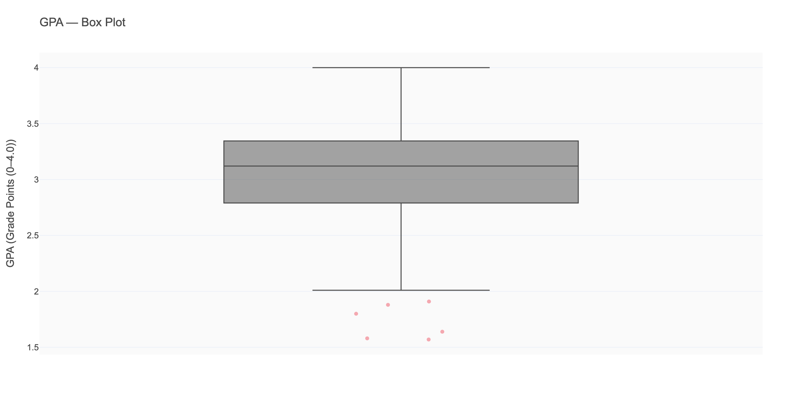

| Stat | Value |
|------|-------|
| Mean | 3.07 |
| Median | 3.12 |
| Std | 0.45 |
| Range | 1.57–4.00 |
| Skewness | -0.38 (slightly left-skewed) |

**Shape:** Approximately normal with a slight left skew — the tail extends toward lower GPAs, meaning a minority of students are performing significantly below average. Most students cluster between 2.7 and 3.7.

**So what?** The GPA distribution suggests a fairly typical academic performance distribution. The left skew tells us that underperformance (not overperformance) is the more extreme case in this population.

---

### Study Hours per Day
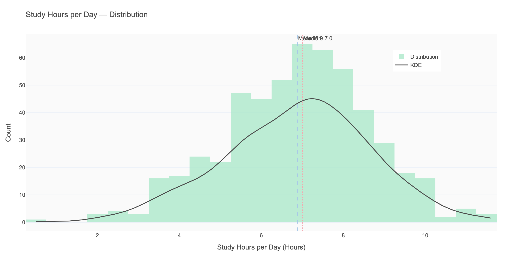

| Stat | Value |
|------|-------|
| Mean | 6.88 |
| Median | 7.0 |
| Std | 1.79 |
| Range | 0.5–11.6 |
| Skewness | -0.23 (symmetric) |

**Shape:** Near-normal, slightly left-skewed. Most students study between 5 and 9 hours per day. The minimum (0.5 hrs) represents students who barely study; the maximum (11.6 hrs) suggests highly dedicated or overwhelmed students.

---

### Attendance Rate
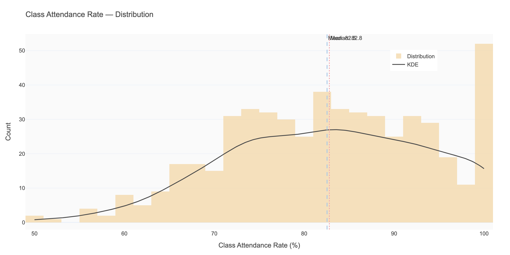

| Stat | Value |
|------|-------|
| Mean | 82.5% |
| Median | 82.8% |
| Std | 11.2% |
| Range | 50–100% |

**Shape:** Slightly left-skewed with a floor at 50% (no student below 50%) and ceiling at 100% (post-cleaning). The distribution is roughly bell-shaped centered around 83%.

**So what?** A meaningful portion of students fall below 75% attendance (commonly the academic warning threshold). This variable may interact with GPA.

---

### Sleep Hours per Night
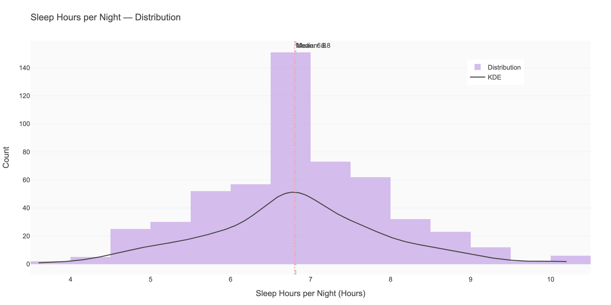
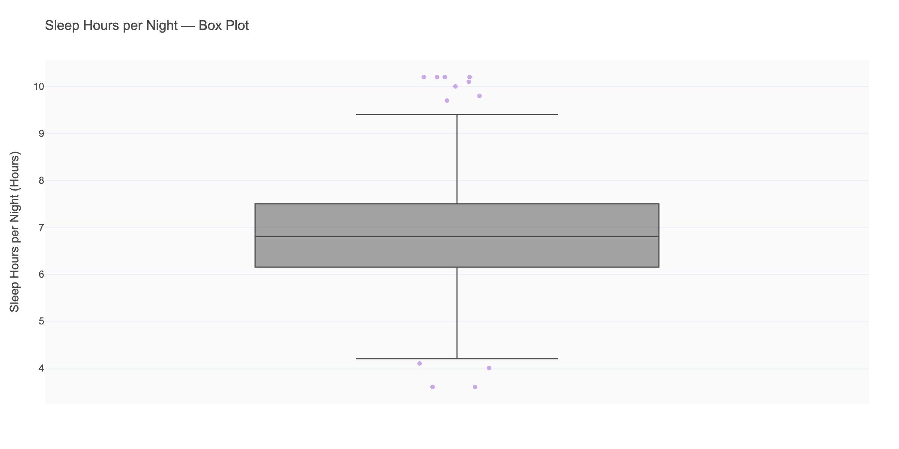

| Stat | Value |
|------|-------|
| Mean | 6.81 |
| Median | 6.80 |
| Std | 1.13 |
| Range | 3.6–10.2 |
| Skewness | 0.15 (symmetric) |

**Shape:** Approximately normal, centered at 6.8 hours. The recommended sleep for adults is 7–9 hours — **the average student in this dataset sleeps slightly below the recommended minimum.**

**So what?** This is a critical finding for wellbeing analysis. The distribution peak is at ~6.8 hrs, meaning the typical student is sleep-deprived by clinical standards. Students sleeping 7+ hours will be a meaningful comparison group.

---

### Exercise Days per Week
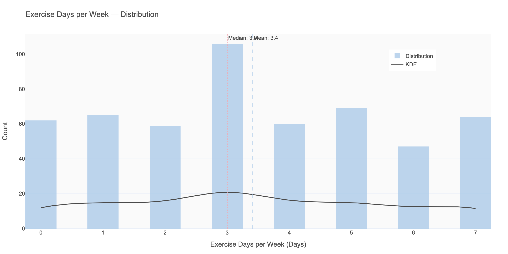

| Stat | Value |
|------|-------|
| Mean | 3.41 |
| Median | 3.0 |
| Std | 2.20 |
| Range | 0–7 |

**Shape:** Nearly uniform across 0–7 days — students are spread across the full range of exercise frequency. This wide spread is analytically useful for comparing groups.

---

### Screen Time (Daily)

| Stat | Value |
|------|-------|
| Mean | 7.56 |
| Median | 7.6 |
| Std | 2.01 |
| Range | 1.4–14.4 |

**Shape:** Near-normal and symmetric. **Average daily screen time is 7.56 hours — nearly as many hours as sleep.** The range (1.4–14.4) shows enormous variation across students.

**So what?** High screen time combined with low sleep creates a meaningful tension. Students with 10+ hours of screen time and <6 hours of sleep form an interesting at-risk subgroup.

---

### Social Media Hours

| Stat | Value |
|------|-------|
| Mean | 2.55 |
| Median | 2.5 |
| Std | 1.19 |
| Range | 0–6.1 |

**Shape:** Near-normal. Social media accounts for roughly **34% of total screen time** on average (2.55 of 7.56 hours).

---

### Caffeine Intake
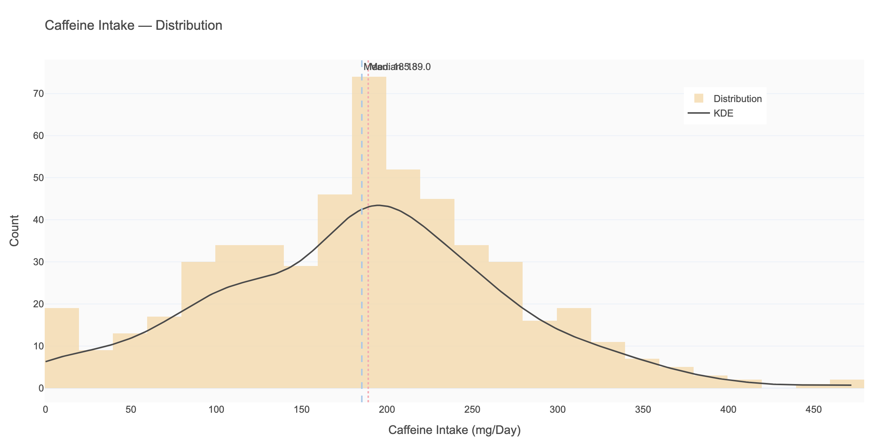

| Stat | Value |
|------|-------|
| Mean | 185 mg |
| Median | 189 mg |
| Std | 86 mg |
| Range | 0–472 mg |

**Shape:** Near-normal. The mean of 185 mg ≈ 1.5 standard cups of coffee. The maximum (472 mg) approaches the FDA's recommended daily limit (400 mg for adults).

---

### Stress Level (Self-Report, 1–10)
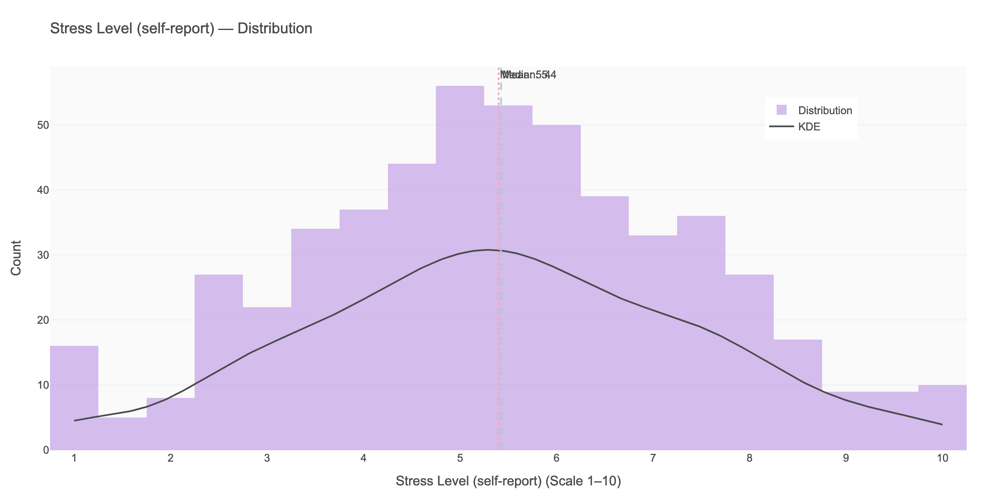

| Stat | Value |
|------|-------|
| Mean | 5.43 |
| Median | 5.4 |
| Std | 2.03 |
| Range | 1–10 |

**Shape:** Symmetric, full range utilized. The mean of 5.4 places the average student in the "moderate stress" range. Note: 20 values were imputed from text labels in Phase 0.

---

### Anxiety Score (GAD-7, 0–21)
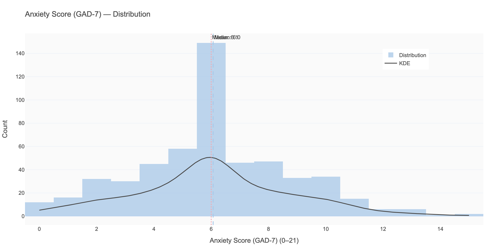

| Stat | Value |
|------|-------|
| Mean | 6.07 |
| Median | 6.0 |
| Std | 2.76 |
| Range | 0–15 |

**Shape:** Near-normal. **GAD-7 scores of 5–9 indicate mild anxiety.** The mean of 6.07 suggests the average student experiences mild-to-moderate anxiety. Clinical cutoff for moderate anxiety is ≥10 — a non-trivial portion of students likely exceed this.

---

### Depression Score (PHQ-9, 0–27)
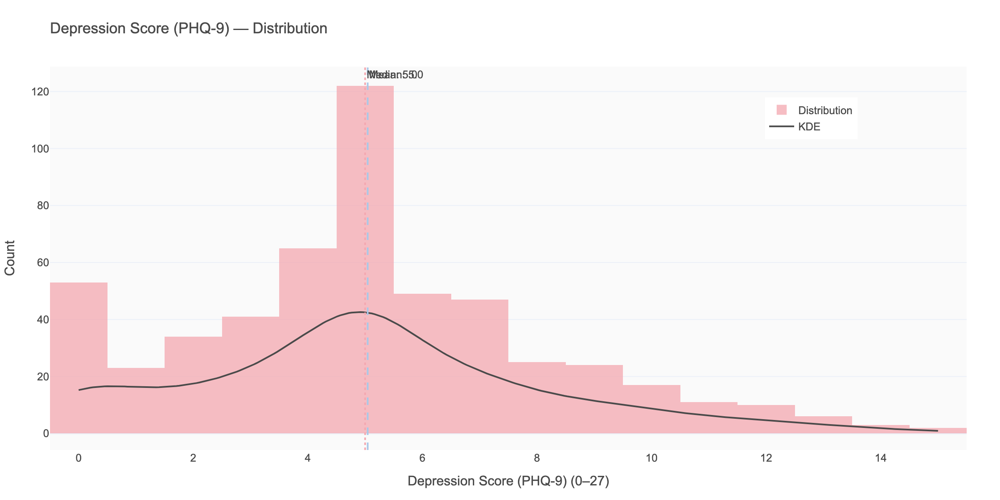

| Stat | Value |
|------|-------|
| Mean | 5.05 |
| Median | 5.0 |
| Std | 3.13 |

**Shape:** Slightly right-skewed. PHQ-9 mild depression threshold: 5–9. The mean (5.05) sits right at the mild threshold, with the skew suggesting a subset of students with moderate-to-severe scores.

---

### Life Satisfaction (1–10)

| Stat | Value |
|------|-------|
| Mean | 5.43 |
| Median | 5.4 |
| Std | 2.36 |

**Shape:** Symmetric and nearly uniform. Notably, life satisfaction (mean 5.43) mirrors stress level (mean 5.43) almost exactly — a negative correlation between the two is expected and worth testing.

---

### Monthly Spending
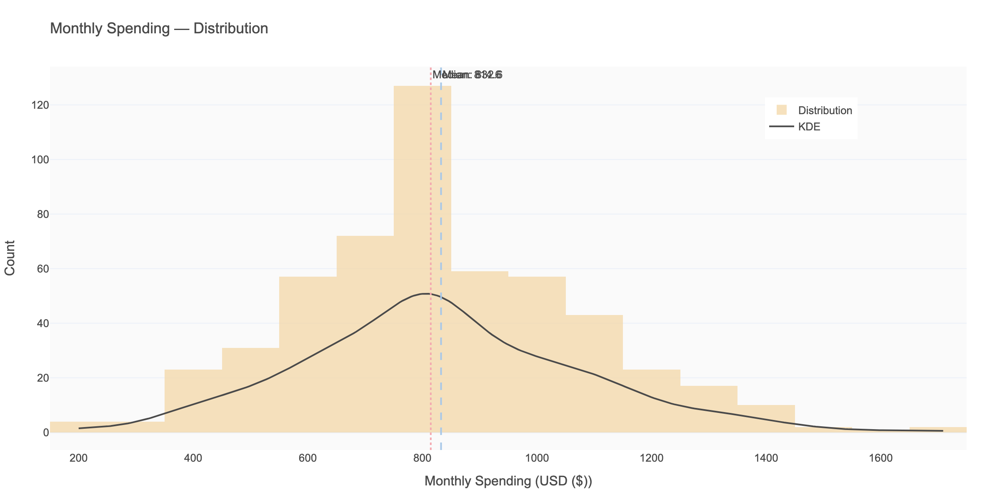

| Stat | Value |
|------|-------|
| Mean | $832 |
| Median | $815 |
| Std | $245 |
| Range | $200–$1,709 |

**Shape:** Slightly right-skewed, with a meaningful upper tail. The range suggests significant financial heterogeneity across students.

---

## Categorical Variables

### Gender Identity
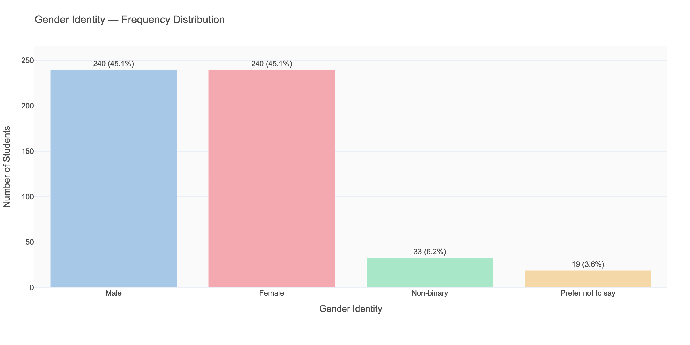

| Value | Count | % |
|-------|-------|---|
| Male | 240 | 45.1% |
| Female | 240 | 45.1% |
| Non-binary | 33 | 6.2% |
| Prefer not to say | 19 | 3.6% |

**So what?** The sample is well-balanced between male and female students. Non-binary and undisclosed represent ~10% — large enough to be analytically present but small enough to warrant caution in subgroup comparisons.

---

### Academic Major
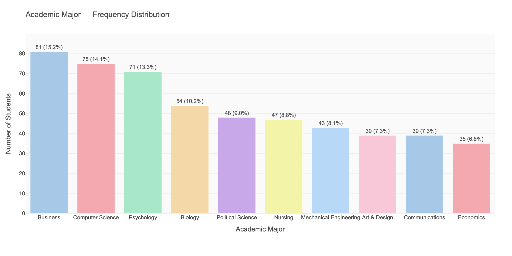

| Major | Count | % |
|-------|-------|---|
| Business | 81 | 15.2% |
| Computer Science | 75 | 14.1% |
| Psychology | 71 | 13.3% |
| Biology | 54 | 10.2% |
| Nursing | 47 | 8.8% |
| Mechanical Engineering | 43 | 8.1% |
| Art & Design | 39 | 7.3% |
| Communications | 39 | 7.3% |
| Economics | 35 | 6.6% |
| Political Science | 48 | 9.0% |

**So what?** STEM-heavy majors (CS, Biology, Nursing, MechEng) together account for ~41% of the sample. Stress and GPA comparisons between STEM and non-STEM groups will be meaningful.

---

### Year in School
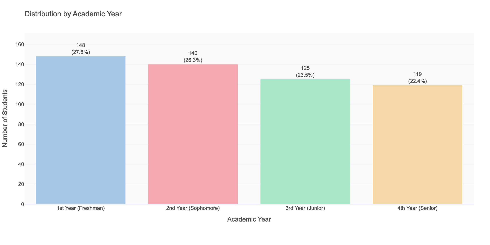

| Year | Count | % |
|------|-------|---|
| 1st Year | 148 | 27.8% |
| 2nd Year | 140 | 26.3% |
| 3rd Year | 125 | 23.5% |
| 4th Year | 119 | 22.4% |

**So what?** Well-balanced across all four years. First-year students may show different stress and performance patterns — worth examining in Phase 3.

---

### Part-Time Job
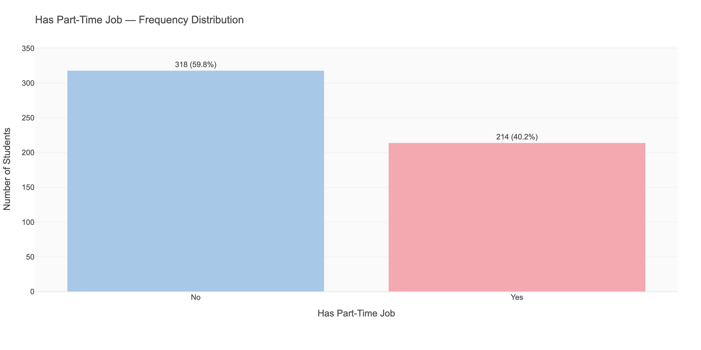

| Value | Count | % |
|-------|-------|---|
| No | 318 | 59.8% |
| Yes | 214 | 40.2% |

**So what?** 40% of students hold part-time jobs — a large enough group for meaningful comparison. Students with jobs likely have less study time, but the relationship with GPA may be complex.

---

### Living Situation (On/Off Campus)
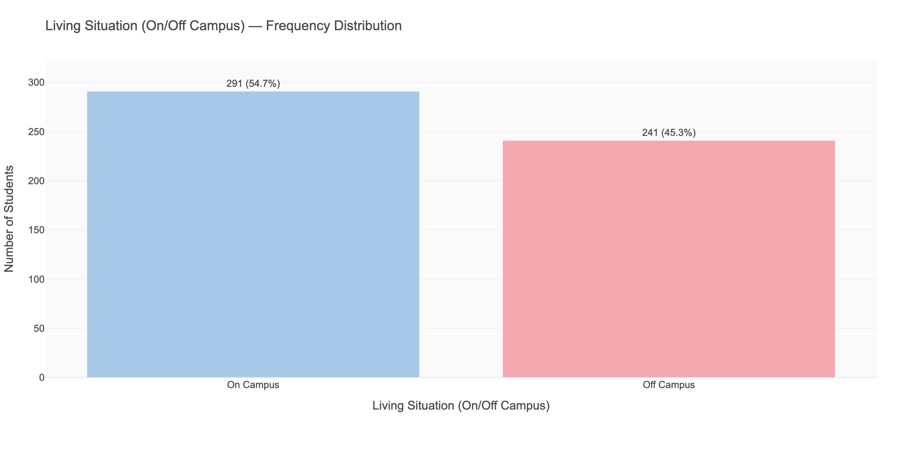

| Value | Count | % |
|-------|-------|---|
| On Campus | 291 | 54.7% |
| Off Campus | 241 | 45.3% |

---

## Phase 1 Summary

| Variable | Key Takeaway |
|----------|-------------|
| GPA | Left-skewed; minority of very low performers pulling the mean down |
| Sleep | **Mean 6.81 hrs — below recommended minimum; a key wellness concern** |
| Screen time | **Mean 7.56 hrs/day — rivals sleep duration; large spread** |
| Stress level | Mean 5.4/10 — moderate stress is the norm |
| Anxiety (GAD-7) | Mean 6.07 — mild anxiety threshold for the average student |
| Depression (PHQ-9) | Mean 5.05 — sits right at mild symptom threshold |
| Exercise | Wide uniform spread — good for comparison groups |
| Life satisfaction | Mean 5.43 — mirrors stress inversely |
| Major | STEM disciplines well-represented (41% combined) |
| Part-time job | 40% hold jobs — large enough for comparison |

**Three variables stand out as analytically richest for Phase 2:**
1. `sleep_hours_per_night` — below clinical recommendations, high variance
2. `screen_time_hours` — enormous daily commitment, wide range
3. `stress_level` — the central wellness axis

These will anchor the hypothesis generation in Phase 2.
