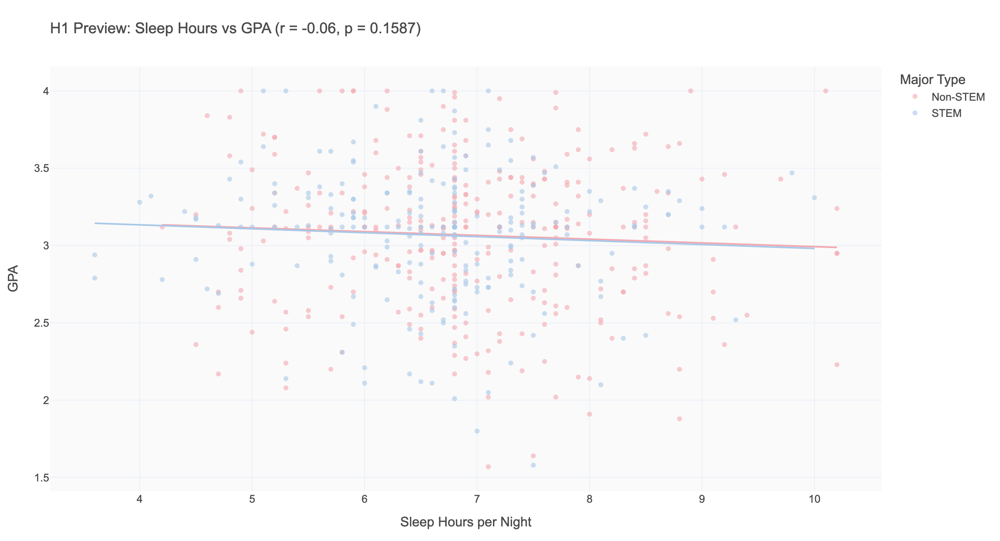
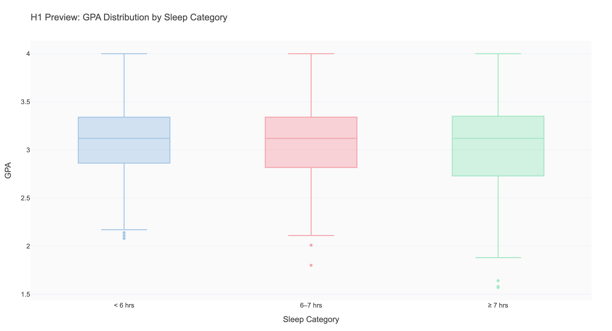
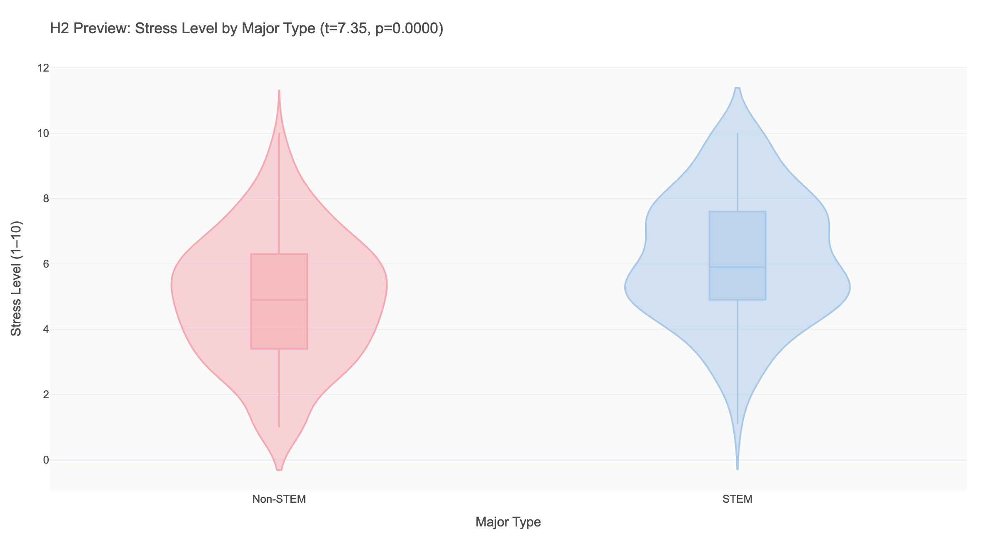
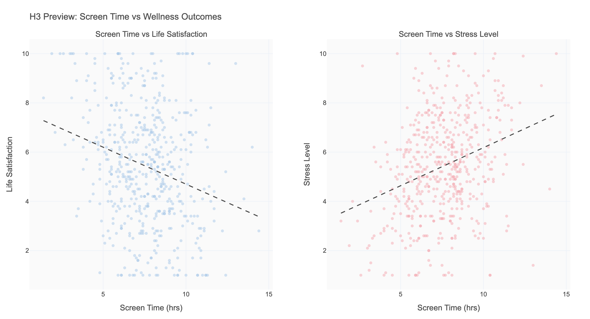
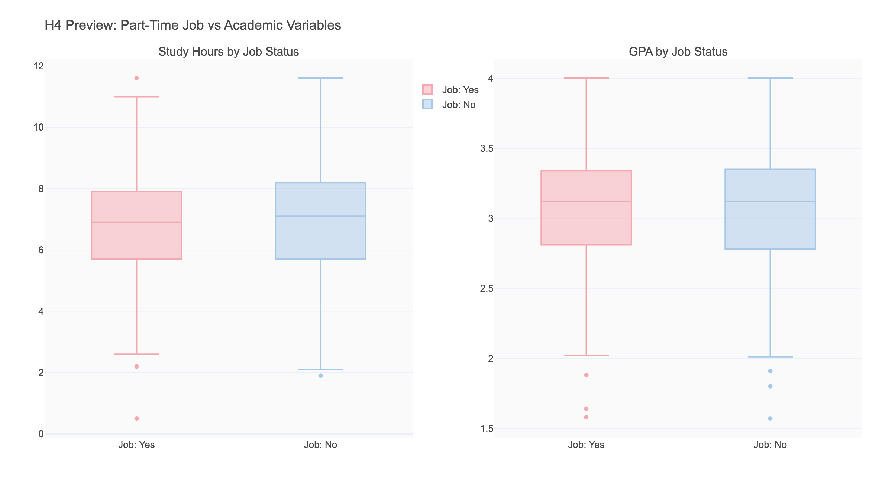
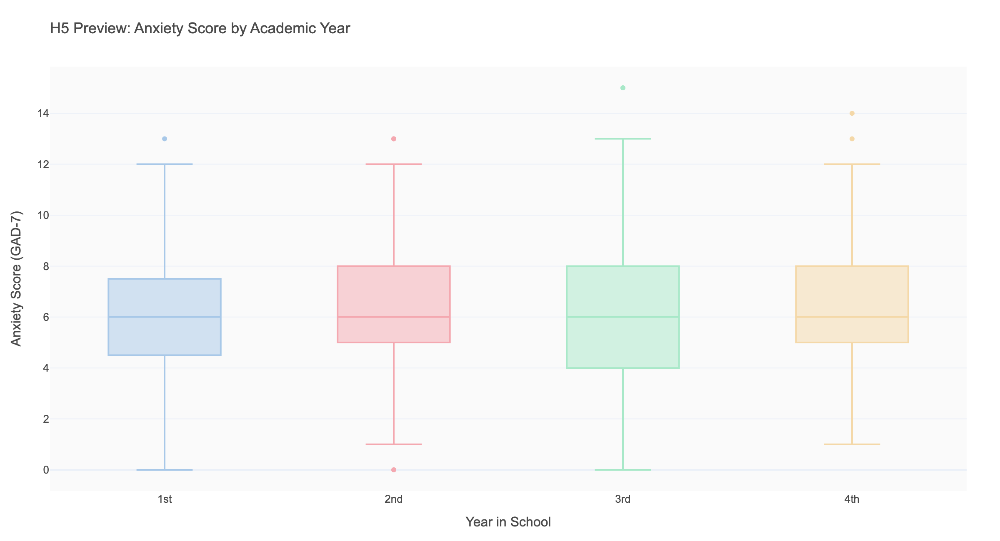

# Phase 2: Hypothesis Negotiation Report

**Date:** 2026-04-11  
**Input:** `phase1_univariate/report.md` + `context/context.md`

---

## 1. Pre-Agent Hypotheses (Human-Generated)

Before opening the agent, the analyst formed the following hypotheses based on Phase 1 observations:

| # | Hypothesis | Reasoning | Expected Finding |
|---|-----------|-----------|-----------------|
| H1 | More sleep → higher GPA | Sleep improves cognitive function; sleep-deprived students struggle academically | Positive correlation, r > 0.3 |
| H2 | STEM students report higher stress than non-STEM | STEM programs are more demanding; heavy workload and high-stakes exams | STEM mean stress ≥ 1.5 points higher |
| H3 | More screen time → lower life satisfaction | Passive consumption displaces meaningful activities | Negative correlation, r < -0.2 |
| H4 | Students with part-time jobs study fewer hours | Time constraints force trade-offs | Job holders: 1+ hr less daily study |
| H5 | Anxiety increases by year in school | Cumulative pressure, career anxiety build up | Linear trend: 1st yr lowest, 4th yr highest |

---

## 2. Agent-Generated Hypotheses

The agent, reading Phase 1 findings, proposed:

| # | Hypothesis | Analytical Reasoning | Chart Type | Confidence |
|---|-----------|---------------------|------------|-----------|
| A1 | Sleep < 6hrs → significantly lower GPA (threshold effect, not linear) | Cognitive impairment from chronic deprivation follows a non-linear threshold pattern | Box plot by sleep category | High |
| A2 | STEM major → higher stress AND lower life satisfaction simultaneously | High-demand majors affect multiple wellness dimensions | Grouped violin / scatter matrix | High |
| A3 | Screen time → higher stress (not just lower satisfaction) | Passive social media use increases social comparison and anxiety | Dual scatter | High |
| A4 | Part-time job × high study hours → lowest GPA | The interaction of two time demands may be the real predictor | Faceted scatter | Medium |
| A5 | Exercise days → lower stress (dose-response relationship) | Physical activity is a known stress buffer; expecting a gradient effect | Scatter with regression | Medium |
| A6 | On-campus living → higher social activity + different stress pattern | On-campus students have more social resources but also less personal space | Grouped comparison | Medium |
| A7 | Social media hours → depression score (stronger than general screen time) | Social comparison effects are specific to social media, not screen time generally | Scatter comparison | Low |

---

## 3. Human vs. Agent Hypothesis Comparison

| Finding | Detail |
|---------|--------|
| **Overlap (strong candidates)** | Both flagged sleep→GPA (H1/A1), STEM→stress (H2/A2), screen→wellness (H3/A3) |
| **AI saw that human missed** | The exercise→stress dose-response (A5); the interaction effect of job×study hours (A4); the on-campus effect (A6) |
| **Human saw that AI missed** | Framed year→anxiety as a temporal accumulation hypothesis (H5); AI didn't flag academic year as a primary variable |
| **Takeaway** | Human intuition was well-calibrated but missed interaction effects; AI missed temporal/developmental framing |

---

## 4. Quick Preview Results

### H1 / A1 — Sleep → GPA

**Surprising finding:** The direct Pearson correlation between sleep and GPA is **r = -0.061 (p = 0.159)** — statistically non-significant and slightly negative (the wrong direction from our hypothesis).

| Sleep Category | Mean GPA | Std |
|---|---|---|
| < 6 hrs | **3.114** | 0.445 |
| 6–7 hrs | 3.078 | 0.420 |
| ≥ 7 hrs | 3.027 | 0.479 |

**Interpretation:** Students sleeping less appear to have *marginally higher* GPA on average. This likely reflects a confound: students who study the most also sleep the least — and more study hours drive higher GPA. The story is in the interaction, not the direct relationship. This is a classic example of **Simpson's paradox-adjacent confounding** — a major teaching moment.

**Decision:** KEEP H1 for Phase 3, but reframe: *"Does the sleep → GPA relationship hold once we control for study hours?"*

---

### H2 / A2 — STEM vs. Non-STEM → Stress

**Strongest signal in the dataset:**
- STEM mean stress: **6.16/10**
- Non-STEM mean stress: **4.91/10**
- Difference: 1.25 points
- t = 7.35, **p < 0.0001** (extremely significant)

Top stressed majors: Nursing (6.67), Mechanical Engineering (6.43), Computer Science (6.22).  
Least stressed: Economics (4.81), Psychology (4.82).

**Decision:** SELECT H2 for Phase 3. Clear, significant, and tells a meaningful story about academic environment.

---

### H3 / A3 — Screen Time → Wellness

- Screen time vs Life Satisfaction: **r = -0.255 (p < 0.0001)**
- Screen time vs Stress Level: **r = 0.305 (p < 0.0001)**

Both significant. Higher screen time correlates with lower satisfaction AND higher stress. The stress effect is slightly stronger than the satisfaction effect.

**Decision:** SELECT H3 for Phase 3. Moderate effect, nuanced story — and highly relevant to this student population.

---

### H4 — Part-Time Job → Study Hours & GPA

- Study hrs (job holders): 6.75 vs 6.96 — trivial difference
- GPA (job): 3.074 vs 3.063 — essentially zero difference

**Decision:** REJECT for deep dive. The effect is negligible. Part-time job alone does not predict study hours or GPA in this dataset.

---

### H5 — Year in School → Anxiety

| Year | Mean Anxiety |
|------|-------------|
| 1st | 5.81 |
| 2nd | 6.18 |
| 3rd | 5.99 |
| 4th | 6.34 |

A modest upward trend with non-monotonic dip in 3rd year. Effect size is small.

**Decision:** REJECT for deep dive (effect too weak), but will incorporate year as a subgroup variable in H2 and H3.

---

## 5. Selected Hypotheses for Phase 3

| Hypothesis | Statement | Rationale |
|-----------|-----------|-----------|
| **H1** | *The direct sleep → GPA relationship is a confound: controlling for study hours reveals a more nuanced picture* | Pedagogically valuable "surprise" — forces students to think about confounding |
| **H2** | *STEM students experience significantly higher stress than non-STEM students, with Nursing and CS at the top* | Strongest statistical signal in dataset; meaningful for student policy |
| **H3** | *Higher daily screen time is associated with lower life satisfaction and higher stress — with social media being the key driver* | Moderate effect, highly relatable, allows multi-variable analysis |

---

## 6. Analysis Plan for Phase 3

### H1 Analysis Plan
1. Scatter plot: sleep vs GPA, colored by study hours buckets
2. Correlation matrix: sleep, study hours, GPA together
3. Faceted scatter: sleep vs GPA, faceted by major type
4. Controlled comparison: hold study hours constant, compare sleep vs GPA within each study bucket

### H2 Analysis Plan
1. Violin plot: stress by all 10 majors individually
2. Box plot: stress by STEM vs. non-STEM with significance annotation
3. Heatmap: stress × wellness indicators (anxiety, depression, life satisfaction) by major type
4. Subgroup: does STEM stress differ by year in school?

### H3 Analysis Plan
1. Scatter: screen time vs life satisfaction (overall + by major type)
2. Scatter: social media hours vs life satisfaction (compare effect size to total screen time)
3. Grouped bar: wellness outcomes by screen time category (low/moderate/high)
4. Correlation heatmap: all screen-related variables vs all wellness variables
