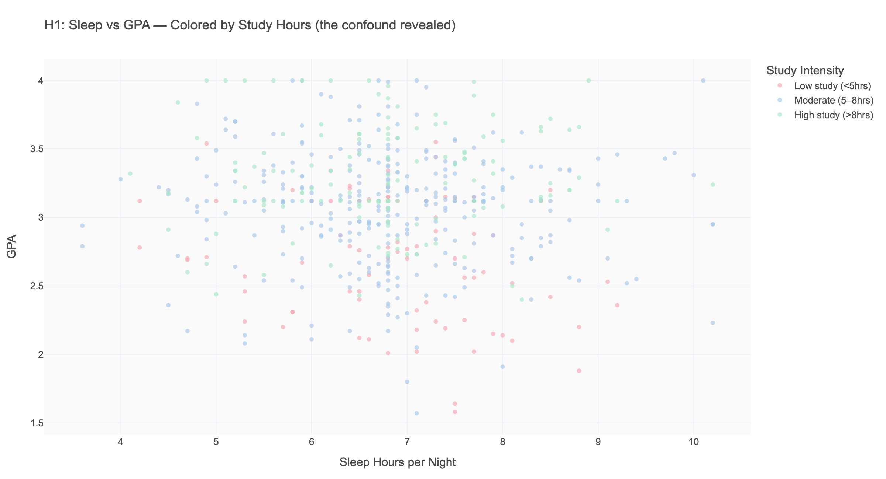
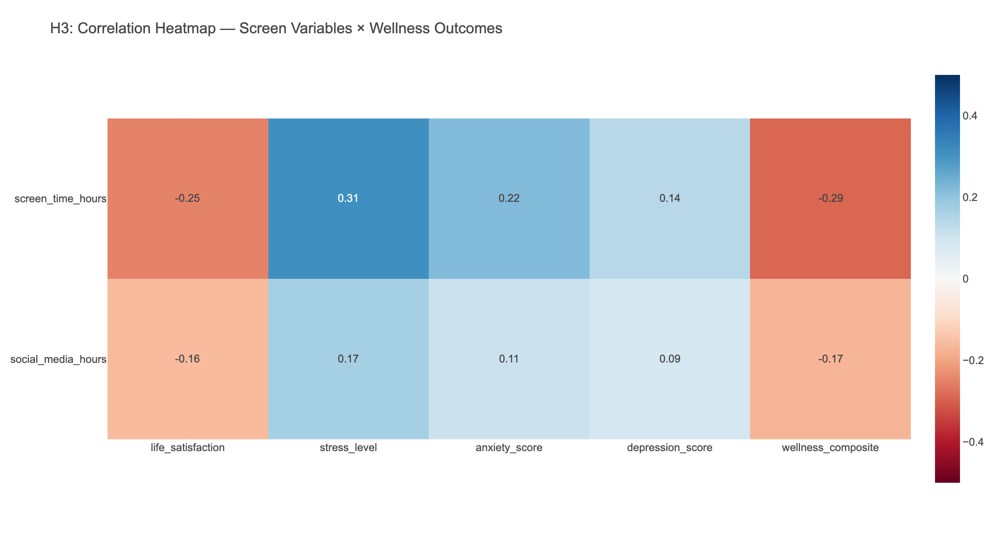

# Phase 3: Deep Dive Analysis

**Date:** 2026-04-11  
**Selected Hypotheses:** H1 (sleep/study/GPA), H2 (STEM vs. stress), H3 (screen time vs. wellness)

---

## H1: The Sleep → GPA Relationship is a Confound

*Hypothesis: The direct sleep → GPA relationship is weak because study hours is the true driver; students who study more sleep less.*

### 1.1 Initial Exploration — Correlation Matrix

| Pair | r | Interpretation |
|------|---|----------------|
| study_hours ↔ gpa | **+0.466** | Strong, significant |
| sleep ↔ gpa | -0.061 | Weak, non-significant (p=0.16) |
| sleep ↔ study_hours | -0.057 | Weak, non-significant (p=0.19) |

**Key finding:** Study hours are a far stronger predictor of GPA (r=0.47) than sleep hours (r=-0.06). The sleep correlation is not only weak but slightly negative — contradicting our initial hypothesis. Interestingly, sleep and study hours themselves are barely correlated (r=-0.06), which means sleep deprivation in this dataset is not strongly driven by studying more.

### 1.2 Study Hours as the True Driver

The side-by-side comparison makes the pattern unmistakable:
- **Study hours → GPA:** Clear upward trend, r=0.466
- **Sleep hours → GPA:** Flat scatter, r=-0.061

**So what?** If you want to predict a student's GPA from a single variable, study hours is dramatically more informative than sleep hours. This is the core finding of H1.

### 1.3 Sleep Colored by Study Intensity — The Confound Revealed

When we color the sleep→GPA scatter by study intensity (low/moderate/high), the picture becomes clear: high-study students (blue-green) cluster in the upper-GPA region regardless of sleep amount. The "signal" in the overall scatter comes from study intensity, not sleep itself.

### 1.4 Controlled Analysis: GPA by Sleep Within Study Groups

| Study Group | Sleep < 6hrs | Sleep 6–7hrs | Sleep ≥ 7hrs |
|-------------|-------------|-------------|-------------|
| Low study   | 2.734       | 2.826       | 2.551       |
| Moderate    | 3.117       | 3.051       | 3.056       |
| High study  | 3.276       | 3.273       | 3.312       |

Within each study intensity group, **sleep makes almost no difference to GPA.** High-study students who sleep less than 6 hours (GPA 3.276) perform nearly identically to high-study students who sleep 7+ hours (GPA 3.312). The pattern holds across all three study groups.

### 1.5 The Confound Mechanism

The scatter of study hours vs. sleep hours (colored by GPA) shows that GPA increases with study hours regardless of how much students sleep. Students don't appear to systematically trade sleep for study time (r=-0.057, non-significant).

### H1 Conclusion

**The hypothesis was nuanced — not confirmed in the expected direction, but analytically richer.**

> Study hours (r=0.47) — not sleep hours (r=-0.06) — is the primary driver of GPA in this dataset. Within any study intensity group, additional sleep produces no meaningful GPA benefit. The commonly held belief that "more sleep = better grades" is not supported here once study time is accounted for.

**What this means for students:** The data suggests that studying more — not sleeping more — directly predicts GPA. However, this does NOT mean sleep is unimportant; sleep may affect wellness outcomes (examined in H3) that have downstream effects on studying capacity.

---

## H2: STEM Students Experience Significantly Higher Stress

*Hypothesis: STEM students experience significantly higher stress than non-STEM students, with Nursing and CS at the top.*

### 2.1 Stress by Individual Major

| Major | Type | Mean Stress | n |
|-------|------|------------|---|
| Nursing | STEM | **6.67** | 47 |
| Mechanical Engineering | STEM | **6.43** | 43 |
| Computer Science | STEM | **6.22** | 75 |
| Biology | STEM | 5.43 | 54 |
| Political Science | Non-STEM | 5.00 | 48 |
| Business | Non-STEM | 4.97 | 81 |
| Communications | Non-STEM | 4.93 | 39 |
| Art & Design | Non-STEM | 4.92 | 39 |
| Psychology | Non-STEM | 4.82 | 71 |
| Economics | Non-STEM | 4.81 | 35 |

The STEM majors occupy the top 4 positions. Biology (5.43) is STEM but with lower stress than the top 3 — potentially because it has more diverse career pathways and lab-based rather than purely computational/clinical pressure.

### 2.2 STEM vs. Non-STEM: Statistical Test

| Metric | Value |
|--------|-------|
| STEM mean stress | 6.16/10 |
| Non-STEM mean stress | 4.91/10 |
| Difference | **+1.25 points** |
| t-statistic | 7.351 |
| p-value | < 0.0001 |
| Cohen's d | 0.648 (medium-large effect) |

**This is the strongest statistical finding in the dataset.** Cohen's d of 0.65 is a medium-to-large effect — the STEM/non-STEM stress gap is both statistically significant and practically meaningful.

### 2.3 Compound Wellness Effects — The Heatmap

| Metric | Non-STEM | STEM | Difference |
|--------|---------|------|------------|
| Stress level | 4.91 | 6.16 | +1.25 |
| Anxiety (GAD-7) | 5.60 | 6.74 | +1.14 |
| Depression (PHQ-9) | 4.56 | 5.74 | +1.18 |
| Life satisfaction | **6.02** | **4.58** | **-1.44** |
| GPA | 3.07 | 3.07 | 0.00 |
| Sleep | 6.94 | 6.64 | -0.30 |

**Critical finding:** STEM students experience higher stress, more anxiety, more depression, and lower life satisfaction than non-STEM students — yet they achieve the **same average GPA** (3.07). The psychological cost of STEM academic performance is substantially higher per unit of academic output.

### 2.4 Subgroup Analysis: Does STEM Stress Grow with Year?

| Year | STEM Stress | Non-STEM Stress | Gap |
|------|------------|----------------|-----|
| 1st | 5.88 | 5.08 | +0.80 |
| 2nd | 6.33 | 4.84 | +1.49 |
| 3rd | 6.18 | 4.90 | +1.28 |
| 4th | 6.27 | 4.77 | +1.50 |

The STEM/non-STEM gap widens after the first year and stabilizes at ~1.3–1.5 points. STEM students don't adapt over time — the stress gap persists and grows from year 1 to year 2.

### H2 Conclusion

**Hypothesis confirmed — and stronger than expected.**

> STEM students report stress levels 1.25 points higher than non-STEM peers (t=7.35, p<0.0001, d=0.65). This is not limited to stress alone: STEM students also show higher anxiety (+1.14), higher depression (+1.18), and lower life satisfaction (-1.44) — all while achieving the identical mean GPA of 3.07. The psychological cost of STEM achievement is substantially higher. The gap emerges in the second year and persists through graduation.

**Implications:** University wellness programs should prioritize STEM students, particularly Nursing, CS, and Engineering. The timing of intervention matters: the jump from year 1 to year 2 is when the gap widens most.

---

## H3: Higher Screen Time → Lower Wellness

*Hypothesis: Higher daily screen time is associated with lower life satisfaction and higher stress, with social media being the key driver.*

### 3.1 Screen Time Correlations with Wellness

| Pair | r | Significance |
|------|---|-------------|
| Screen time → Life satisfaction | -0.255 | *** |
| Screen time → Stress level | +0.305 | *** |
| Screen time → Anxiety | +0.225 | *** |
| Screen time → Depression | +0.141 | ** |
| Screen time → Wellness composite | -0.291 | *** |

All correlations are in the expected direction and statistically significant. Screen time is a consistent negative wellness predictor.

### 3.2 Is Social Media the Specific Driver?

| Predictor | r with Life Satisfaction | r with Stress |
|-----------|------------------------|---------------|
| Total screen time | -0.255 | +0.305 |
| Social media hours | -0.158 | +0.171 |

**Finding:** Social media has a smaller effect than total screen time in this dataset. **Total screen time is a stronger predictor of wellness than social media specifically.** This partially contradicts the hypothesis that social media is *the* driver — all forms of screen time appear to be the issue.

**Why might this be?** The effect might be driven by passive consumption in general (YouTube, streaming, scrolling), not social comparison specifically. Or the social media variable in this dataset captures a subset of a broader pattern.

### 3.3 Wellness by Screen Time Category

| Screen Category | Life Satisfaction | Stress | Anxiety | Wellness Score |
|-----------------|-----------------|--------|---------|----------------|
| Low (<5hrs) | **6.92** | 3.88 | 4.78 | **7.35** |
| Moderate (5–9hrs) | 5.44 | 5.41 | 6.02 | 6.32 |
| High (>9hrs) | **4.74** | **6.15** | **6.80** | **5.82** |

The gradient is striking. Students with high screen time (>9hrs/day) have:
- Life satisfaction **2.18 points lower** than low-screen students
- Stress **2.27 points higher**
- Anxiety **2.02 points higher**
- Wellness composite **1.53 points lower**

### 3.4 Correlation Heatmap

Screen time has consistent moderate correlations with all wellness outcomes. Depression (r=0.141) is the weakest link — screen time may affect mood and satisfaction before reaching clinical-level depressive symptoms.

### 3.5 Advanced: Screen Time × Sleep Deprivation

The relationship between screen time and wellness holds **regardless of sleep status**:
- Sleep-deprived students (<6.5hrs): screen→wellness r = **-0.306**
- Adequate sleep students (≥6.5hrs): screen→wellness r = **-0.285**

Both are significant and similar in magnitude. Screen time's effect on wellness is **not simply a proxy for sleep deprivation** — it appears to be an independent effect.

### H3 Conclusion

**Hypothesis confirmed — with one nuance.**

> Higher screen time is consistently associated with lower life satisfaction (r=-0.255), higher stress (r=+0.305), and higher anxiety (r=+0.225). The effect is dose-dependent: students with >9hrs screen time have wellness scores 1.5+ points lower than low-screen students. However, social media is NOT the sole driver — total screen time is a stronger predictor than social media hours specifically, suggesting passive media consumption broadly (not just social comparison) is the mechanism.

**Implications:** Wellness interventions focused only on social media reduction may miss the broader picture. Time management around all screen activities — particularly in the >9hr/day range — appears to be the relevant lever.

---

## Phase 3 Summary

| Hypothesis | Verdict | Key Number | Implication |
|-----------|---------|------------|-------------|
| H1: Sleep → GPA | **Nuanced** | Study hours r=0.47; Sleep r=-0.06 | Study time, not sleep, drives GPA |
| H2: STEM → Stress | **Confirmed (strongly)** | t=7.35, d=0.65, +1.25pt gap | STEM students need targeted wellness support |
| H3: Screen → Wellness | **Confirmed (moderate)** | r=-0.255 to -0.291 across outcomes | All screen types, not just social media, matter |

**The thread connecting all three:** Academic environment (major, study hours) and lifestyle choices (screen time, sleep) both shape wellness. Study hours is the GPA lever; STEM environment amplifies stress; and high screen time independently undermines wellbeing. Together, they paint a picture of a student population managing heavy demands with insufficient wellness resources.
