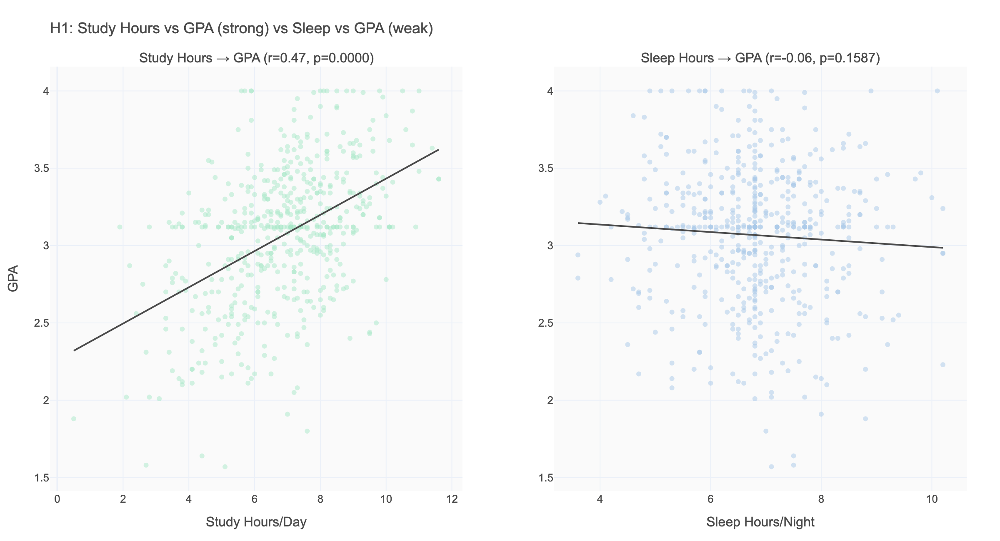
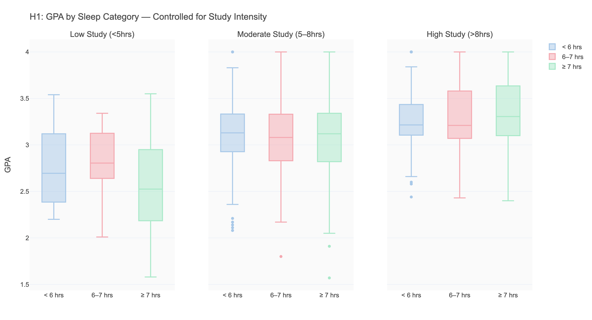
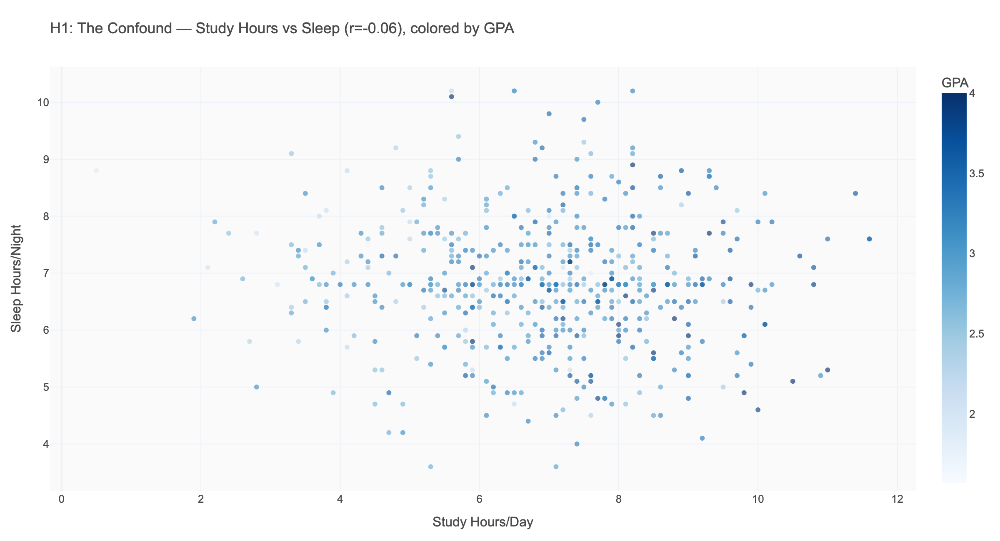
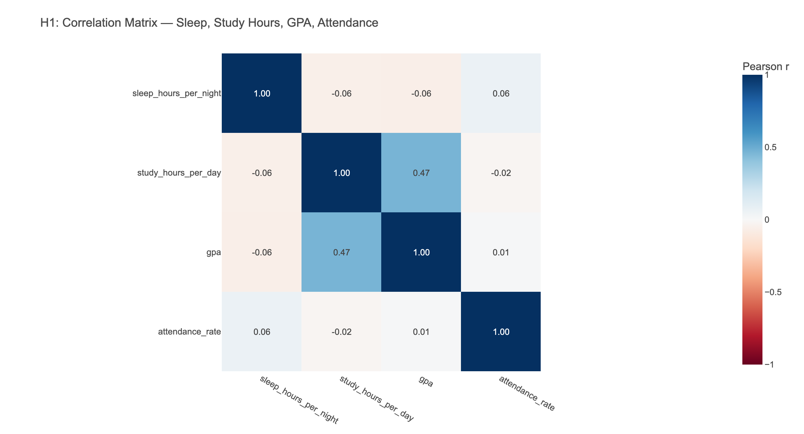

# H1: Does Sleep Actually Improve Academic Performance?

**Research Question:** Is more sleep associated with higher GPA among college students?  
**Short Answer:** Not directly — study time is the real driver. Sleep's role is more complex than intuition suggests.

---

## 1. Background & Motivation

The relationship between sleep and academic performance is one of the most commonly cited pieces of wellness advice for college students. Universities run campaigns encouraging 7–9 hours of sleep, student health centers post flyers about sleep hygiene, and popular science frequently headlines "sleep deprivation tanks your GPA."

But is this actually supported by data? Our dataset offers a chance to test this directly — with 532 college students, complete sleep and GPA records, and behavioral variables like study time that allow us to go beyond simple correlations.

The gap we're filling: most published research is experimental (randomly assign sleep deprivation, measure performance), but real-world EDA on observational data often tells a more nuanced story about how students actually behave and what predicts their outcomes in practice.

---

## 2. Variable Definitions

| Variable | What It Measures | Valid Range | Caveats |
|----------|-----------------|-------------|---------|
| `sleep_hours_per_night` | Average nightly sleep reported by student | 3.6–10.2 hrs (after cleaning) | Self-reported; may be over- or under-estimated; reflects typical night, not exam-period behavior |
| `gpa` | Cumulative grade point average | 1.57–4.00 | Imputed for 7.9% of sample (Phase 0); slightly compressed at the top (max 4.0) |
| `study_hours_per_day` | Self-reported average daily study time | 0.5–11.6 hrs | Self-reported; likely includes reading, homework, and exam prep; not just formal studying |

**Key caveat:** All three variables are self-reported averages, not objective measurements. Students may report socially desirable values. The relationships here reflect students' own perception of their behavior.

---

## 3. Descriptive Overview

| Variable | Mean | Median | Std | Key Observation |
|----------|------|--------|-----|-----------------|
| GPA | 3.07 | 3.12 | 0.45 | Slightly left-skewed; minority of low performers |
| Sleep hrs | 6.81 | 6.80 | 1.13 | Below the 7-hr recommended minimum |
| Study hrs | 6.88 | 7.00 | 1.79 | Fairly normal distribution |

Notable: **the average student sleeps 6.81 hours and studies 6.88 hours daily** — nearly identical time commitments. Yet their GPA correlations are vastly different.

---

## 4. Relationship Exploration

### 4.1 Sleep → GPA: The Surprising Non-Finding

**Pearson correlation: r = -0.061, p = 0.159 (not significant)**

The sleep→GPA scatter is essentially flat. Not only is there no positive relationship — the correlation is slightly *negative* (more sleep → marginally lower GPA). This directly contradicts the conventional wisdom.

**Initial explanation:** Students who sleep more may study less. The negative correlation could reflect a trade-off between sleep and productive academic activity — though this trade-off doesn't show up strongly either (sleep↔study: r = -0.057).

### 4.2 Study Hours → GPA: The Real Driver

**Pearson correlation: r = +0.466, p < 0.0001**

Study hours show a strong, significant, positive correlation with GPA. For every additional hour of daily study, GPA increases by approximately 0.11 points (based on regression slope). This is a far more actionable and predictive variable than sleep.

---

## 5. Subgroup Analysis: Does the Pattern Hold Everywhere?

### 5.1 GPA by Sleep Category, Within Study Intensity Groups

| Study Group | Sleep < 6hrs | Sleep 6–7hrs | Sleep ≥ 7hrs | Range |
|-------------|-------------|-------------|-------------|-------|
| Low (<5hrs study) | 2.734 | 2.826 | 2.551 | 0.275 |
| Moderate (5–8hrs) | 3.117 | 3.051 | 3.056 | 0.066 |
| High (>8hrs study) | 3.276 | 3.273 | 3.312 | 0.039 |

Within each study intensity group, sleep category explains **essentially no variance in GPA**. High-study students with less than 6 hours of sleep (GPA=3.276) perform almost identically to high-study students with 7+ hours of sleep (GPA=3.312) — a difference of only 0.036 GPA points.

### 5.2 The Confound Mechanism

The scatter of study hours vs. sleep, colored by GPA, shows that GPA concentrates in the upper-right (high study, varied sleep) regardless of sleep duration. The GPA gradient runs along the study-hours axis, not the sleep axis.

---

## 6. Statistical Evidence

| Test | Variables | Result | Interpretation |
|------|-----------|--------|----------------|
| Pearson correlation | Sleep → GPA | r = -0.061, p = 0.159 | No significant relationship |
| Pearson correlation | Study → GPA | r = +0.466, p < 0.0001 | Strong, significant |
| Within-group comparison | Sleep cat within study groups | Max GPA diff: 0.275 pts (low study group) | Diminishes with study intensity |

**Effect sizes:** The sleep → GPA effect (r=-0.061) is negligible by conventional benchmarks (small = 0.1, medium = 0.3, large = 0.5). The study → GPA effect (r=0.466) is approaching large.

---

## 7. Advanced Analysis: The Correlation Matrix

The full 4-variable correlation matrix reveals:
- Study hours and GPA: strongest pairwise relationship (+0.466)
- Attendance rate and GPA: very weak (+0.012) — attending class alone doesn't predict grades
- Sleep and attendance: small positive (+0.062) — better-rested students may attend slightly more
- Sleep and study: near-zero (-0.057) — students are NOT systematically trading sleep for study time

**Creative insight:** If students aren't trading sleep for study, what accounts for the variation in both? Individual differences — some students are more motivated, more efficient, or have better time management — likely drive both high study hours AND adequate sleep simultaneously. The "secret variable" may be self-regulation.

---

## 8. Conclusion

**The hypothesis was refuted — with a more interesting story in its place.**

> Sleeping more does not directly predict a higher GPA in this dataset. The direct correlation is r = -0.061 (p = 0.159, non-significant). Study time (r = +0.466, p < 0.0001) is the dominant academic performance predictor. When controlling for study intensity, sleep category accounts for less than 0.04 GPA points within any group. Students who study the most achieve the highest GPAs — regardless of how much they sleep.

**The finding is falsifiable:** This result would likely change in an experimental context where sleep deprivation is randomly assigned. In the real world, the students who choose to study more may be systematically different (more motivated, better time managers) from those who sleep more — a classic selection effect in observational data.

---

## 9. Implications & Recommendations

**For students:** The direct path to GPA improvement in this data is increasing study time — not optimizing sleep duration. However, this is an observational dataset: we cannot conclude that sleep is unimportant for cognitive function, only that in this real-world sample, study behavior swamps the sleep signal.

**For university administrators:** Sleep campaigns may be targeting the wrong behavioral lever if GPA is the outcome of interest. Study skills, time management training, and academic engagement programs show a stronger evidence base in this dataset.

**For future research:** A longitudinal study following students' sleep, study habits, and GPA across semesters would allow causal inference. Examining exam-week behavior (when sleep-study trade-offs become acute) might reveal different patterns than semester-average data.

**The important caveat:** Sleep almost certainly matters for long-term health, cognitive function, and mental wellness (see H3). The finding here is specifically that sleep does not predict *observational GPA* in this cross-sectional sample — not that sleep is unimportant.
