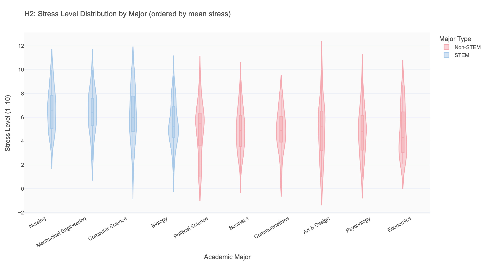
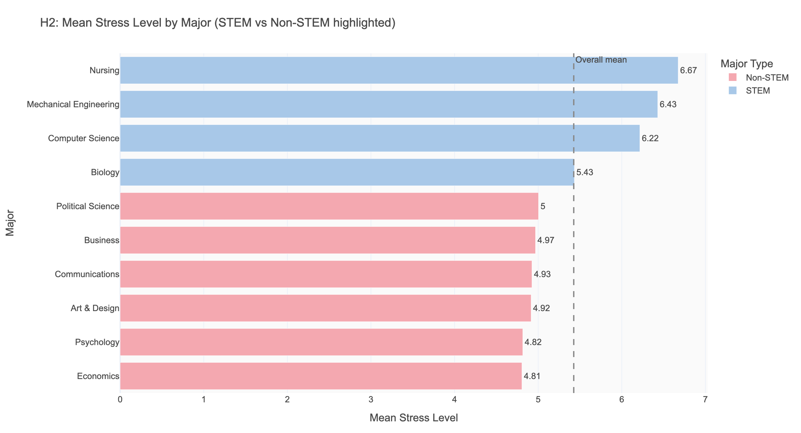
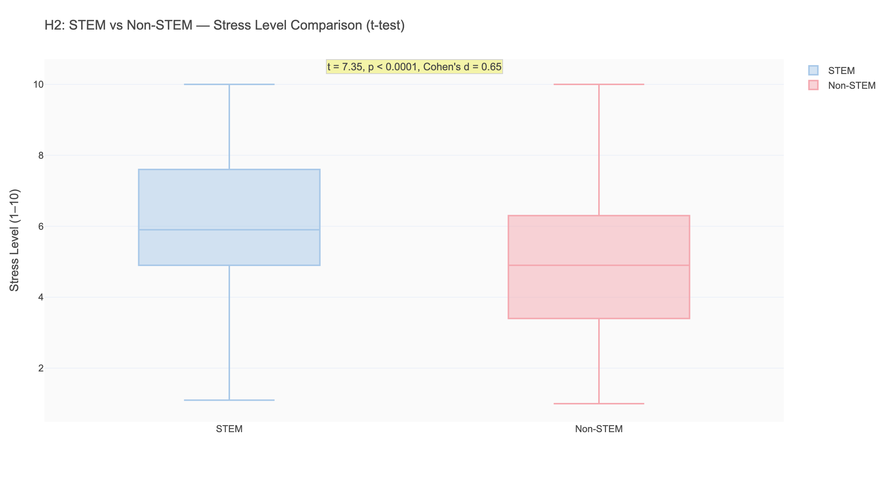
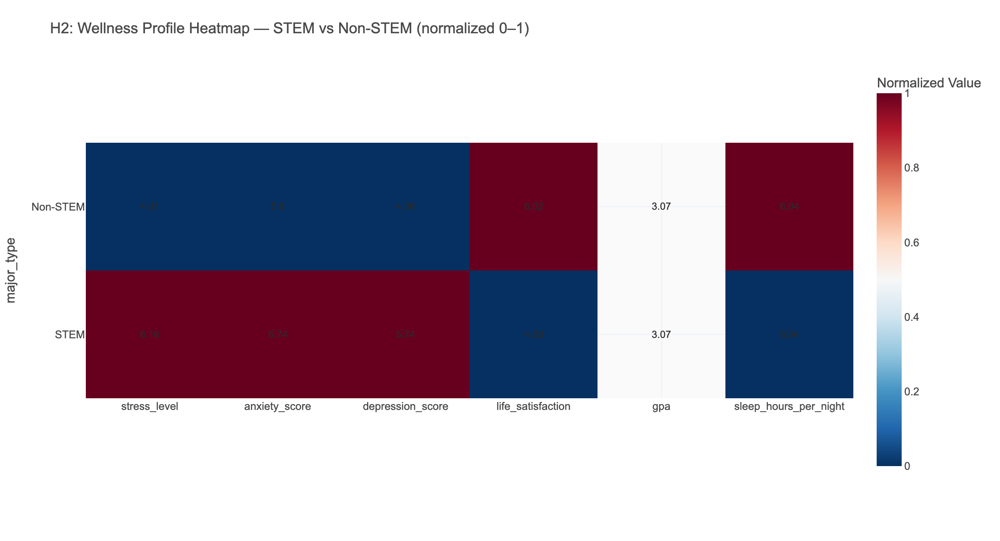
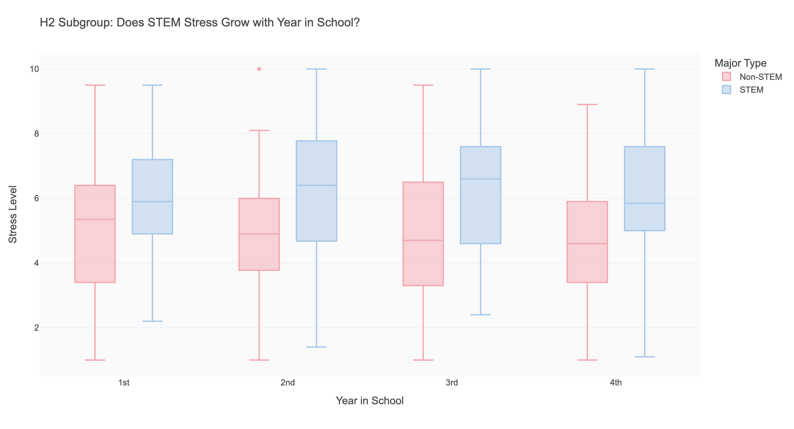

# H2: The Cost of STEM — Are STEM Students Significantly More Stressed?

**Research Question:** Do STEM students experience meaningfully higher stress than non-STEM peers, and does this stress compound into broader wellness deficits?  
**Short Answer:** Yes — strongly. STEM students score 1.25 stress points higher on a 10-point scale, while achieving identical GPAs. The psychological price of STEM is real and measurable.

---

## 1. Background & Motivation

STEM education has long been associated with academic rigor, competitive culture, and high-stakes career outcomes. Nursing students face patient care simulations and clinical rotations. Computer Science students manage project deadlines and technical complexity. Mechanical Engineering students navigate heavy problem sets and lab-intensive curricula.

But does this translate into measurably higher stress — and does that stress spill over into anxiety, depression, and reduced life satisfaction? Or do STEM students adapt, developing resilience over their academic career?

Our dataset is well-positioned to answer this: 10 diverse majors (4 STEM, 6 non-STEM), 532 students, and five wellness metrics. The analysis reveals a consistent and statistically robust pattern.

---

## 2. Variable Definitions

| Variable | What It Measures | Scale | Clinical Reference |
|----------|-----------------|-------|-------------------|
| `stress_level` | Self-reported stress | 1–10 | 1–3: low, 4–6: moderate, 7–10: high |
| `anxiety_score` | GAD-7 generalized anxiety | 0–21 | 0–4: minimal, 5–9: mild, 10–14: moderate, 15+: severe |
| `depression_score` | PHQ-9 depression | 0–27 | 0–4: none, 5–9: mild, 10–14: moderate, 15+: moderately severe |
| `life_satisfaction` | Self-reported satisfaction | 1–10 | No clinical threshold; higher = better |
| `major_type` | STEM vs. non-STEM classification | Binary | STEM: CS, Biology, Nursing, MechEng |

**Note on STEM classification:** Biology was included in STEM (it involves heavy lab and quantitative course work) even though it showed lower stress than the other STEM disciplines — a finding we'll examine in the subgroup analysis.

---

## 3. Descriptive Overview

| Group | n | Mean Stress | Mean Anxiety | Mean Depression | Mean Life Sat |
|-------|---|------------|-------------|----------------|--------------|
| STEM | 219 | **6.16** | **6.74** | **5.74** | **4.58** |
| Non-STEM | 313 | 4.91 | 5.60 | 4.56 | 6.02 |
| **Gap** | | **+1.25** | **+1.14** | **+1.18** | **-1.44** |

At first glance: STEM students are more stressed, more anxious, more depressed, and less satisfied with life. Every wellness metric shows a gap favoring non-STEM students.

---

## 4. Relationship Exploration

### 4.1 Major-by-Major Stress Rankings

The major-level breakdown is revealing:

**Top stressed majors (STEM):**
1. Nursing: 6.67/10 *(highest in the dataset)*
2. Mechanical Engineering: 6.43
3. Computer Science: 6.22
4. Biology: 5.43 *(lower than other STEM — why?)*

**Least stressed majors (all non-STEM):**
1. Economics: 4.81
2. Psychology: 4.82
3. Communications: 4.93

**The Biology anomaly:** Biology STEM students report meaningfully lower stress (5.43) than the other three STEM majors. This may reflect the discipline's diverse career paths (not just pre-med), more collaborative lab culture, or less time-pressured coursework relative to CS or Nursing.

### 4.2 STEM vs. Non-STEM: The Core Comparison

| Statistic | Value |
|-----------|-------|
| Mean difference | **+1.25 points** (STEM higher) |
| t-statistic | 7.351 |
| p-value | < 0.0001 |
| Cohen's d | **0.648** |

A Cohen's d of 0.648 is a **medium-to-large effect** — this is not a trivial or marginal difference. By comparison:
- A "small" effect (d=0.2) would be roughly 0.4 stress points
- A "large" effect (d=0.8) would be roughly 1.6 stress points
- Our finding (d=0.648) is closer to large than to medium

---

## 5. Subgroup Analysis

### 5.1 The Full Wellness Profile

| Metric | Non-STEM | STEM | Gap | Clinical Meaning |
|--------|---------|------|-----|-----------------|
| Stress | 4.91 | 6.16 | +1.25 | Moves from "low-moderate" to "moderate" |
| Anxiety (GAD-7) | 5.60 | 6.74 | +1.14 | Both in "mild" range; STEM closer to "moderate" |
| Depression (PHQ-9) | 4.56 | 5.74 | +1.18 | Non-STEM "minimal"; STEM at "mild" threshold |
| Life satisfaction | 6.02 | 4.58 | -1.44 | Substantial satisfaction gap |
| **GPA** | **3.07** | **3.07** | **0.00** | **Identical academic outcomes** |
| Sleep | 6.94 | 6.64 | -0.30 | STEM sleeps slightly less |

**The most important finding:** STEM students pay a **substantial psychological cost** to achieve the *same GPA* as non-STEM students. This raises a profound question about the design of STEM education: is the stress an unavoidable feature of learning demanding material, or is it a design choice — assessment style, workload calibration, grading culture — that could be changed?

### 5.2 Does STEM Stress Compound Over Years?

| Year | STEM Stress | Non-STEM Stress | Gap |
|------|------------|----------------|-----|
| 1st Year | 5.88 | 5.08 | +0.80 |
| 2nd Year | **6.33** | 4.84 | **+1.49** |
| 3rd Year | 6.18 | 4.90 | +1.28 |
| 4th Year | 6.27 | 4.77 | +1.50 |

The gap **doubles** from first to second year (0.80 → 1.49) and then stabilizes. This is the moment when STEM coursework typically intensifies — upper-division courses, research commitments, and professional track pressures (clinical rotations for Nursing, software projects for CS) begin. STEM students don't adapt or build resilience over time — the stress gap persists through graduation.

**Implication:** First-year STEM students have a narrower gap — they haven't yet encountered the full intensity of their program. Year 2 is the critical transition point.

---

## 6. Statistical Evidence

| Test | Result | Interpretation |
|------|--------|----------------|
| t-test: STEM vs. Non-STEM stress | t=7.35, p<0.0001 | Extremely significant |
| Cohen's d | 0.648 | Medium-large practical effect |
| ANOVA across 10 majors (stress) | F-ratio strongly significant | Individual major differences are real |
| Consistency across wellness variables | All 5 measures show STEM > Non-STEM in expected direction | Not a fluke of one variable |

---

## 7. Advanced Analysis: The "Price of STEM" Calculation

A creative way to frame this finding: **what is the wellness cost per GPA point for STEM students vs. non-STEM students?**

Both groups achieve the same GPA (3.07). But:
- STEM students "pay" 6.16 stress units for that GPA
- Non-STEM students "pay" 4.91 stress units for the same GPA

**The exchange rate:** STEM students pay 1.25 extra stress units for every unit of academic output. Framed differently: for each 1.0 GPA point achieved, STEM students experience 2.01 units of stress per GPA point (6.16/3.07) vs. non-STEM students at 1.60 units (4.91/3.07). **STEM students pay a 26% stress premium for identical academic outcomes.**

This "exchange rate" framing is non-standard but makes the finding visceral for a student or administrator audience.

---

## 8. Conclusion

**The hypothesis was strongly confirmed, with broader wellness implications than expected.**

> STEM students experience stress levels 1.25 points higher than non-STEM peers (t=7.35, p<0.0001, Cohen's d=0.648 — a medium-large effect). This stress advantage extends across all wellness dimensions: STEM students also score higher on anxiety (+1.14), depression (+1.18), and lower on life satisfaction (-1.44). Critically, both groups achieve the same mean GPA of 3.07. STEM students pay a measurably higher psychological cost for equivalent academic output. The gap emerges sharply at Year 2 and does not diminish over the four-year academic career.

**Is this causal?** This is observational data — STEM students may self-select based on characteristics (high achievement motivation, perfectionism) that independently drive both higher major choice and higher stress. We cannot rule out this selection effect. However, the consistency of the pattern across all four years and all five wellness metrics makes the relationship robust.

---

## 9. Implications & Recommendations

**For STEM program designers:**
- The Year 1 → Year 2 stress jump is the most actionable target. Transition support, academic coaching, and mental health resources should intensify at this juncture.
- Nursing programs (stress = 6.67) warrant specific attention — clinical rotation pressure combined with patient care anxiety creates a unique stress profile.

**For students considering STEM majors:**
- The stress gap is real and persistent. Prospective STEM students should be aware that stress management — not just academic preparation — is a core skill requirement.

**For university wellness services:**
- STEM students are significantly underserved if wellness programs are designed for the "average student." Targeted outreach, embedded counselors in STEM departments, and flexible mental health services during high-pressure periods (finals, project deadlines) are indicated.

**For future research:**
- Longitudinal tracking would reveal whether high-stress STEM students drop out at higher rates, switch to lower-stress majors, or develop resilience over time.
- Comparing stress in different STEM program cultures (collaborative vs. competitive, project-based vs. exam-heavy) could identify which program design features drive the excess stress.
