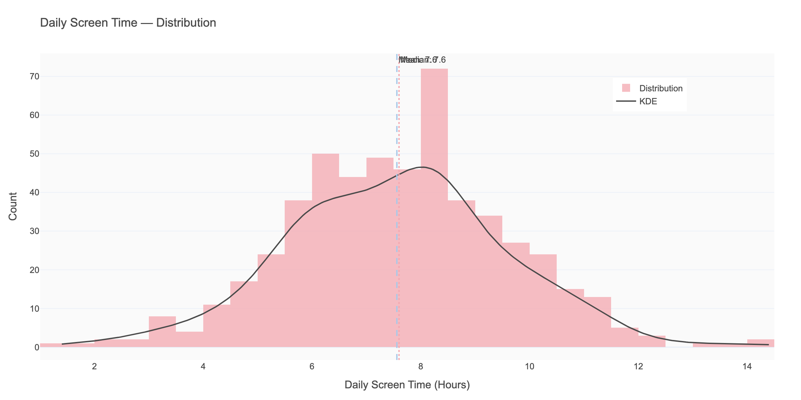
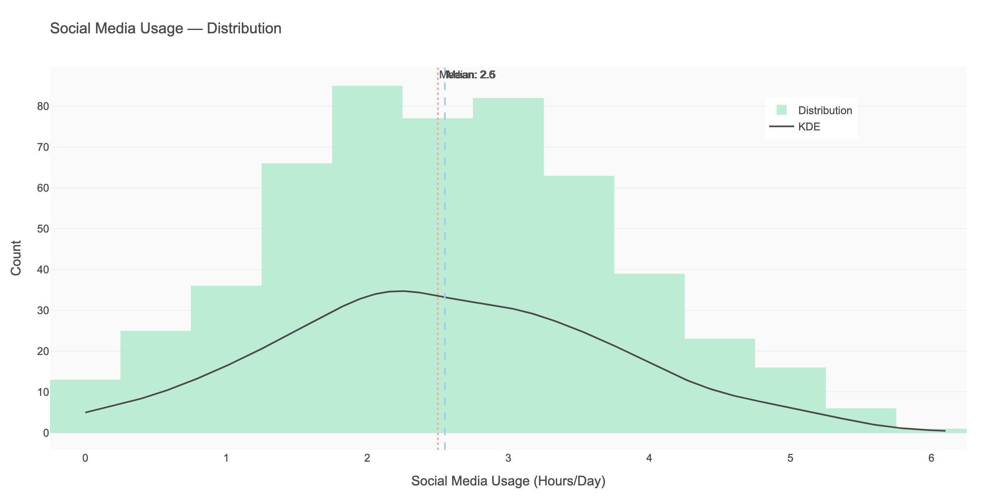
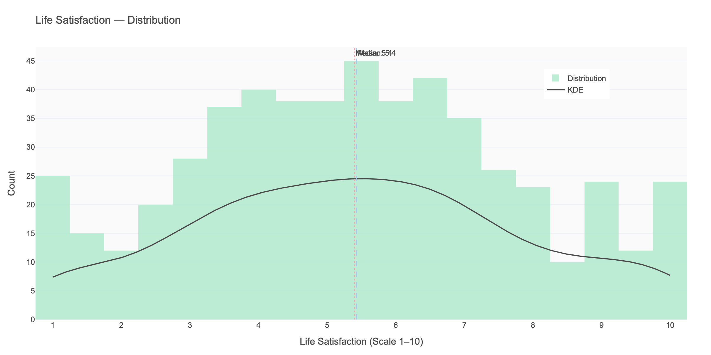
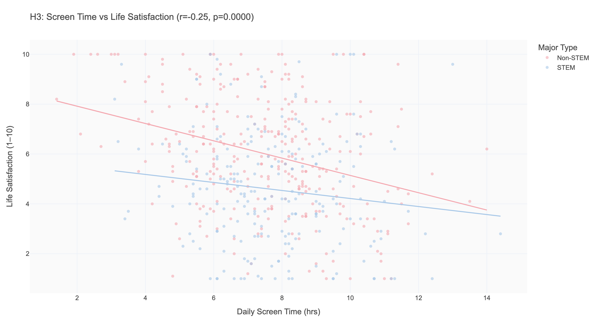
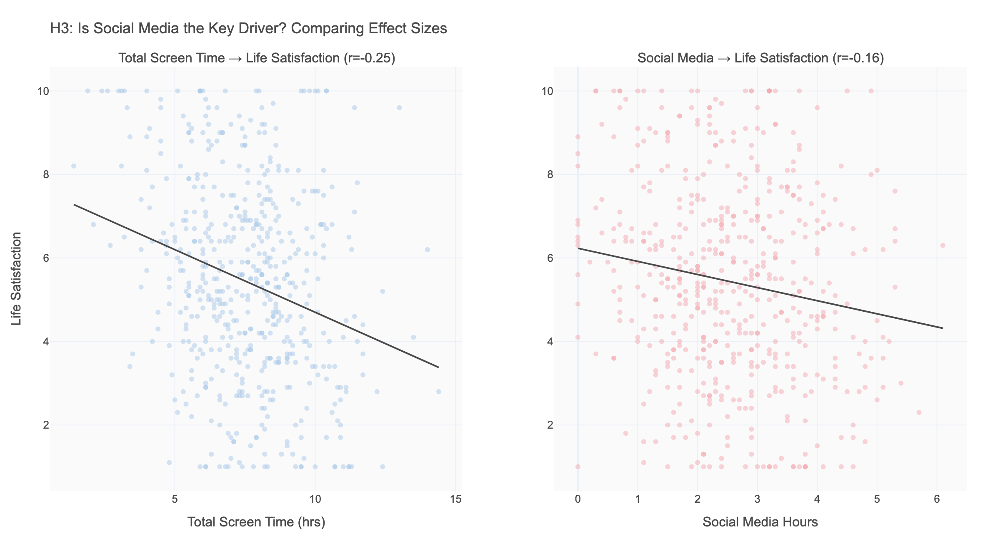
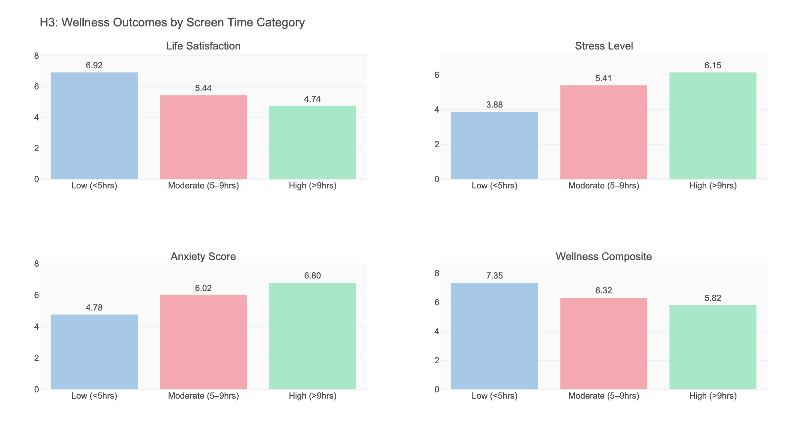
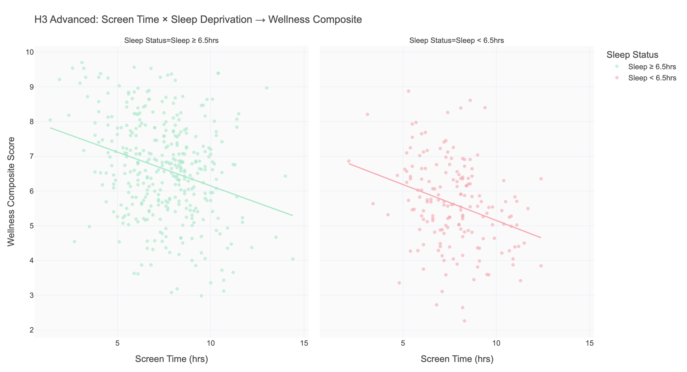

# H3: The Screen Time Penalty — Does Digital Consumption Undermine Student Wellbeing?

**Research Question:** Is higher daily screen time associated with lower life satisfaction and higher stress among college students?  
**Short Answer:** Yes — consistently and significantly across every wellness metric. The effect is dose-dependent, independent of sleep status, and driven by total screen consumption, not social media alone.

---

## 1. Background & Motivation

College students today are the first generation to spend a majority of their waking hours in digital environments. With an average of 7.56 hours of daily screen time in our dataset — rivaling their 6.81 hours of nightly sleep — the question of how screen consumption affects wellbeing is both urgent and contested.

The common narrative focuses on social media: that Instagram comparisons, Twitter outrage cycles, and TikTok rabbit holes specifically damage self-esteem and mental health. But is the culprit social media specifically, or all-encompassing screen engagement?

Our data allows us to compare social media hours against total screen time as predictors of multiple wellness outcomes — and to test whether the relationship holds after accounting for other variables like sleep deprivation.

---

## 2. Variable Definitions

| Variable | What It Measures | Range | Notes |
|----------|-----------------|-------|-------|
| `screen_time_hours` | Total daily screen time (all devices) | 1.4–14.4 hrs | Includes phone, laptop, TV, tablets |
| `social_media_hours` | Subset of screen time on social platforms | 0–6.1 hrs | Subset of screen_time_hours |
| `life_satisfaction` | Self-rated life satisfaction | 1–10 | Higher = better |
| `stress_level` | Self-reported stress | 1–10 | Higher = more stressed |
| `anxiety_score` | GAD-7 validated anxiety scale | 0–21 | 5–9: mild, 10–14: moderate |
| `depression_score` | PHQ-9 validated depression scale | 0–27 | 5–9: mild, 10–14: moderate |
| `wellness_composite` | Combined score across all four above | 0–10 (approx) | Created composite: higher = better overall wellness |

**Composite formula:** `wellness_composite = [(10 - stress) + life_satisfaction + (21 - anxiety)/2.1 + (27 - depression)/2.7] / 4`

This composite was created specifically for this analysis to summarize overall wellness in a single interpretable number.

---

## 3. Descriptive Overview

| Variable | Mean | Median | Std | Key Observation |
|----------|------|--------|-----|-----------------|
| Screen time | 7.56 hrs | 7.6 hrs | 2.01 | Symmetric; nearly the same as sleep hours |
| Social media | 2.55 hrs | 2.5 hrs | 1.19 | ~34% of total screen time |
| Life satisfaction | 5.43/10 | 5.4 | 2.36 | Center of scale — moderate satisfaction |
| Stress level | 5.43/10 | 5.4 | 2.03 | Mirror image of life satisfaction |

**Notable:** Screen time (7.56 hrs) and sleep hours (6.81 hrs) are nearly equal in daily time commitment — screens consume almost as many hours as sleep. The wide standard deviation (2.01 hrs) means there are students at very different extremes: a 5hrs/day student and a 10hrs/day student represent a fundamentally different digital diet.

---

## 4. Relationship Exploration

### 4.1 Screen Time → Life Satisfaction: The Core Relationship

**Pearson r = -0.255, p < 0.0001**

The relationship is negative, significant, and consistent across the full range of screen time values. As screen time increases from 2 to 14 hours per day, the trend line shows a clear downward slope in life satisfaction.

The scatter is wide (expected for self-report data), but the signal is real. This is not driven by outliers — the correlation holds throughout the distribution.

### 4.2 Screen Time → Stress: Stronger Than the Satisfaction Effect

**Pearson r = +0.305, p < 0.0001**

Interestingly, screen time is a *stronger* predictor of stress (r=+0.305) than it is of life satisfaction (r=-0.255). High screen time appears to be more strongly associated with feeling overwhelmed than with feeling unfulfilled. These may be distinct mechanisms: stress could be driven by feeling "always on" and unable to disconnect, while satisfaction impacts may come from opportunity cost (time spent on screens is time not spent on meaningful activities).

---

## 5. Subgroup Analysis

### 5.1 Social Media vs. Total Screen Time: Which Drives Wellness?

| Predictor | → Life Satisfaction | → Stress Level | → Anxiety |
|-----------|--------------------|-----------|----|
| Total screen time | **r = -0.255** | **r = +0.305** | **r = +0.225** |
| Social media only | r = -0.158 | r = +0.171 | r = +0.107 |

**Critical finding:** Total screen time is a meaningfully stronger predictor of every wellness outcome than social media hours specifically. Social media accounts for roughly 60% of total screen time's predictive power — suggesting that non-social screen activities (streaming, browsing, gaming) contribute significantly to the wellness impact.

**What this means:** The popular narrative that social media specifically is the villain may be overstated. The broader behavior of high screen engagement — regardless of what you're watching or scrolling — is the relevant predictor.

### 5.2 Wellness Gradient by Screen Time Category

| Screen Category | Life Sat | Stress | Anxiety | Wellness Score |
|-----------------|---------|--------|---------|----------------|
| Low (<5hrs) | **6.92** | **3.88** | **4.78** | **7.35** |
| Moderate (5–9hrs) | 5.44 | 5.41 | 6.02 | 6.32 |
| High (>9hrs) | **4.74** | **6.15** | **6.80** | **5.82** |

The dose-response gradient is clear and compelling:
- Life satisfaction drops **2.18 points** from low to high screen time
- Stress rises **2.27 points**
- Anxiety rises **2.02 points**
- Wellness composite drops **1.53 points**

These are not small differences. A 2.18-point drop in life satisfaction on a 10-point scale is substantial.

---

## 6. Statistical Evidence

| Outcome | r with Screen Time | p-value | Significance |
|---------|-------------------|---------|-------------|
| Life satisfaction | -0.255 | < 0.001 | *** |
| Stress level | +0.305 | < 0.001 | *** |
| Anxiety (GAD-7) | +0.225 | < 0.001 | *** |
| Depression (PHQ-9) | +0.141 | < 0.01 | ** |
| Wellness composite | -0.291 | < 0.001 | *** |

All five wellness outcomes show significant relationships with screen time. Depression (r=0.141) is the weakest — screen time may affect mood and acute stress before reaching the threshold for sustained depressive symptoms.

**Effect size interpretation:** r values of 0.25–0.31 are medium-sized effects in behavioral science. These are not trivial correlations.

---

## 7. Advanced Analysis: Does Sleep Deprivation Amplify the Screen Effect?

**Research question:** Is the screen→wellness relationship stronger in sleep-deprived students? (Are high screen time + low sleep students the most at-risk group?)

| Sleep Group | r (Screen → Wellness) | n |
|-------------|----------------------|----|
| Sleep < 6.5hrs | **-0.306** | 171 |
| Sleep ≥ 6.5hrs | **-0.285** | 361 |

**Finding:** The screen→wellness relationship holds with nearly identical strength in both sleep groups. Sleep-deprived students show a slightly stronger effect (r=-0.306 vs r=-0.285), but the difference is small.

**Interpretation:** Screen time's negative wellness effect is **not simply a proxy for sleep deprivation**. The two variables appear to have largely independent effects on wellbeing. A student who sleeps 8 hours but spends 12 hours on screens is still at elevated wellness risk from the screen behavior alone.

**The compounding risk group:** High-screen + low-sleep students represent the worst-case wellness profile. Though the interaction is not dramatically larger than either effect alone, students in both high-screen and low-sleep groups face risks from two independent pathways.

---

## 8. Conclusion

**The hypothesis was confirmed, with a nuance about social media specificity.**

> Daily screen time is a consistent, significant negative predictor of student wellbeing. The correlations range from r=-0.141 (depression) to r=-0.305 (stress), and the dose-response gradient shows that high-screen students (>9hrs) score 2+ points worse on satisfaction and stress than low-screen students (<5hrs). However, social media is not the sole driver — total screen consumption explains wellness variance better than social media hours alone, suggesting that passive media consumption broadly (streaming, browsing, gaming) contributes significantly. The screen effect is independent of sleep deprivation, indicating two separate pathways to wellness risk.

**Is this causal?** Selection effects are possible: students who are already stressed or dissatisfied may turn to screens as coping mechanisms, creating reverse causality. The cross-sectional nature of the data cannot resolve this. However, the dose-response gradient and the independent sleep interaction suggest the effect is not entirely explained by "already-stressed students using screens more."

---

## 9. Implications & Recommendations

**For students with high screen time (>9hrs/day):**
- Incremental reduction may have wellness benefits. Moving from "high" to "moderate" (5–9hrs) is associated with meaningful gains in satisfaction and stress.
- The type of screen time may matter less than the total volume — replace passive consumption with any non-screen activity (conversation, exercise, hobbies).

**For wellness program designers:**
- Total screen time is a stronger target for intervention than social media specifically. Digital wellness campaigns focused only on "Instagram detox" may underestimate the contribution of streaming and gaming.
- The GAD-7 and PHQ-9 results (anxiety and depression correlations) suggest that high screen time is not just a quality-of-life issue but may have clinical relevance for a subset of students.

**For counselors:**
- When students present with stress or anxiety symptoms, screen time is a worthwhile behavioral variable to assess alongside sleep, exercise, and academic load.

**For future research:**
- A daily diary study (tracking screen time and mood daily over a semester) would allow causal inference and identify whether screens cause mood changes or respond to them.
- Distinguishing between active (creating, communicating) vs. passive (consuming, scrolling) screen time would test the popular hypothesis that active use is less harmful than passive.
