# Phase 0 — Data Orientation & Diagnostic Report

**Dataset:** Student Wellness & Academic Performance  
**File:** `dataset/student_wellness.csv`  
**Date:** 2026-04-13  

---

## 1. Executive Summary

The raw dataset contains **535 rows × 21 columns** representing self-reported wellness and academic data from ~520 unique students. The diagnostic uncovered **16 data quality issues** spanning duplicates, impossible values, inconsistent encodings, mixed types, and missing data.

**Key headline numbers:**
- **3 exact duplicate rows** (indices 189, 404, 488)
- **6 impossible ages** including −3, 0, 5, 150, 200, and 999
- **75 rows** with non-canonical gender encodings (e.g., "M", "MALE", "man", "woman")
- **60 rows** with non-canonical on_campus encodings ("YES", "1", "true", "no", etc.)
- **20 stress_level entries** stored as text labels instead of numeric values
- **8 GPA values** outside the valid [0, 4] range
- **397 total missing cells** across 9 columns (anxiety_score and depression_score are the worst at 12.9% each)

**So what?** If you skip cleaning, any analysis touching age, gender, stress, GPA, or the mental-health scores will be biased or crash outright. The duplicates inflate sample size modestly (+0.6%), but the impossible values and encoding chaos make several columns unreliable without intervention.

---

## 2. Structural Overview — All 21 Columns

### 2.1 student_id
| Property | Value |
|----------|-------|
| dtype | str |
| Missing | 0 (0%) |
| Unique | 520 |

Only 520 unique IDs among 535 rows — consistent with the 3 duplicated rows + the duplicated IDs that come with them. No data quality issue with the ID itself.

---

### 2.2 age
| Property | Value |
|----------|-------|
| dtype | float64 |
| Missing | 0 (0%) |
| Unique | 14 |
| Min / Max | −3.0 / 999.0 |
| Mean / Median | 23.79 / 21.0 |
| Std | 43.39 |

**6 impossible values found:** −3, 0, 5, 150, 200, 999. The mean (23.8) is artificially inflated; the median (21) reflects the true center. After removing impossibles the valid range is 18–25, consistent with a college sample.

**So what?** The huge std (43.4) is entirely driven by 6 bad rows. Any age-based grouping or regression will be distorted unless these are handled.

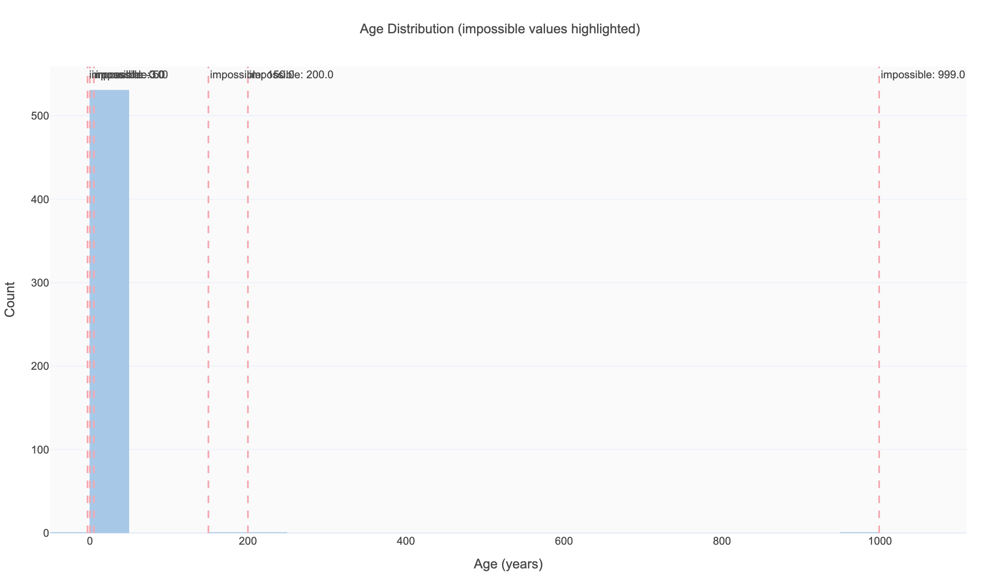

---

### 2.3 gender
| Property | Value |
|----------|-------|
| dtype | str |
| Missing | 0 (0%) |
| Unique values | 12 |

| Value | Count | Canonical Mapping |
|-------|-------|------------------|
| Female | 206 | Female |
| Male | 201 | Male |
| Non-binary | 34 | Non-binary |
| Prefer not to say | 19 | Prefer not to say |
| M | 12 | → Male |
| F | 12 | → Female |
| man | 11 | → Male |
| FEMALE | 10 | → Female |
| male | 10 | → Male |
| female | 7 | → Female |
| MALE | 7 | → Male |
| woman | 6 | → Female |

**75 rows (14%)** use non-canonical encodings. After mapping: Male ≈ 241, Female ≈ 241, Non-binary = 34, Prefer not to say = 19.

**So what?** Gender is nearly perfectly balanced after cleaning — good for group comparisons. Leaving uncleaned would split "Male" into 5 separate categories, destroying any grouped analysis.

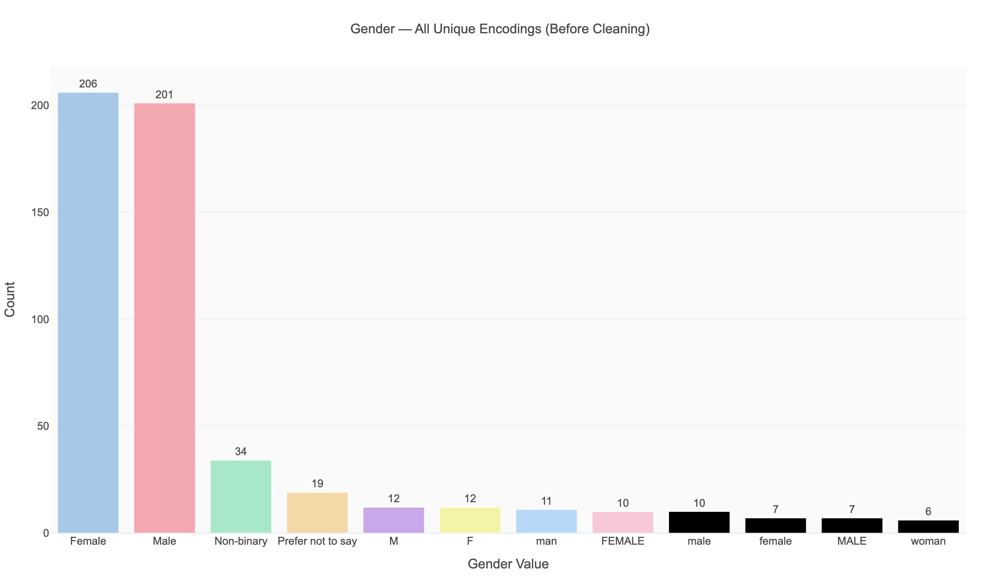

---

### 2.4 major
| Property | Value |
|----------|-------|
| dtype | str |
| Missing | 0 (0%) |
| Unique | 10 |

| Major | Count |
|-------|-------|
| Business | 81 |
| Computer Science | 77 |
| Psychology | 71 |
| Biology | 54 |
| Political Science | 48 |
| Nursing | 47 |
| Mechanical Engineering | 43 |
| Communications | 40 |
| Art & Design | 39 |
| Economics | 35 |

No quality issues. All 10 majors are cleanly encoded. Largest group (Business) is about 2.3× the smallest (Economics) — reasonable balance for cross-major comparisons.

---

### 2.5 year_in_school
| Property | Value |
|----------|-------|
| dtype | float64 |
| Missing | 0 (0%) |
| Unique | 4 |
| Min / Max | 1.0 / 4.0 |
| Mean / Median | 2.41 / 2.0 |

No quality issues. Values are exactly {1, 2, 3, 4} as expected. Slight skew toward underclassmen (mean 2.4 vs. midpoint 2.5).

---

### 2.6 gpa
| Property | Value |
|----------|-------|
| dtype | float64 |
| Missing | 42 (7.85%) |
| Unique | 180 |
| Min / Max | −1.0 / 6.0 |
| Mean / Median | 3.07 / 3.12 |

**8 values outside [0, 4]:** includes negatives and values above 4.0. After removing these, the distribution centers around 3.1 with reasonable spread (std ≈ 0.58).

**So what?** GPA is a key outcome variable. The 7.85% missingness plus 8 impossible values means ~9.3% of rows need attention before any GPA-based analysis.

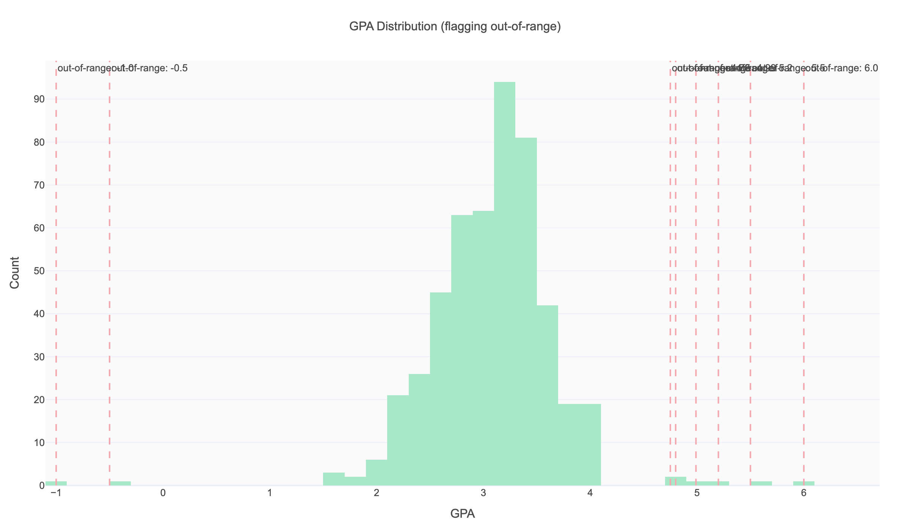

---

### 2.7 study_hours_per_day
| Property | Value |
|----------|-------|
| dtype | float64 |
| Missing | 0 (0%) |
| Unique | 91 |
| Min / Max | −2.0 / 35.0 |
| Mean / Median | 7.02 / 7.0 |

**5 impossible values** (negative or > 16 hours/day). Median (7.0) is a sensible center for college students.

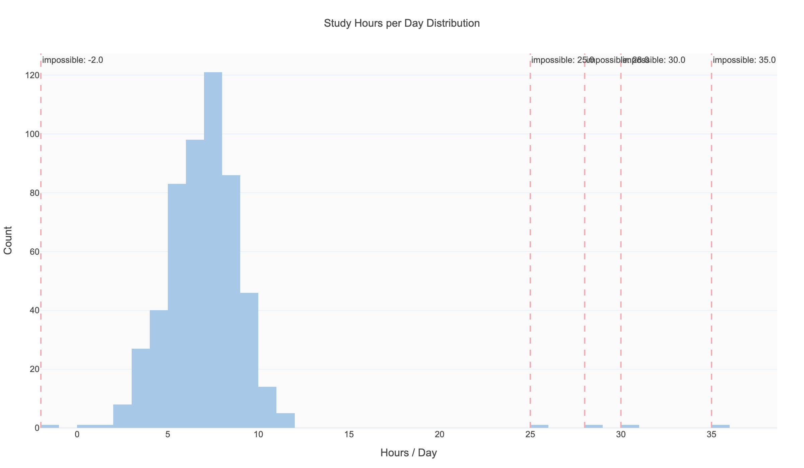

---

### 2.8 attendance_rate
| Property | Value |
|----------|-------|
| dtype | float64 |
| Missing | 0 (0%) |
| Unique | 282 |
| Min / Max | 50.0 / 128.0 |
| Mean / Median | 82.85 / 82.8 |

**10 values exceed 100%**, which is impossible for a percentage. Maximum is 128%.

**So what?** These likely represent data entry errors. Capping at 100 or setting to NaN are both defensible; capping preserves the "very high attendance" signal.

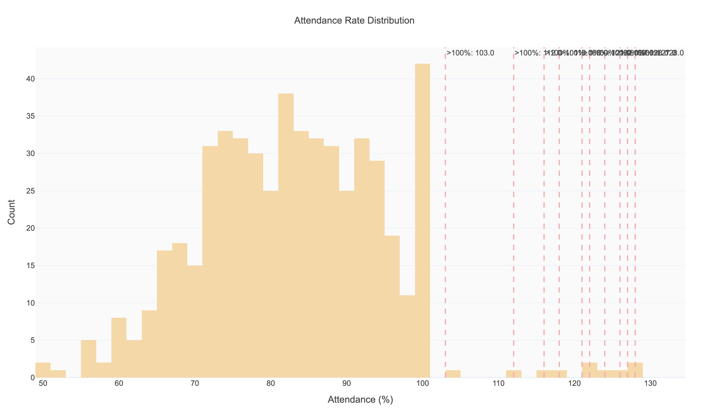

---

### 2.9 sleep_hours_per_night
| Property | Value |
|----------|-------|
| dtype | float64 |
| Missing | 53 (9.91%) |
| Unique | 65 |
| Min / Max | −3.0 / 24.0 |
| Mean / Median | 6.83 / 6.8 |

**4 extreme values** (negative or above 16 hrs). The 9.91% missingness is notable — sleep is a key variable for the "Sleep vs. GPA" research theme.

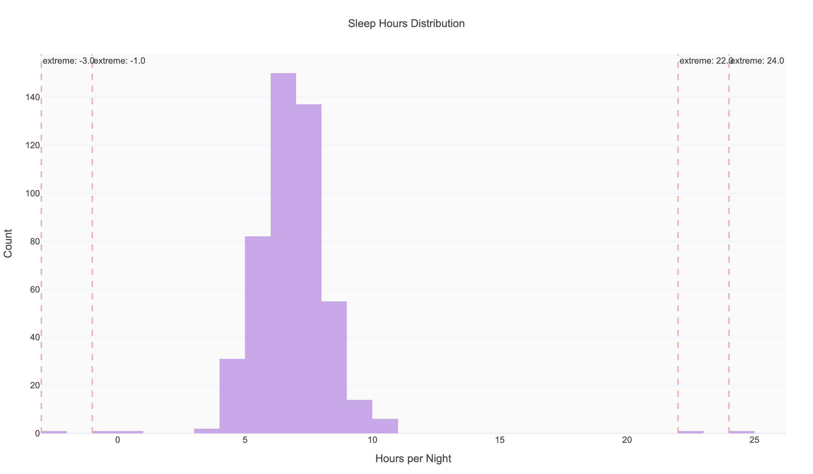

---

### 2.10 exercise_days_per_week
| Property | Value |
|----------|-------|
| dtype | float64 |
| Missing | 32 (5.98%) |
| Unique | 8 |
| Min / Max | 0.0 / 7.0 |
| Mean / Median | 3.45 / 3.0 |

No impossible values — range [0, 7] is valid. **32 missing values (6%)** need attention.

---

### 2.11 screen_time_hours
| Property | Value |
|----------|-------|
| dtype | float64 |
| Missing | 0 (0%) |
| Unique | 95 |
| Min / Max | 1.4 / 14.4 |
| Mean / Median | 7.56 / 7.6 |

Clean column — no missing values, range is plausible. Average of 7.6 hrs/day of screen time is realistic for college students.

---

### 2.12 social_media_hours
| Property | Value |
|----------|-------|
| dtype | float64 |
| Missing | 0 (0%) |
| Unique | 56 |
| Min / Max | 0.0 / 6.1 |
| Mean / Median | 2.55 / 2.5 |

Clean column. No issues.

---

### 2.13 caffeine_mg_per_day
| Property | Value |
|----------|-------|
| dtype | float64 |
| Missing | 37 (6.92%) |
| Unique | 255 |
| Min / Max | 0.0 / 472.0 |
| Mean / Median | 185.28 / 189.0 |

Range is plausible (0–472 mg; context: a typical coffee is ~95 mg). **37 missing values (6.9%).**

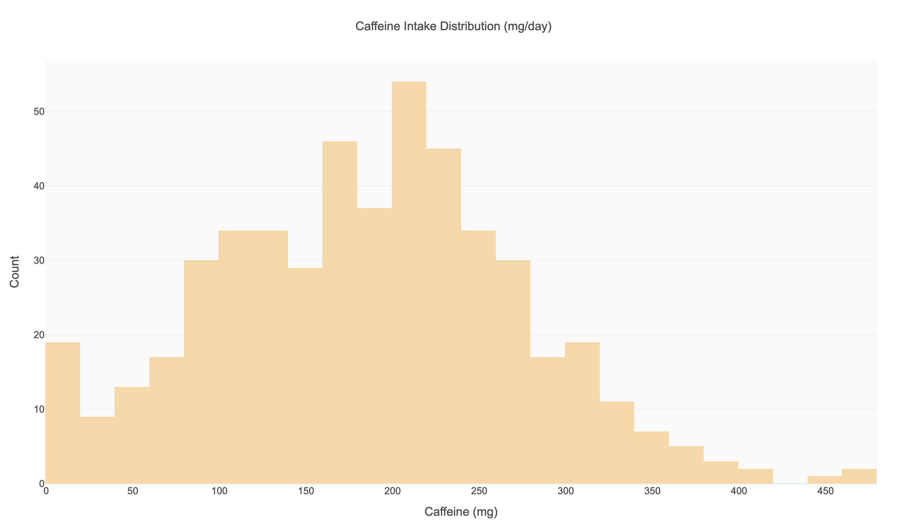

---

### 2.14 stress_level
| Property | Value |
|----------|-------|
| dtype | str (object) |
| Missing | 0 (0%) |
| Unique | 90 |

**Mixed types:** Mostly numeric strings (e.g., "4.9", "5.6"), but **20 rows contain text labels:**

| Text Value | Count |
|-----------|-------|
| low | 8 |
| medium | 6 |
| high | 4 |
| very high | 2 |

**So what?** This column cannot be used in any numeric analysis until the text labels are mapped to numbers. Suggested mapping: low → 2, medium → 5, high → 8, very high → 9.5.

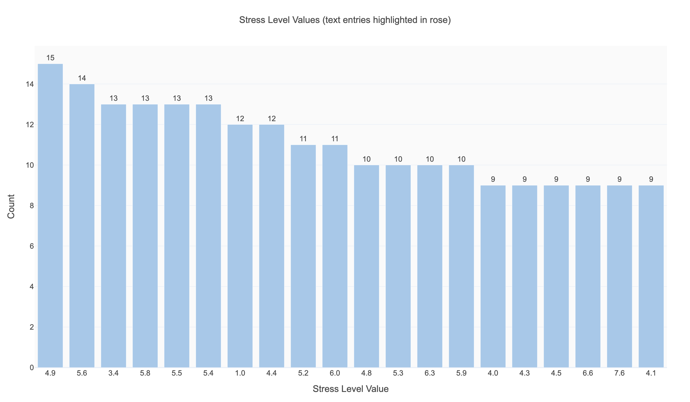

---

### 2.15 anxiety_score
| Property | Value |
|----------|-------|
| dtype | float64 |
| Missing | 69 (12.9%) |
| Unique | 16 |
| Min / Max | 0.0 / 15.0 |
| Mean / Median | 6.08 / 6.0 |

Valid range for GAD-7 is 0–21; all observed values fall within [0, 15]. **Highest missingness in the dataset (12.9%)** — tied with depression_score. This may indicate survey fatigue or sensitivity around mental health questions.

---

### 2.16 depression_score
| Property | Value |
|----------|-------|
| dtype | float64 |
| Missing | 69 (12.9%) |
| Unique | 16 |
| Min / Max | 0.0 / 15.0 |
| Mean / Median | 5.05 / 5.0 |

Same missingness pattern as anxiety_score (69 rows, 12.9%). Valid range for PHQ-9 is 0–27; observed max is 15. These two columns likely share the same missing rows — worth investigating in Phase 1.

---

### 2.17 life_satisfaction
| Property | Value |
|----------|-------|
| dtype | float64 |
| Missing | 0 (0%) |
| Unique | 88 |
| Min / Max | 1.0 / 10.0 |
| Mean / Median | 5.44 / 5.4 |

Clean column. Full range observed, roughly symmetric around the midpoint.

---

### 2.18 num_clubs
| Property | Value |
|----------|-------|
| dtype | float64 |
| Missing | 21 (3.93%) |
| Unique | 7 |
| Min / Max | 0.0 / 6.0 |
| Mean / Median | 3.12 / 3.0 |

Range [0, 6] is valid. **21 missing values** — moderate missingness.

---

### 2.19 on_campus
| Property | Value |
|----------|-------|
| dtype | str |
| Missing | 0 (0%) |
| Unique | 10 |

| Value | Count | Canonical Mapping |
|-------|-------|------------------|
| True | 258 | True |
| False | 217 | False |
| YES | 13 | → True |
| true | 8 | → True |
| 1 | 7 | → True |
| 0 | 7 | → False |
| false | 7 | → False |
| yes | 7 | → True |
| NO | 6 | → False |
| no | 5 | → False |

**60 rows (11.2%)** use non-canonical encodings. After mapping: True ≈ 293, False ≈ 242.

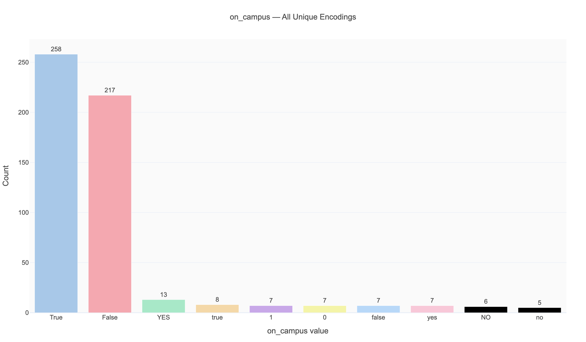

---

### 2.20 has_part_time_job
| Property | Value |
|----------|-------|
| dtype | str |
| Missing | 26 (4.86%) |
| Unique | 2 |

Only "Yes" (215) and "No" (294). Clean encoding, but **26 missing values** to handle.

---

### 2.21 monthly_spending
| Property | Value |
|----------|-------|
| dtype | float64 |
| Missing | 48 (8.97%) |
| Unique | 471 |
| Min / Max | 200.0 / 1708.98 |
| Mean / Median | 834.65 / 817.62 |

Range is plausible for college student monthly spending. **48 missing values (9%).**

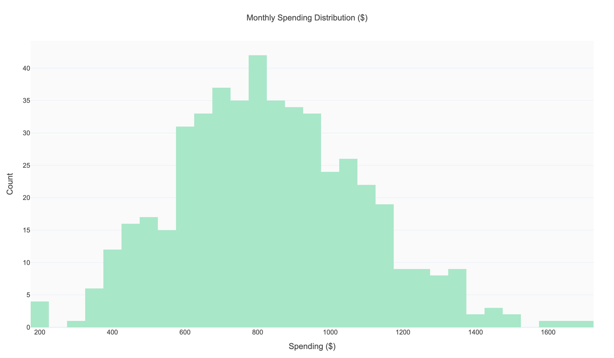

---

## 3. Cleaning Decision Log

| # | Column | Issue | Decision | Rationale |
|---|--------|-------|----------|-----------|
| 1 | (whole row) | 3 exact duplicate rows | Drop duplicates, keep first | Duplicates inflate sample and bias stats |
| 2 | age | 6 impossible values (−3, 0, 5, 150, 200, 999) | Set to NaN; impute with median (21) | These are clearly data entry errors, not outliers |
| 3 | gender | 75 rows with variant encodings | Map to canonical: Male/Female/Non-binary/Prefer not to say | Need consistent categories for group analysis |
| 4 | gpa | 8 values outside [0, 4.0] | Set to NaN | GPA > 4.0 or negative is impossible on a 4.0 scale |
| 5 | study_hours_per_day | 5 impossible values (neg or > 16) | Set to NaN | Cannot study negative hours or > 16 hrs/day |
| 6 | attendance_rate | 10 values > 100% | Set to NaN | Percentages cannot exceed 100 |
| 7 | sleep_hours_per_night | 4 extreme values (neg or > 16) | Set to NaN | Cannot sleep negative hours or 24 hrs |
| 8 | stress_level | 20 text labels mixed with numeric | Map: low→2, medium→5, high→8, very high→9.5; coerce to float | Need consistent numeric scale for correlation analysis |
| 9 | on_campus | 60 rows non-canonical encoding | Map to boolean True/False | Need consistent binary variable |
| 10 | gpa | 42 missing (7.85%) | Keep as NaN for now; evaluate imputation in Phase 1 | GPA is a key outcome — imputation strategy needs careful thought |
| 11 | sleep_hours_per_night | 53 missing (9.91%) | Keep as NaN for now | Sleep is key for H1 (Sleep vs. GPA) |
| 12 | anxiety_score | 69 missing (12.9%) | Keep as NaN for now; check if correlated with depression_score missingness | Mental health questions have highest missingness — may be MNAR |
| 13 | depression_score | 69 missing (12.9%) | Keep as NaN for now | Same as anxiety_score |
| 14 | caffeine_mg_per_day | 37 missing (6.92%) | Keep as NaN for now | Moderate missingness |
| 15 | exercise_days_per_week | 32 missing (5.98%) | Keep as NaN for now | Moderate missingness |
| 16 | num_clubs | 21 missing (3.93%) | Keep as NaN for now | Low missingness |
| 17 | has_part_time_job | 26 missing (4.86%) | Keep as NaN for now | Low missingness |
| 18 | monthly_spending | 48 missing (8.97%) | Keep as NaN for now | Substantial missingness |

---

## 4. Missingness Overview

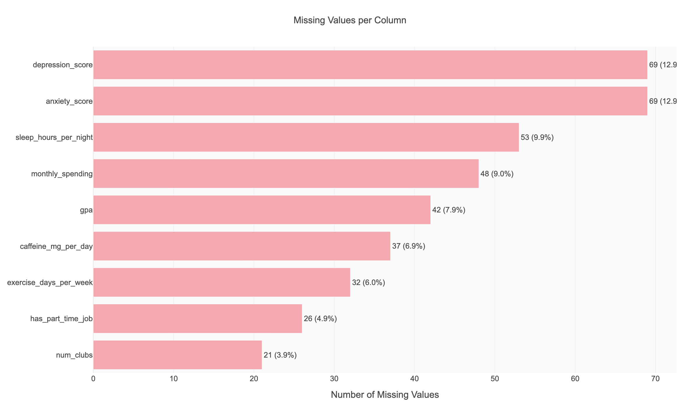

**Total missing cells:** 397 across 9 columns (3.5% of all cells in the dataset).

| Tier | Columns | % Missing |
|------|---------|-----------|
| High | anxiety_score, depression_score | 12.9% |
| Medium | sleep_hours_per_night (9.9%), monthly_spending (9.0%), gpa (7.9%), caffeine_mg_per_day (6.9%), exercise_days_per_week (6.0%) | 6–10% |
| Low | has_part_time_job (4.9%), num_clubs (3.9%) | < 5% |
| None | 12 columns | 0% |

**Key question for Phase 1:** Do anxiety_score and depression_score share the same missing rows? If so, this suggests systematic non-response on mental health questions (MNAR — Missing Not At Random), which would bias any mental health analysis.

---

## 5. Duplicate Rows

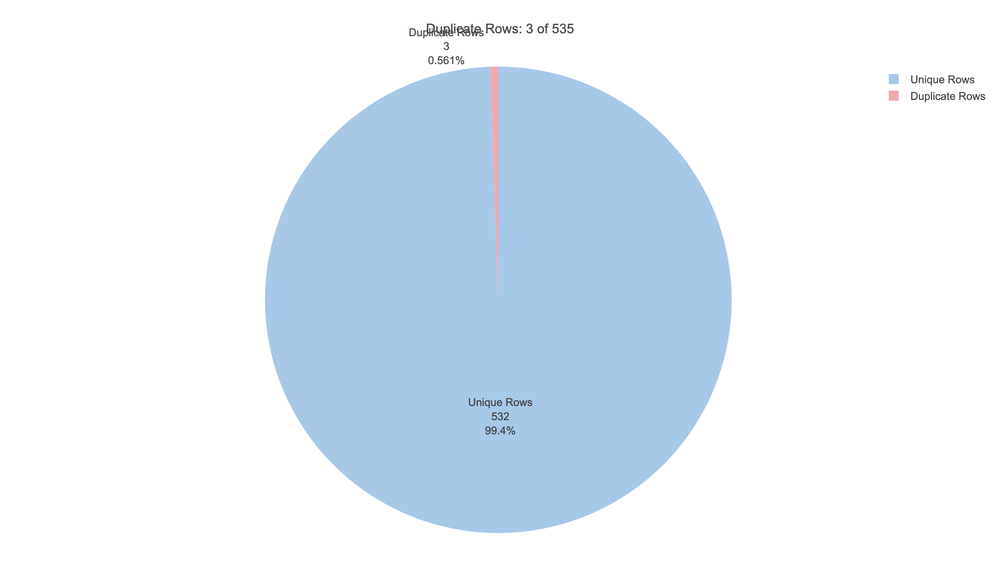

**3 exact duplicate rows** found at indices 189, 404, 488. These represent 0.6% of the dataset. After deduplication the dataset shrinks from 535 → 532 rows.

---

## 6. Key Questions Raised

1. **Missingness pattern:** Do anxiety_score and depression_score always go missing together? Is missingness correlated with stress level, major, or year?
2. **Stress text labels:** The mapping low→2, medium→5, high→8, very high→9.5 is a judgment call. Are there better reference points?
3. **Attendance > 100%:** Could these represent extra-credit adjustments, or are they pure errors?
4. **Age distribution:** After removing impossibles, is the 18–25 range truly complete, or do some ages dominate?
5. **GPA missingness:** Is GPA more likely to be missing for certain majors or year levels?

---

## 7. Figures Index

| Figure | File | Description |
|--------|------|-------------|
| Missing values overview | `figures/missing_values_overview.png` | Horizontal bar chart of missing counts per column |
| Age distribution | `figures/age_distribution.png` | Histogram with impossible values annotated |
| Gender encoding | `figures/gender_encoding.png` | Bar chart of all 12 unique gender strings |
| GPA distribution | `figures/gpa_distribution.png` | Histogram with out-of-range values flagged |
| Stress level mixed | `figures/stress_level_mixed.png` | Bar chart highlighting text vs. numeric entries |
| on_campus encoding | `figures/on_campus_encoding.png` | Bar chart of all 10 encoding variants |
| Sleep hours distribution | `figures/sleep_hours_distribution.png` | Histogram with extreme values annotated |
| Attendance rate | `figures/attendance_rate_distribution.png` | Histogram with > 100% values flagged |
| Study hours | `figures/study_hours_distribution.png` | Histogram with impossible values annotated |
| Caffeine distribution | `figures/caffeine_distribution.png` | Histogram of daily caffeine intake |
| Monthly spending | `figures/monthly_spending_distribution.png` | Histogram of monthly spending |
| Duplicate rows | `figures/duplicate_rows.png` | Pie chart showing duplicate proportion |
