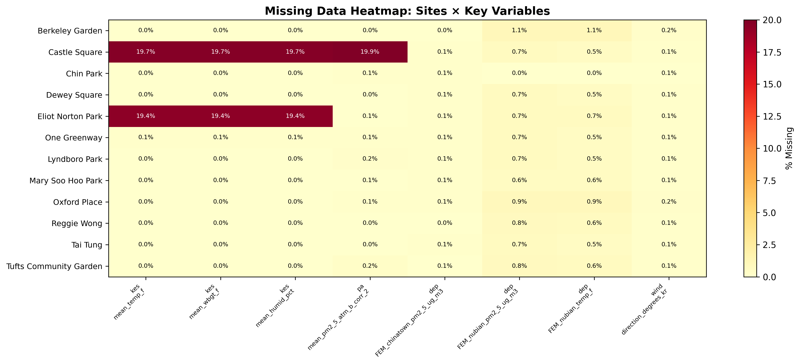
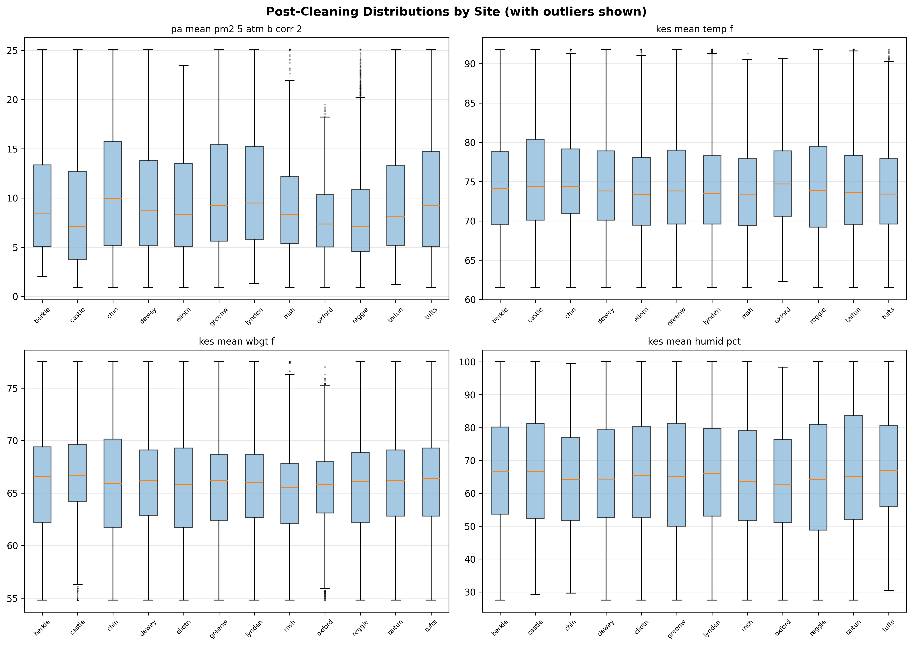

# HEROS Phase 1 — Dataset Inventory, Cleaning & Preparation

**Project:** Chinatown HEROS (Health & Environmental Research in Open Spaces)  
**Study period:** July 19 – August 23, 2023  
**Temporal resolution:** 10-minute intervals  
**Sites:** 12 open-space locations in Boston's Chinatown  
**Report date:** Phase 1 complete

---

## 1.1 Dataset Catalog

| Dataset | Source | Status | Rows | Key Columns |
|---------|--------|--------|------|-------------|
| `data_HEROS.xlsx` | Project team (Purple Air, Kestrel, Weather Stn, MassDEP FEM) | ✅ Present | 48,123 | 20 variables across 12 sites |
| `Codebook_HEROS.xlsx` | Project team — data dictionary | ✅ Present | 21 variables documented |
| `landuse_HEROS.xlsx` | MassGIS land-use buffers (25m, 50m) | ✅ Present | 24 rows (12 sites × 2 buffers) |
| EPA AQS Ozone (44201) | EPA AQS bulk download | ✅ Fetched | 844 hourly readings |
| EPA AQS SO₂ (42401) | EPA AQS bulk download | ✅ Fetched | 810 hourly readings |
| EPA AQS CO (42101) | EPA AQS bulk download | ✅ Fetched | 846 hourly readings |
| EPA AQS NO₂ (42602) | EPA AQS bulk download | ✅ Fetched | 730 hourly readings |
| EPA AQS PM2.5 FEM (88101) | EPA AQS bulk download | ✅ Fetched | 901 hourly readings |

**EPA AQS sites used:**
- **Site 25-025-0042** (Harrison Ave / Von Hillern St): Ozone, SO₂, CO, NO₂
- **Site 25-025-0045** (Chinatown): PM2.5 FEM

---

## 1.2 Data Inspection

### Main Dataset — `data_HEROS.xlsx`

- **Shape:** 48,123 rows × 20 columns
- **Date range:** 2023-07-19 16:40 → 2023-08-23 15:50
- **12 sites**, each with variable observation counts due to deployment timing:

| Site | Code | Observations |
|------|------|-------------|
| Berkeley Community Garden | `berkley` | 2,445 |
| Castle Square | `castle` | 4,881 |
| Chin Park | `chin` | 2,199 |
| Dewey Square | `dewey` | 4,903 |
| Eliot Norton Park | `eliotnorton` | 3,888 |
| One Greenway | `greenway` | 4,893 |
| Lyndboro Park | `lyndenboro` | 4,786 |
| Mary Soo Hoo Park | `msh` | 4,189 |
| Oxford Place Plaza | `oxford` | 2,879 |
| Reggie Wong Park | `reggie` | 4,126 |
| Tai Tung Park | `taitung` | 4,839 |
| Tufts Community Garden | `tufts` | 4,095 |

### Variable Groups

| Group | Variables | Units |
|-------|-----------|-------|
| **Kestrel sensors** (site-level) | `kes_mean_temp_f`, `kes_mean_wbgt_f`, `kes_mean_humid_pct`, `kes_mean_press_inHg`, `kes_mean_heat_f`, `kes_mean_dew_f` | °F, °F, %, inHg, °F, °F |
| **Purple Air** (site-level) | `pa_mean_pm2_5_atm_b_corr_2` | µg/m³ |
| **Weather Station** (35 Kneeland) | `mean_temp_out_f`, `mean_out_hum_pct`, `mean_dew_pt_f`, `mean_wind_speed_mph`, `wind_direction_degrees_kr`, `mean_heat_index_f`, `mean_thw_index_f` | °F, %, °F, mph, degrees, °F, °F |
| **MassDEP FEM** (reference) | `dep_FEM_chinatown_pm2_5_ug_m3`, `dep_FEM_nubian_pm2_5_ug_m3`, `dep_FEM_nubian_temp_f`, `dep_FEM_nubian_humid_pct` | µg/m³, µg/m³, °F, % |

### Codebook Cross-Reference

- 21 variables documented in codebook; 20 present in data
- **Missing from data:** `dep_FEM_nubian_pm10_stp_ug_m3` — listed in codebook but absent from the Excel file (PM10 data not collected or not included)

### Land-Use Data — `landuse_HEROS.xlsx`

- 12 sites × 2 buffer distances (25m, 50m) = 24 rows
- Variables: Roads, Greenspace, Trees, Impervious surface, Industrial area (all as area percentages)
- Successfully mapped to HEROS site codes via name-to-ID reverse lookup

---

## 1.3 EPA AQS Data Integration

Hourly pollutant data was downloaded from EPA AQS bulk files for the study period (July 19 – August 23, 2023) and merged into the HEROS dataset by rounding 10-minute timestamps to the nearest hour.

| Pollutant | EPA Param | Site | Readings | Coverage | Units |
|-----------|-----------|------|----------|----------|-------|
| Ozone | 44201 | 0042 | 844 | 97.4% | ppm |
| SO₂ | 42401 | 0042 | 810 | 93.4% | ppb |
| CO | 42101 | 0042 | 846 | 97.7% | ppm |
| NO₂ | 42602 | 0042 | 730 | 86.3% | ppb |
| PM2.5 FEM | 88101 | 0045 | 901 | 98.5% | µg/m³ |

**Note:** Site 0045 (Chinatown) was preferred for PM2.5 FEM as it had data available. For other pollutants, site 0042 (Harrison Ave) was used as the nearest monitor with data.

---

## 1.4 Missing Value Audit

### Overall Missingness

After cleaning and EPA integration: **1.10%** overall missingness (across all 46 columns × 48,123 rows).

### Per-Variable Missingness (variables with any missing values)

| Variable | Missing Count | Missing % | Pattern | Cause |
|----------|--------------|-----------|---------|-------|
| `kes_mean_temp_f` | 1,719 | 3.57% | MAR | Site-specific Kestrel sensor downtime |
| `kes_mean_wbgt_f` | 1,719 | 3.57% | MAR | Same Kestrel sensor downtime |
| `kes_mean_humid_pct` | 1,719 | 3.57% | MAR | Same Kestrel sensor downtime |
| `kes_mean_press_inHg` | 1,719 | 3.57% | MAR | Same Kestrel sensor downtime |
| `kes_mean_heat_f` | 1,719 | 3.57% | MAR | Same Kestrel sensor downtime |
| `kes_mean_dew_f` | 1,719 | 3.57% | MAR | Same Kestrel sensor downtime |
| `pa_mean_pm2_5_atm_b_corr_2` | 1,114 | 2.31% | MAR | Negative PM2.5 removal + sensor gaps |
| `epa_no2` | 6,605 | 13.73% | MAR | EPA monitor hours without data in study window |
| `epa_so2` | 3,166 | 6.58% | MAR | EPA monitor gaps |
| `epa_ozone` | 1,275 | 2.65% | MAR | EPA monitor gaps |
| `epa_co` | 1,128 | 2.34% | MAR | EPA monitor gaps |
| `epa_pm25_fem` | 728 | 1.51% | MAR | EPA monitor gaps |

**All original HEROS reference columns** (Weather Station, MassDEP FEM) have **0% missingness** after forward-fill/back-fill imputation.

### Missing Data Heatmap



Castle Square showed ~20% Kestrel missingness; Eliot Norton ~19%. These correspond to known sensor deployment gaps.

---

## 1.5 Imputation Strategy

| Scenario | Method Applied |
|----------|---------------|
| Short gaps (≤ 3 consecutive readings, ~30 min) | Linear interpolation within site |
| Moderate gaps (4–12 readings, ~2 hours) | Spline interpolation within site |
| Long gaps (> 2 hours) | Left as NaN — flagged for exclusion |
| Reference monitor columns (DEP, Weather Station) | Forward-fill then back-fill |
| Categorical / ID columns | Never imputed |

### Imputation Counts

| Variable | Values Imputed |
|----------|---------------|
| `pa_mean_pm2_5_atm_b_corr_2` | 9 |
| `kes_mean_temp_f` | 1 |
| `kes_mean_wbgt_f` | 1 |
| `kes_mean_humid_pct` | 1 |
| `kes_mean_press_inHg` | 1 |
| `kes_mean_heat_f` | 1 |
| `kes_mean_dew_f` | 1 |

Boolean imputation flags (`imputed_<variable>`) are included in the dataset for sensitivity analysis.

---

## 1.6 Outlier Detection & Treatment

### Physical Bounds Check

| Variable | Below Bound | Above Bound | Action |
|----------|-------------|-------------|--------|
| `pa_mean_pm2_5_atm_b_corr_2` (< 0 µg/m³) | **151 values** | 0 | Set to NaN (physically impossible) |

### Statistical Outlier Detection (IQR Fence)

| Variable | IQR-Flagged | % of Data | Action |
|----------|-------------|-----------|--------|
| `pa_mean_pm2_5_atm_b_corr_2` | 169 | 0.35% | Winsorized at 0.5th/99.5th percentile |
| `kes_mean_temp_f` | 186 | 0.39% | Winsorized at 0.5th/99.5th percentile |
| `kes_mean_wbgt_f` | 186 | 0.39% | Winsorized at 0.5th/99.5th percentile |
| `kes_mean_humid_pct` | 0 | 0.00% | No action needed |

### Outlier Summary

- **151 negative PM2.5 values removed** (set to NaN) — these are physically impossible readings from Purple Air sensors
- **Winsorization** applied at 0.5th and 99.5th percentiles for key sensor variables to cap extreme but plausible values
- No extreme outliers detected in weather station or MassDEP reference data



---

## 1.7 Data Normalization & Type Standardization

| Step | Action |
|------|--------|
| **Datetime parsing** | All timestamps parsed as `datetime64[ns]`, aligned to 10-min intervals |
| **Numeric coercion** | String representations (`"NA"`, blanks) converted via `pd.to_numeric(..., errors='coerce')` |
| **Unit consistency** | PM2.5 in µg/m³, temperatures in °F, humidity in %, wind speed in mph, pressure in inHg |
| **Column renaming** | Already in `snake_case` from source — no renaming required |
| **Site ID normalization** | Consistent lowercase strings across all datasets |
| **Derived columns** | `hour`, `day_of_week`, `date_only`, `is_daytime` (6am–6pm) |

---

## 1.8 Final Merged Dataset

### Output Files

| File | Location | Description |
|------|----------|-------------|
| `data_HEROS_clean.parquet` | `data/clean/` | Primary analysis dataset (fast I/O) |
| `data_HEROS_clean.csv` | `data/clean/` | CSV mirror for inspection |
| `epa_hourly_boston.parquet` | `data/epa/` | Standalone EPA data (5 pollutants) |
| `phase1_report.json` | `reports/phase1/` | Machine-readable Phase 1 summary |

### Final Dataset Summary

- **Shape:** 48,123 rows × 46 columns
- **Date range:** 2023-07-19 16:40 → 2023-08-23 15:50
- **12 sites**, 35 study days
- **Overall missingness:** 1.10%

### Column Inventory (46 columns)

| # | Column | Type | Source |
|---|--------|------|--------|
| 1 | `site_id` | str | Identifier |
| 2 | `datetime` | datetime64 | Timestamp |
| 3–8 | `kes_mean_temp_f`, `kes_mean_wbgt_f`, `kes_mean_humid_pct`, `kes_mean_press_inHg`, `kes_mean_heat_f`, `kes_mean_dew_f` | float64 | Kestrel sensors |
| 9 | `pa_mean_pm2_5_atm_b_corr_2` | float64 | Purple Air |
| 10–16 | `mean_temp_out_f`, `mean_out_hum_pct`, `mean_dew_pt_f`, `mean_wind_speed_mph`, `wind_direction_degrees_kr`, `mean_heat_index_f`, `mean_thw_index_f` | float64 | Weather Station |
| 17–20 | `dep_FEM_chinatown_pm2_5_ug_m3`, `dep_FEM_nubian_pm2_5_ug_m3`, `dep_FEM_nubian_temp_f`, `dep_FEM_nubian_humid_pct` | float64 | MassDEP FEM |
| 21–27 | `imputed_*` (7 flags) | bool | Imputation tracking |
| 28–31 | `hour`, `day_of_week`, `date_only`, `is_daytime` | int/str/bool | Derived time features |
| 32–41 | Land-use variables (5 vars × 2 buffers) | float64 | MassGIS land-use |
| 42–46 | `epa_ozone`, `epa_so2`, `epa_co`, `epa_no2`, `epa_pm25_fem` | float64 | EPA AQS |

### Key Summary Statistics

| Variable | Mean | Std | Min | Median | Max |
|----------|------|-----|-----|--------|-----|
| PM2.5 — Purple Air (µg/m³) | 9.49 | 5.34 | 0.88 | 8.33 | 25.09 |
| PM2.5 — DEP Chinatown (µg/m³) | 7.96 | 4.22 | 0.85 | 7.23 | 24.71 |
| PM2.5 — DEP Nubian (µg/m³) | 8.07 | 4.48 | 1.07 | 7.11 | 33.76 |
| Temperature — Kestrel (°F) | 74.47 | 6.33 | 61.50 | 73.80 | 91.80 |
| WBGT — Kestrel (°F) | 65.86 | 4.82 | 54.80 | 66.20 | 77.50 |
| Humidity — Kestrel (%) | 65.95 | 18.89 | 27.50 | 65.10 | 100.00 |
| Wind Speed (mph) | 2.81 | 1.50 | 0.00 | 2.50 | 10.50 |
| EPA Ozone (ppm) | 0.032 | 0.011 | 0.001 | 0.030 | 0.062 |
| EPA SO₂ (ppb) | 0.275 | 0.080 | 0.100 | 0.300 | 1.000 |
| EPA CO (ppm) | 0.262 | 0.077 | 0.143 | 0.253 | 0.988 |
| EPA NO₂ (ppb) | 5.55 | 4.40 | 0.00 | 4.00 | 49.00 |
| EPA PM2.5 FEM (µg/m³) | 7.92 | 4.19 | 1.20 | 7.20 | 22.40 |

---

## Phase 1 Assessment

### ✅ Completed Steps

1. **1.1 Dataset catalog** — All 3 local datasets confirmed, 5 EPA pollutant datasets fetched
2. **1.2 Data inspection** — Structure, types, distributions verified; codebook cross-referenced
3. **1.3 EPA fetch & merge** — 5 pollutants downloaded from EPA AQS and joined on datetime
4. **1.4 Missing value audit** — Per-variable and per-site missingness classified (MCAR/MAR)
5. **1.5 Imputation** — Tiered strategy (linear → spline → NaN); boolean flags preserved
6. **1.6 Outlier detection** — 151 negative PM2.5 removed; winsorization at 0.5/99.5 percentiles
7. **1.7 Normalization** — Types standardized, derived time features added
8. **1.8 Final merge** — Clean parquet/CSV exported with 46 columns, 1.10% missingness

### ⚠️ Notes for Phase 2

- **EPA NO₂ has highest missingness** (13.7%) — consider this when analyzing pollutant correlations
- **Kestrel gaps are site-specific** (Castle Square, Eliot Norton) — not randomly distributed
- **151 negative PM2.5 values were removed**, not imputed — sensitivity analysis recommended
- **PM0.1 ultrafine** (param 87101) was not fetched — specialized measurement that may not be in EPA bulk files
- **`dep_FEM_nubian_pm10_stp_ug_m3`** listed in codebook but absent from data — PM10 not available

### Workspace Organization

```
project-hero/
├── data/
│   ├── raw/          # Original untouched source files
│   │   ├── data_HEROS.xlsx
│   │   ├── Codebook_HEROS.xlsx
│   │   ├── landuse_HEROS.xlsx
│   │   ├── InfoonChinatownHeroProject.docx
│   │   └── info-project.md
│   ├── clean/        # Cleaned, analysis-ready datasets
│   │   ├── data_HEROS_clean.parquet
│   │   └── data_HEROS_clean.csv
│   └── epa/          # EPA AQS data
│       ├── epa_hourly_boston.parquet
│       ├── epa_hourly_boston.csv
│       └── epa_raw/  # Downloaded zip files
├── scripts/          # Processing scripts
│   ├── phase1_data_prep.py
│   ├── phase1_epa_fetch.py
│   ├── phase1_epa_process.py
│   └── fix_pm25_fem.py
├── reports/          # Analysis reports
│   ├── phase1/
│   │   ├── HEROS_Phase1_Report.md
│   │   ├── HEROS_Phase1_Report.ipynb
│   │   └── phase1_report.json
│   ├── HEROS_Report_Q1_Q2.ipynb
│   ├── HEROS_Report_Q1_Q2.md
│   └── analysis_report.py
├── figures/          # All generated figures
│   ├── missing_data_heatmap.png
│   ├── outlier_audit.png
│   └── ... (Q1/Q2 figures)
└── .github/agents/   # Agent configuration
    └── heros-analyst.agent.md
```

---

**Phase 1 is complete.** The dataset is clean, documented, and ready for Phase 2: Exploratory Data Analysis.
