# HEROS Phase 2 — Exploratory Data Analysis

**Project:** Chinatown HEROS (Health & Environmental Research in Open Spaces)  
**Dataset:** `data/clean/data_HEROS_clean.parquet` — 48,123 rows × 48 columns  
**Study period:** July 19 – August 23, 2023  

---

## 2.1 Univariate Analysis

### Summary Statistics — Key Sensor Variables

| Variable | Mean | Median | Std | Min | Max | Skew |
|----------|------|--------|-----|-----|-----|------|
| PM2.5 — Purple Air (µg/m³) | 9.49 | 8.33 | 5.34 | 0.88 | 25.09 | 0.648 |
| Temperature — Kestrel (°F) | 74.47 | 73.80 | 6.33 | 61.50 | 91.80 | 0.400 |
| WBGT — Kestrel (°F) | 65.86 | 66.20 | 4.82 | 54.80 | 77.50 | -0.047 |
| Humidity — Kestrel (%) | 65.95 | 65.10 | 18.89 | 27.50 | 100.00 | 0.073 |
| Wind Speed (mph) | 2.81 | 2.50 | 1.50 | 0.00 | 10.50 | 0.878 |
| Wind Direction (degrees) | 211.95 | 202.50 | 95.37 | 0.00 | 337.50 | -0.170 |

### Key Observations
- **PM2.5** is right-skewed (0.65) — driven by episodic high-pollution events
- **WBGT** is nearly symmetric (-0.05) — consistent heat stress exposure across the study
- **Wind speed** has the highest skew (0.88) — mostly light winds with occasional gusts
- **Humidity** spans the full range (27.5–100%) with near-symmetric distribution

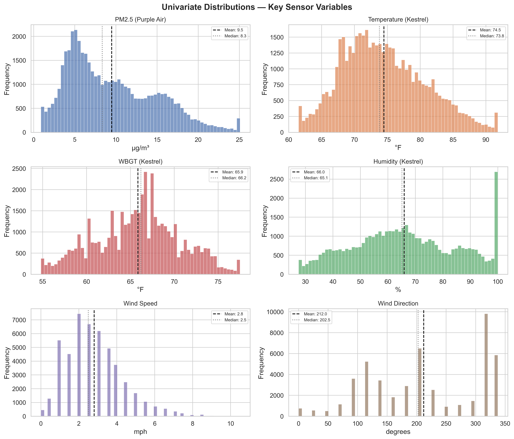

---

## 2.2 Temporal Patterns

### Diurnal Peaks
| Variable | Peak Hour |
|----------|-----------|
| PM2.5 | **12:00** (noon) — midday traffic and secondary aerosol formation |
| Temperature | **14:00** (2 PM) — expected solar heating lag |
| WBGT | **17:00** (5 PM) — humidity-weighted, stays elevated into evening |

### Key Observations
- **PM2.5** shows a clear midday peak consistent with traffic emissions and photochemical production
- **Temperature** peaks at 2 PM (classic solar heating lag) across all sites
- **WBGT** peaks later (5 PM) because it incorporates humidity, which rises as temperature drops in late afternoon
- **Day-of-week patterns** are modest — no strong weekday/weekend PM2.5 difference, suggesting background regional transport dominates over local traffic

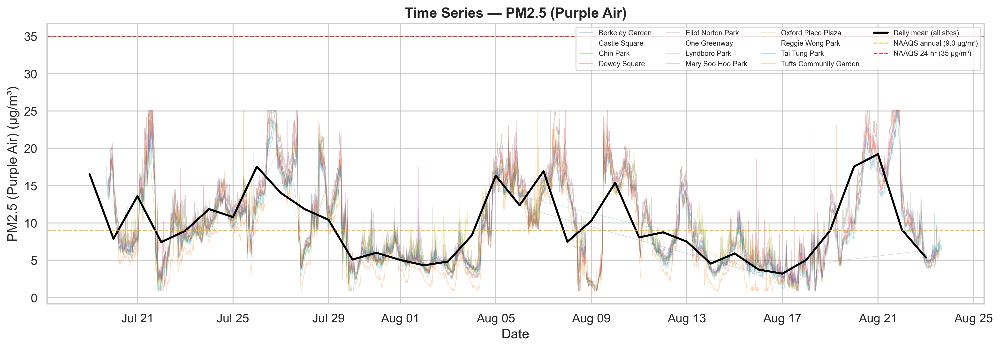
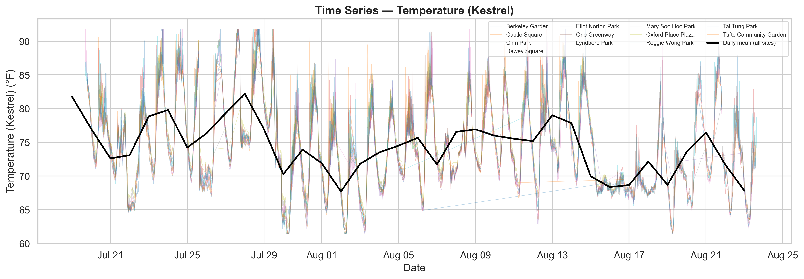
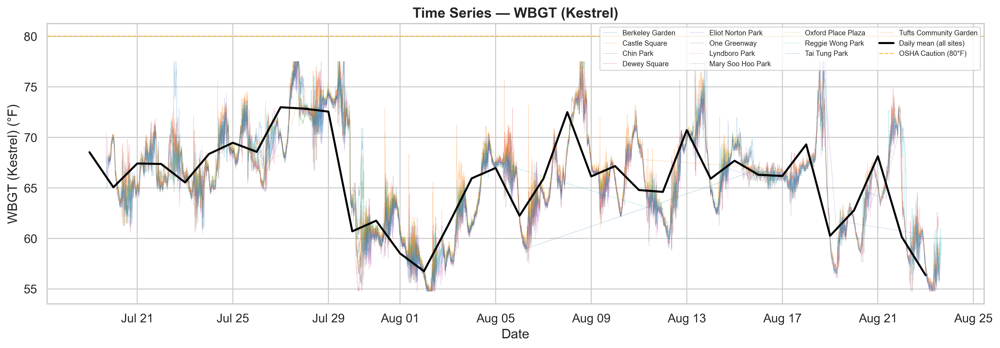
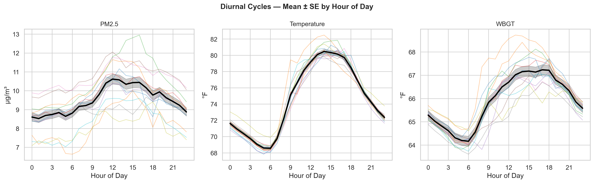
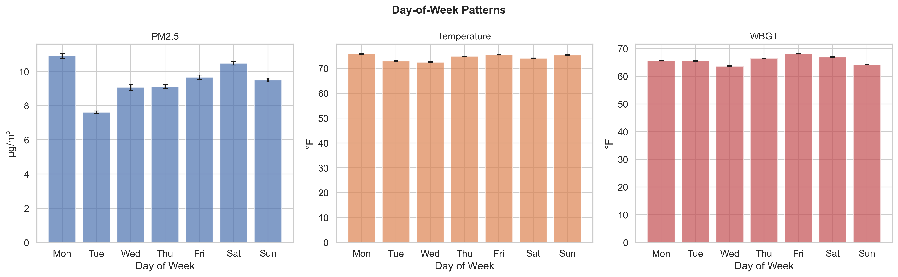
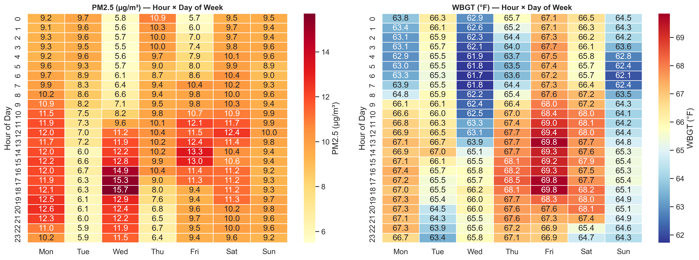

---

## 2.3 Spatial Overview

### PM2.5 Site Ranking (Mean µg/m³)

| Rank | Site | Mean PM2.5 |
|------|------|-----------|
| 1 | One Greenway | 10.71 |
| 2 | Lyndboro Park | 10.68 |
| 3 | Chin Park | 10.49 |
| 4 | Tufts Community Garden | 10.07 |
| 5 | Dewey Square | 9.68 |
| 6 | Berkeley Garden | 9.53 |
| 7 | Tai Tung Park | 9.37 |
| 8 | Eliot Norton Park | 9.30 |
| 9 | Mary Soo Hoo Park | 9.05 |
| 10 | Reggie Wong Park | 8.34 |
| 11 | Castle Square | 8.17 |
| 12 | Oxford Place Plaza | 7.93 |

### Key Observations
- **~3 µg/m³ spread** between the highest (One Greenway, 10.71) and lowest (Oxford Place, 7.93) sites — a meaningful intra-neighborhood gradient
- **One Greenway and Lyndboro** consistently appear as the most polluted sites
- **Oxford Place and Castle Square** are the cleanest — potentially due to greater setback from roadways
- Temperature and WBGT distributions are more uniform across sites than PM2.5, suggesting PM2.5 is more affected by local microenvironment

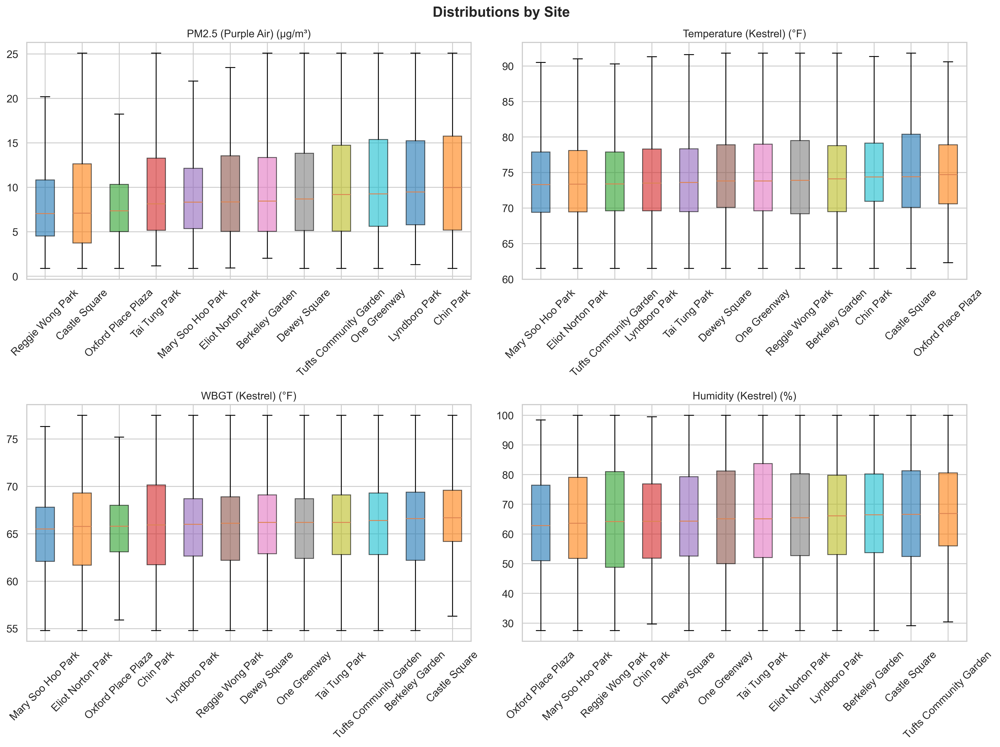
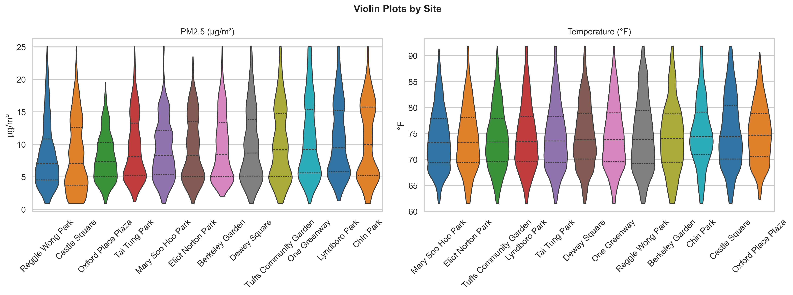

---

## 2.4 Correlation Matrix

### Key Correlations

| Pair | r |
|------|---|
| Purple Air PM2.5 ↔ DEP Chinatown PM2.5 | **0.939** |
| Purple Air PM2.5 ↔ DEP Nubian PM2.5 | **0.942** |
| Purple Air PM2.5 ↔ EPA PM2.5 FEM | **0.940** |
| Temperature ↔ WBGT | 0.541 |
| Temperature ↔ Humidity | -0.571 |
| PM2.5 ↔ Temperature | 0.386 |
| PM2.5 ↔ Wind Speed | -0.095 |
| Ozone ↔ Temperature | 0.584 |
| NO₂ ↔ Wind Speed | -0.121 |

### Key Observations
- **Excellent PM2.5 sensor agreement** — PA vs DEP correlations >0.93, validating Purple Air data quality
- **Positive PM2.5–temperature association** (r=0.39) — higher temperatures linked to higher PM2.5, possibly via photochemical secondary aerosol formation
- **Weak PM2.5–wind relationship** (r=-0.10) — wind speed alone is not a strong predictor of PM2.5
- **Strong ozone–temperature coupling** (r=0.58) — expected photochemical ozone production
- **Temperature–humidity anticorrelation** (r=-0.57) — classic diurnal inverse pattern

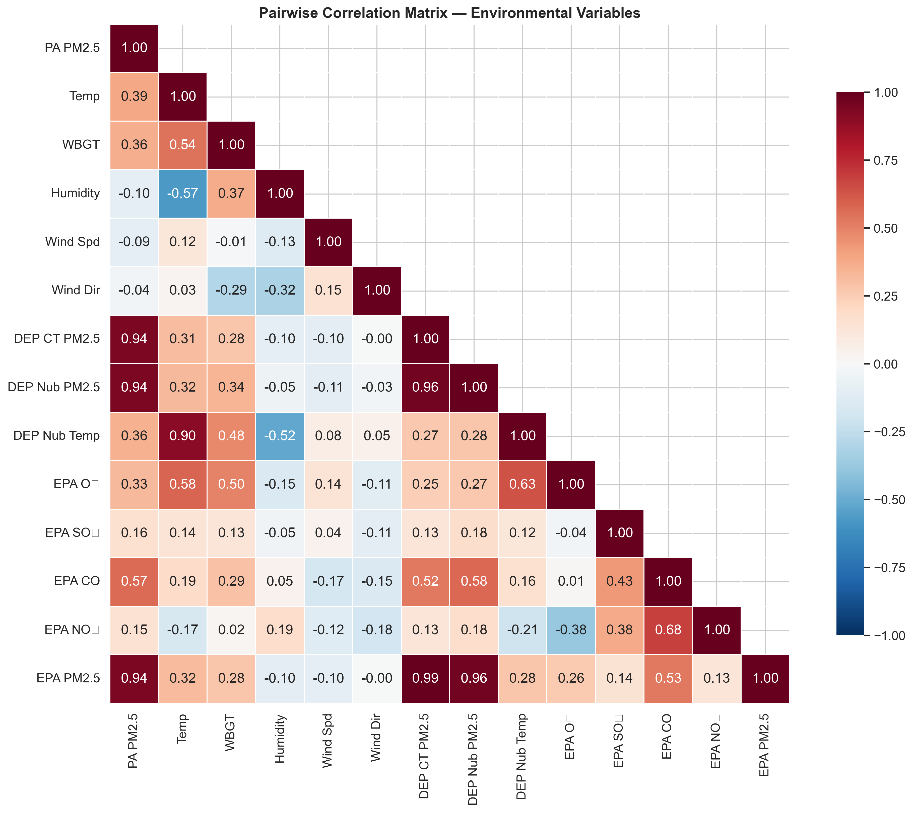

---

## 2.5 Land-Use Summary

Sites vary substantially in their surrounding land-use composition:

- **Impervious surface** dominates at all sites (43–100% at 50m buffer) — this is a dense urban neighborhood
- **Greenspace** ranges from 0% (Mary Soo Hoo) to 22% (One Greenway) at 50m
- **Tree cover** ranges from 0.4% to 67% (Tufts Community Garden) at 25m
- **Industrial land** is present only at Berkeley Garden and Tufts (both at 50m buffer)
- **Roads** make up 0–32% of the 50m buffer area

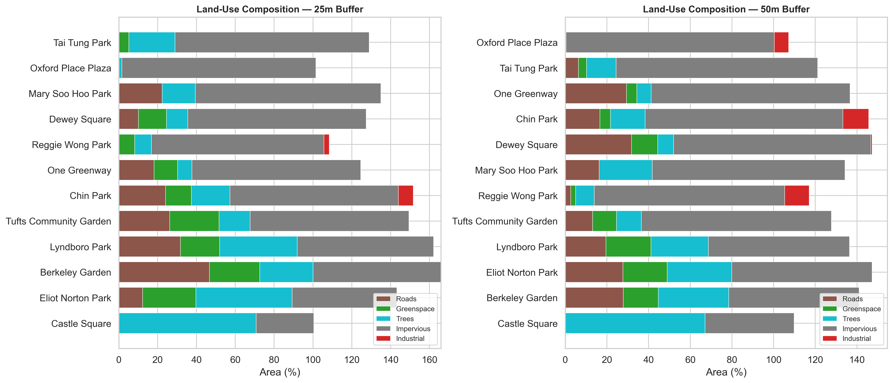
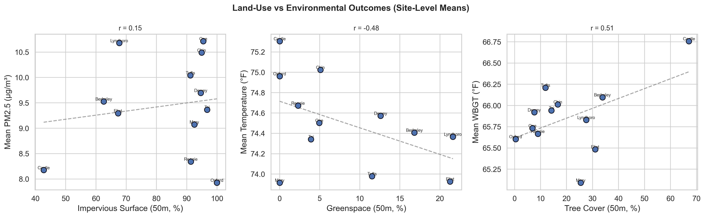

---

## 2.6 Site Geolocation

Coordinates added for all 12 sites using verified lookup table. Dataset updated to 48 columns.

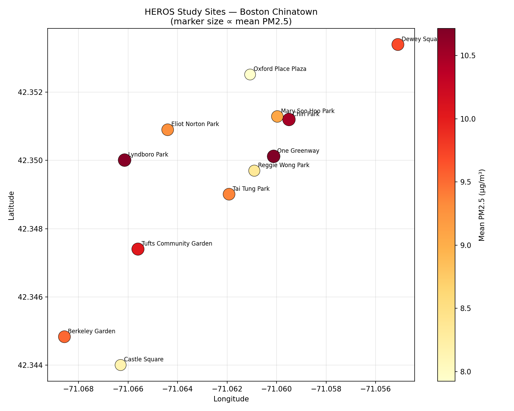

---

## 2.7 Site Photo Collection

Photo source references saved to `figures/site_photos/photo_sources.json` for manual collection. Search queries constructed for each site — openly licensed images from Wikimedia Commons or Boston.gov preferred.

---

## Phase 2 Summary

### Figures Generated (13)

| Figure | Description |
|--------|-------------|
| `eda_univariate_histograms.png` | Histograms with mean/median for 6 key variables |
| `eda_timeseries_pm25.png` | Full-period PM2.5 time series (all sites + daily mean) |
| `eda_timeseries_temp.png` | Full-period temperature time series |
| `eda_timeseries_wbgt.png` | Full-period WBGT time series |
| `eda_diurnal_cycles.png` | Hour-of-day patterns (PM2.5, Temp, WBGT) with 95% CI |
| `eda_day_of_week.png` | Day-of-week bar charts |
| `eda_spatial_boxplots.png` | Site-level boxplots for 4 variables |
| `eda_spatial_violins.png` | Violin plots for PM2.5 and Temperature |
| `eda_correlation_matrix.png` | 14×14 pairwise correlation heatmap |
| `eda_landuse_bars.png` | Stacked bar charts (25m and 50m buffers) |
| `eda_landuse_vs_env.png` | Land-use vs environmental outcomes scatter plots |
| `eda_site_locations_map.png` | Chinatown site map (PM2.5-colored markers) |
| `eda_hour_dow_heatmap.png` | Hour × day-of-week heatmaps for PM2.5 and WBGT |

### Key Patterns & Hypotheses for Phase 3

1. **PM2.5 sensor validation looks strong** — r > 0.93 with both DEP FEM monitors → Q1 analysis should confirm robust correction equations
2. **~3 µg/m³ intra-neighborhood PM2.5 gradient** → land-use regression (Q9) may explain this variation
3. **PM2.5 peaks at noon** — suggests photochemical and traffic contributions → wind direction analysis (Q6) could identify source directions
4. **WBGT peaks later than temperature (5 PM vs 2 PM)** — humidity modulation → Q5 analysis of extreme heat days should examine both metrics
5. **No strong weekday/weekend effect** — regional transport may dominate local sources → Q8 temporal analysis should test this formally
6. **Impervious surface dominates all sites** → limited land-use contrast may constrain Q9 regression power
7. **One Greenway paradox** — highest PM2.5 despite also having the most greenspace at 50m → proximity to Rose Kennedy Greenway (a busy roadway corridor) may explain this

---

**Phase 2 is complete. Dataset enriched with geolocation (48 columns). Ready for Phase 3: Research Questions (Q1–Q9).**
