# Q1 — PM2.5 Sensor Comparison: Purple Air vs MassDEP FEM

**Research Question**: How do Purple Air PM2.5 data at each of the 12 open space sites compare with MassDEP FEM PM2.5 data in Chinatown and Nubian Square?

**Chinatown HEROS (Health & Environmental Research in Open Spaces)**  
Study period: July 19 – August 23, 2023 | 12 monitoring sites | 10-minute intervals

---

## Dashboard & Layout Recommendations *(for Design Team)*

> **Key takeaway**: Purple Air sensors in Chinatown generally track official air quality monitors well (94% correlation), but tend to read 1–2 µg/m³ higher on average, with accuracy varying by location and weather conditions.

**Visual Hierarchy**: Hero KPI cards → Geographic bias map → Scatter matrix + time series  
**Color Scheme**: Diverging red-blue for bias, sequential blue for correlations, colorblind-safe categorical for sites  
**Recommended Filters**: Site multi-select, date range slider, weather toggles, correction method toggle  
**Full recommendations**: See [q1_ai_recommendations.md](q1_ai_recommendations.md)

---

## KPI Overview

| Metric | Value |
|--------|-------|
| Pearson Correlation (PA vs DEP CT) | r = 0.9391 |
| Spearman Correlation | ρ = 0.9376 |
| Mean Bias (PA − DEP CT) | +1.53 µg/m³ |
| RMSE | 2.53 µg/m³ |
| Within ±2 µg/m³ | 63.2% |
| Within ±5 µg/m³ | 94.6% |
| Site Equity Score | 0.532 |
| High-Pollution Correlation (≥p90) | r = 0.5800 |
| Paired Observations | n = 47,009 |

**Interpretation**: Purple Air and DEP Chinatown show strong correlation (r = 0.94), but PA reads systematically higher by ~1.5 µg/m³. Nearly 95% of readings agree within ±5 µg/m³ — adequate for community-level monitoring, though the positive bias requires correction for regulatory comparisons. The site equity score indicates moderate variability in PA accuracy across the 12 sites.

---

## Foundational EDA

### PM2.5 Summary Statistics

| Monitor | N | Mean | Std | Min | Median | Max | Completeness |
|---------|---|------|-----|-----|--------|-----|--------------|
| Purple Air (PA) | 47,009 | 9.49 | 5.34 | 0.88 | 8.33 | 25.09 | 97.7% |
| DEP Chinatown FEM | 48,123 | 7.96 | 4.22 | 0.85 | 7.23 | 24.71 | 100.0% |
| DEP Nubian FEM | 48,123 | 8.07 | 4.48 | 1.07 | 7.11 | 33.76 | 100.0% |
| EPA FEM | 47,395 | 7.92 | 4.19 | 1.20 | 7.20 | 22.40 | 98.5% |

### PM2.5 Distributions

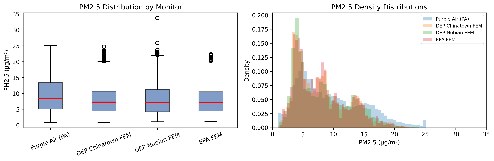

All four PM2.5 sources show similar right-skewed distributions centered around 7–10 µg/m³. Purple Air has a slightly wider distribution and heavier right tail, consistent with its positive bias at higher concentrations.

### Purple Air PM2.5 by Site

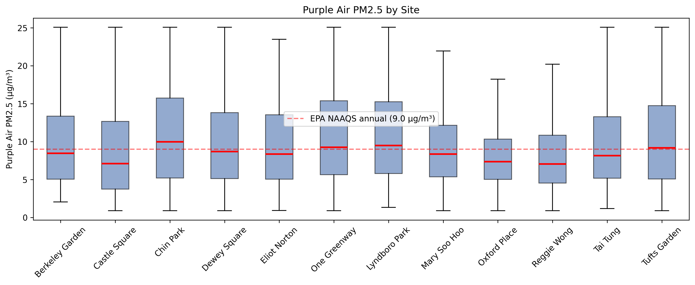

Site-level distributions are remarkably similar, with medians ranging from ~7 to ~10 µg/m³. Most sites hover near the EPA NAAQS annual standard of 9.0 µg/m³.

### Reference Monitor Agreement

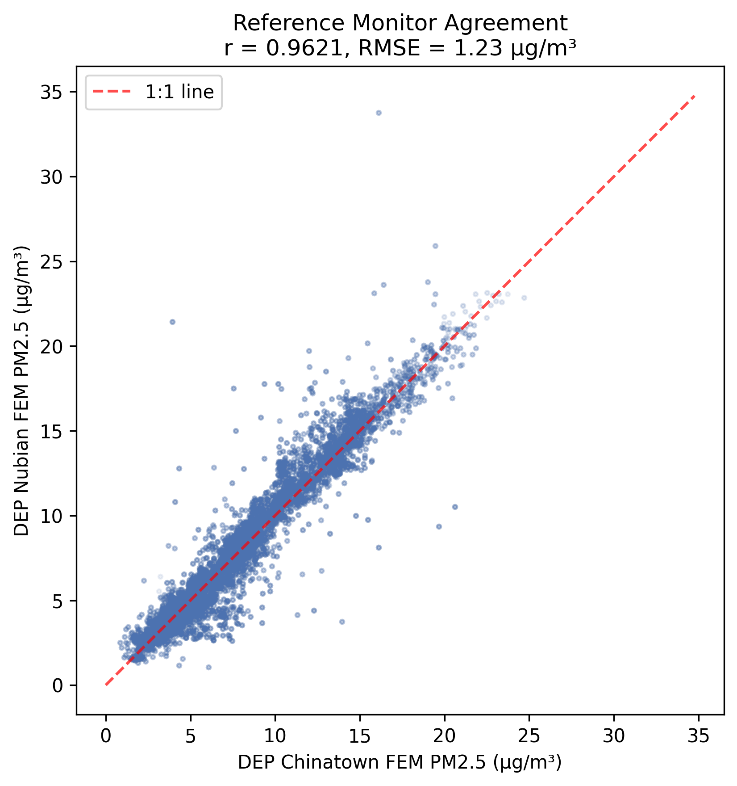

The two DEP FEM monitors (Chinatown vs Nubian Square, ~2 km apart) correlate at r = 0.96 with RMSE of 1.23 µg/m³. This sets the *best-case* benchmark — even regulatory-grade instruments don't agree perfectly. Any PA-DEP discrepancy should be evaluated against this 1.23 µg/m³ reference-reference variability.

---

## Core Analysis

### PA vs Reference Scatter Plots

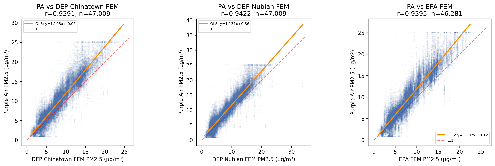

All three comparisons show strong linear relationships (r ≈ 0.94). The OLS regression lines consistently lie above the 1:1 line, confirming the systematic positive PA bias. The scatter thickens at moderate concentrations (5–15 µg/m³) where most observations fall.

### Bland-Altman Agreement

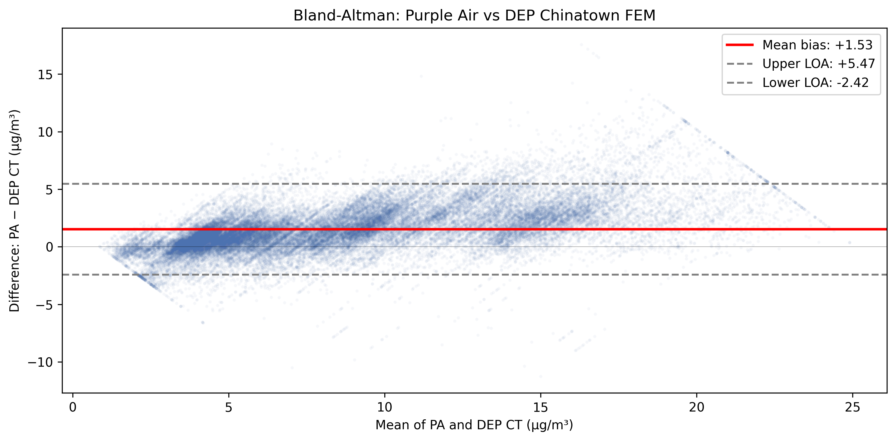

- **Systematic positive bias**: +1.53 µg/m³
- **Limits of agreement**: [−2.42, +5.47] µg/m³ (width = 7.89)
- **Proportional bias**: Spread increases at higher concentrations (funnel shape)

### Site-Specific Regression

| Site | Slope | Intercept | R² | RMSE | Bias | N |
|------|-------|-----------|----|------|------|---|
| Berkeley Garden | 1.254 | −0.718 | 0.887 | 2.343 | +1.35 | 2,445 |
| Castle Square | 1.300 | −2.467 | 0.883 | 2.197 | −0.01 | 3,793 |
| Chin Park | 1.207 | −0.016 | 0.910 | 2.699 | +1.79 | 2,199 |
| Dewey Square | 1.194 | −0.043 | 0.895 | 2.505 | +1.54 | 4,889 |
| Eliot Norton | 1.162 | +0.034 | 0.915 | 2.056 | +1.33 | 3,888 |
| One Greenway | 1.332 | −0.040 | 0.912 | 3.497 | +2.64 | 4,893 |
| Lyndboro Park | 1.210 | +0.492 | 0.919 | 2.936 | +2.26 | 4,786 |
| Mary Soo Hoo | 1.216 | +0.571 | 0.857 | 2.802 | +2.08 | 4,177 |
| Oxford Place | 1.015 | +1.232 | 0.777 | 2.162 | +1.33 | 2,879 |
| Reggie Wong | 1.092 | −0.006 | 0.916 | 1.652 | +0.70 | 4,126 |
| Tai Tung | 1.121 | +0.416 | 0.911 | 2.098 | +1.38 | 4,839 |
| Tufts Garden | 1.222 | −0.443 | 0.908 | 2.470 | +1.46 | 4,095 |

Slopes range from 1.015 (Oxford) to 1.332 (Greenway). Bias varies from −0.01 (Castle Square) to +2.64 (Greenway).

### Local Linear Calibration

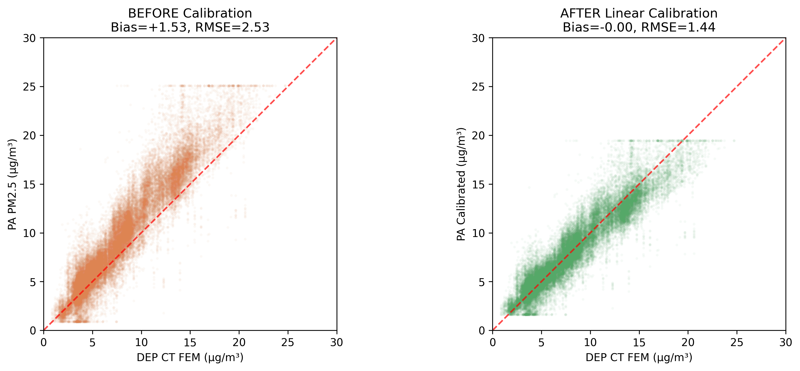

**Important note**: The PA data column is already PurpleAir-corrected (ALT-CF3). Applying Barkjohn (designed for raw `cf_1` data) would double-correct and worsen performance. Instead, a study-specific linear calibration was fitted:

> DEP_est = 0.7376 × PA + 0.9596

Result: Bias reduced from +1.53 to ~0.00 µg/m³; RMSE from 2.53 to 1.44 µg/m³.

---

## Deep-Dive & Enrichment

### Concentration-Dependent Bias

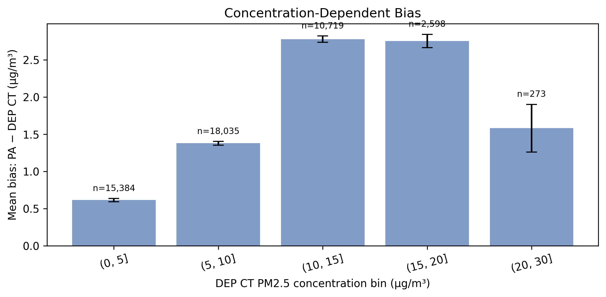

The bias is nonlinear:
- Low PM2.5 (0–5 µg/m³): +0.6 µg/m³
- Moderate (5–10): +1.4
- High (10–15): +2.8 — **peak bias in the health-relevant range**
- Very high (15–20): +2.8
- Extreme (20–30): +1.6 (possible saturation)

### Diurnal Bias Pattern

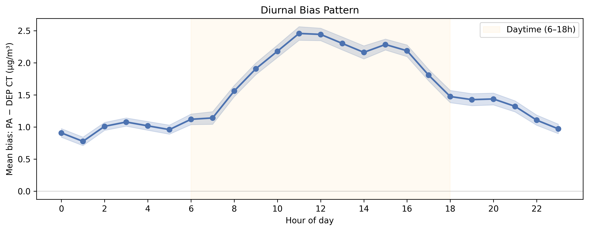

- **Daytime bias (~2.0 µg/m³)** is nearly **2× nighttime (~1.1 µg/m³)**
- Peak at 11–12 PM (~2.5), trough at 1 AM (~0.8)
- Likely reflects temperature-driven sensor response and daytime mixing patterns

### Daily Bias Time Series

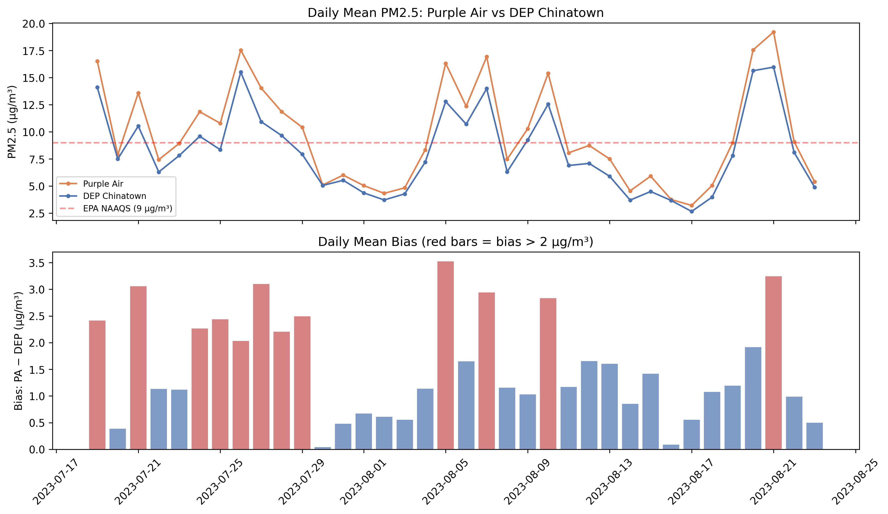

PA and DEP track the same ups and downs. Bias ranges from near-zero (Jul 30) to +3.5 (Aug 5), tracking concentration levels. No sensor drift detected over the 36-day study.

### Site-Level Bias Distributions

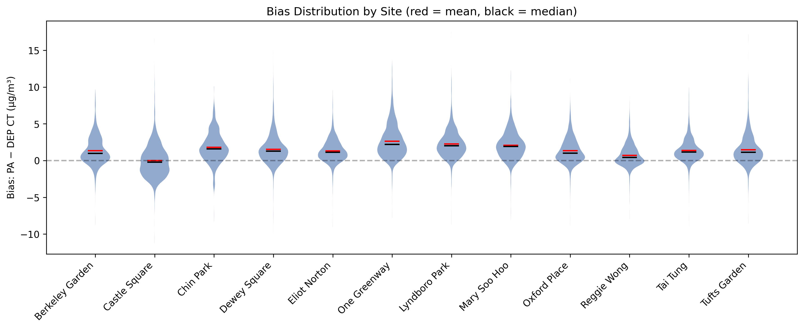

| Site | Mean Bias | LOA | LOA Width |
|------|-----------|-----|-----------|
| One Greenway | +2.64 | [−1.86, +7.13] | 8.99 (worst) |
| Castle Square | −0.01 | [−4.32, +4.29] | 8.61 |
| Reggie Wong | +0.70 | [−2.23, +3.63] | 5.87 (best) |

### Meteorological Drivers: Temperature × Humidity

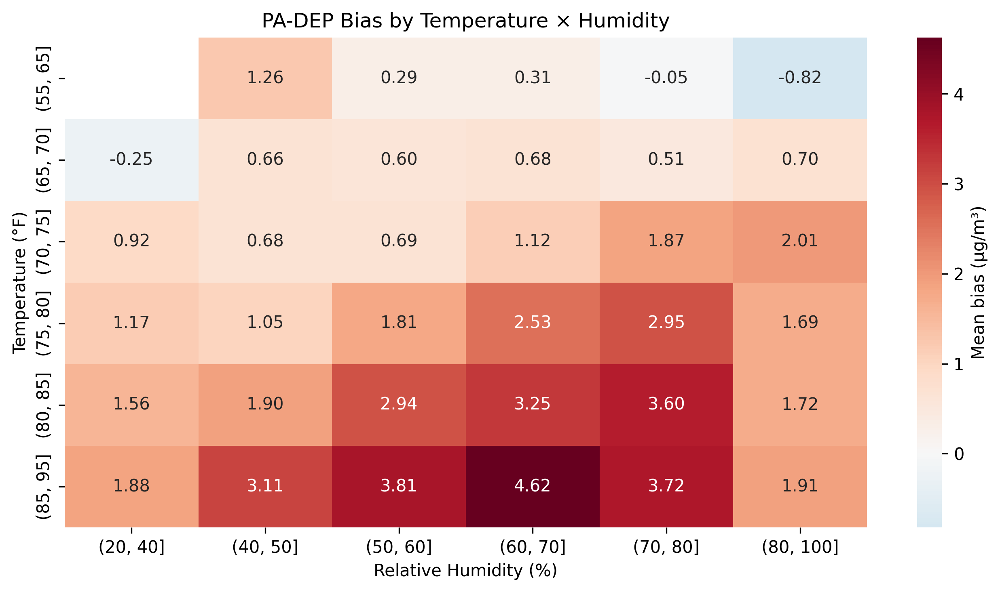

Highest bias occurs at high temperature (85–95°F) combined with moderate humidity (60–70%): bias reaches +4.6 µg/m³. Low temperature + high humidity produces the lowest bias. This pattern aligns with known PA sensor physics.

### Wind Direction Effects

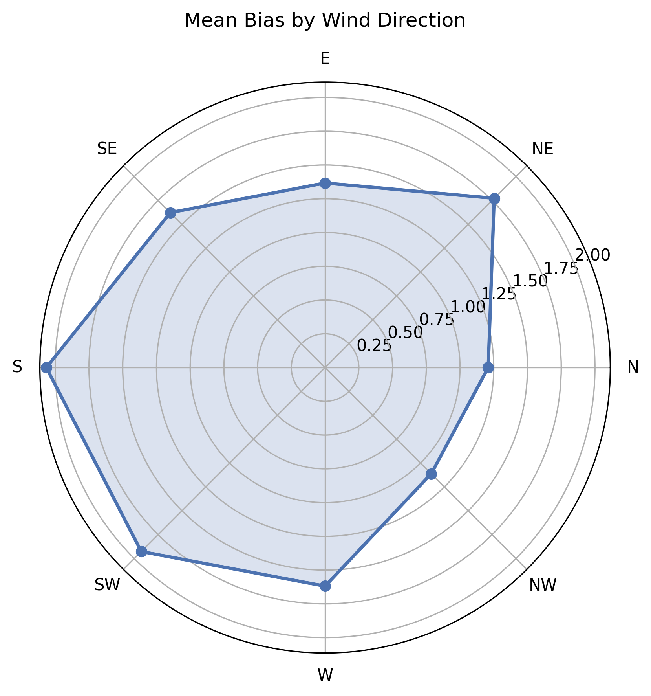

- **S/SW winds**: highest bias (+2.07/+1.93) — from I-93 expressway and South Station
- **N/NW winds**: lowest bias (+1.21/+1.11) — cleaner residential air
- Suggests PA sensors may be more sensitive to traffic-related particles

### Land-Use Associations

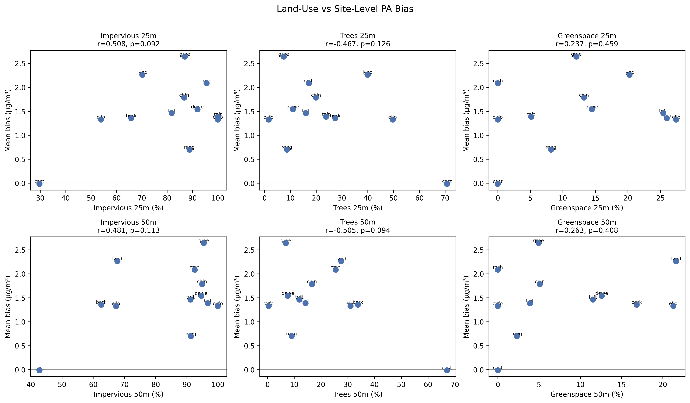

Exploratory analysis with n=12 sites (low power):
- **Impervious surface**: weak positive trend (r ≈ 0.5, p ≈ 0.09–0.11)
- **Tree canopy**: weak negative trend (r ≈ −0.5, p ≈ 0.09–0.13)
- Castle Square (low impervious, high tree cover) is an outlier with near-zero bias

### Temporal Stability

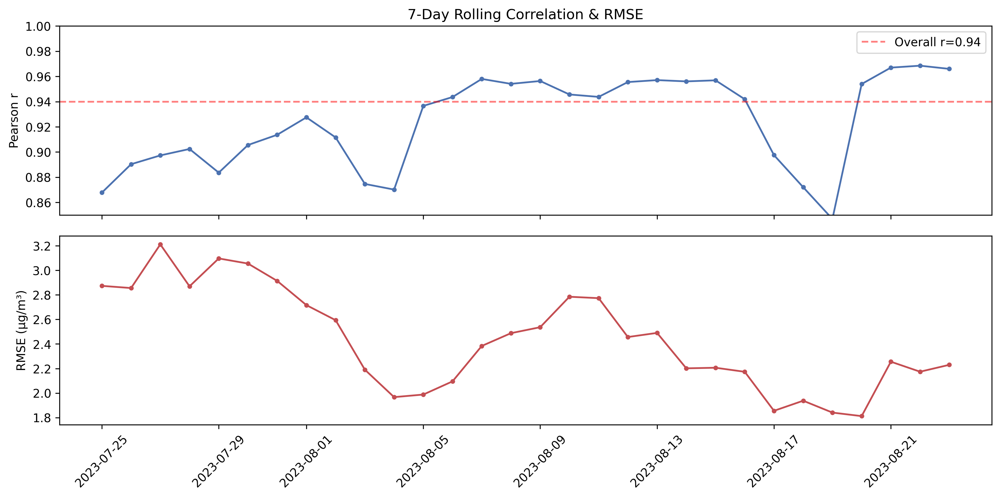

Rolling 7-day correlations remain >0.85 throughout the study (range: 0.847–0.969). RMSE fluctuates between 1.8 and 3.2 µg/m³. No evidence of sensor drift — encouraging for long-term deployments.

### Co-Pollutant Interference

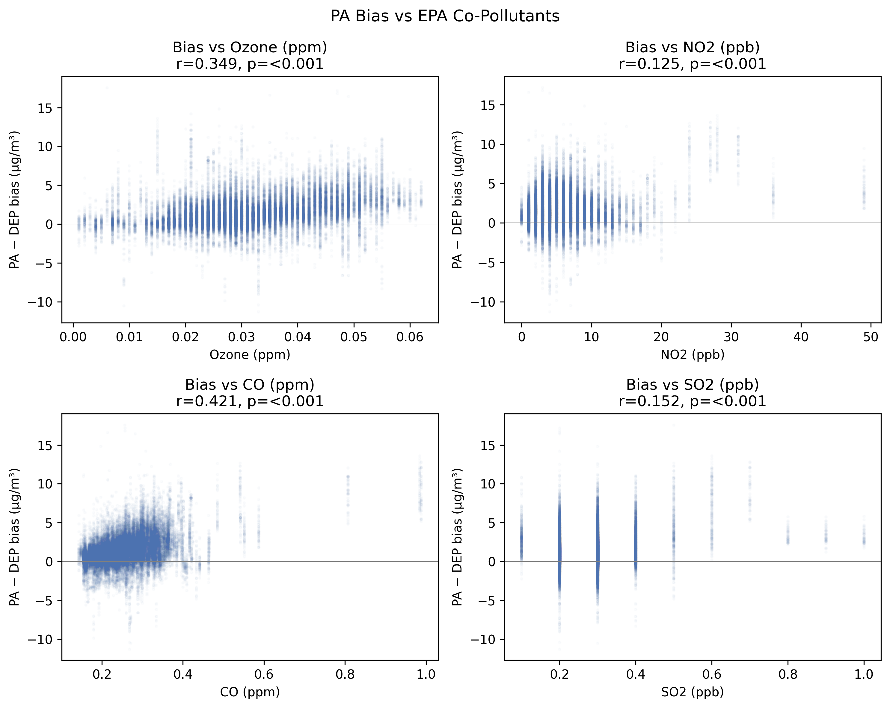

- **CO** shows moderate correlation with bias (r = 0.42) — may reflect combustion-source co-emission
- **Ozone** correlation (r = 0.35) — secondary aerosol formation marker
- **NO2** (r = 0.13) and **SO2** (r = 0.15) show weak associations
- Bias appears driven more by concentration and meteorology than cross-pollutant interference

---

## Synthesis & Conclusions

### Key Findings

1. **Strong overall agreement**: PA and DEP Chinatown FEM correlate at r = 0.94, confirming PA sensors are viable for community-level PM2.5 monitoring

2. **Systematic positive bias**: PA reads +1.53 µg/m³ higher than DEP reference. This bias is:
   - **Concentration-dependent**: peaks at 10–20 µg/m³ (the health-relevant range near EPA standards)
   - **Diurnal**: daytime bias (~2.0) is ~2× nighttime (~1.1), peaking at midday
   - **Wind-direction-sensitive**: S/SW winds (from I-93) produce highest bias
   - **Correctable**: Local linear calibration reduces bias to zero, RMSE to 1.44

3. **Site-level variability**: Bias from −0.01 (Castle) to +2.64 (Greenway). LOA width from 5.87 (Reggie Wong) to 8.99 (Greenway)

4. **Temporal stability**: Rolling 7-day correlations remain >0.85 — no sensor drift

5. **Reference baseline**: Even DEP FEM monitors disagree by RMSE = 1.23 µg/m³ — PA's calibrated RMSE of 1.44 is close to this baseline

### Limitations

- Single summer study period — may not generalize to cold/wet seasons
- Site-level bias may reflect true spatial PM2.5 variability, not just sensor error
- Only global linear correction evaluated; site-specific corrections could improve further
- Land-use analysis is exploratory (n=12 sites)

### Implications for Community Monitoring

- PA sensors are **adequate for screening-level monitoring** in Chinatown
- The positive bias means **PA-based AQI alerts are conservative** (trigger earlier than warranted) — defensible from a public health standpoint
- For regulatory comparisons, **always apply calibration** (DEP_est = 0.74 × PA + 0.96)
- Sites with highest bias (Greenway) warrant additional investigation into local source influences
