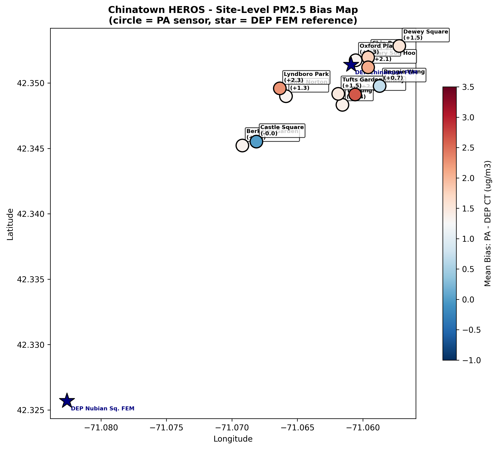
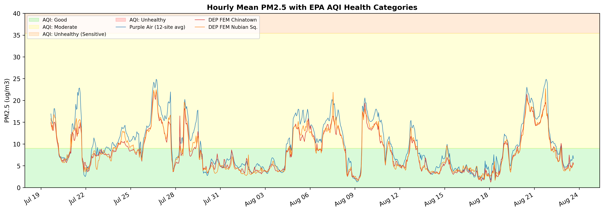
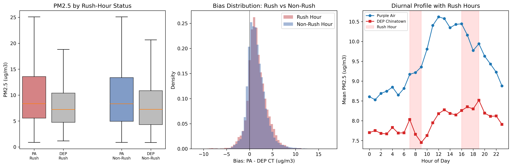
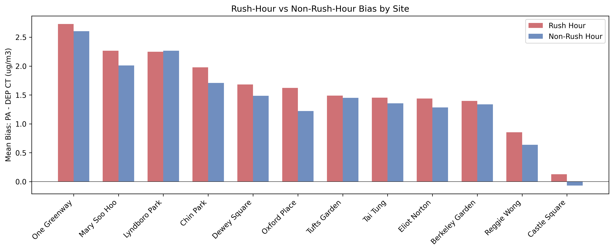
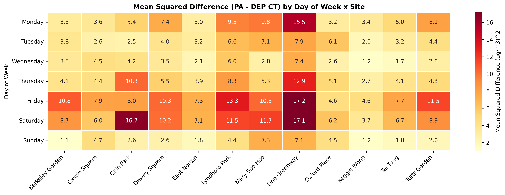
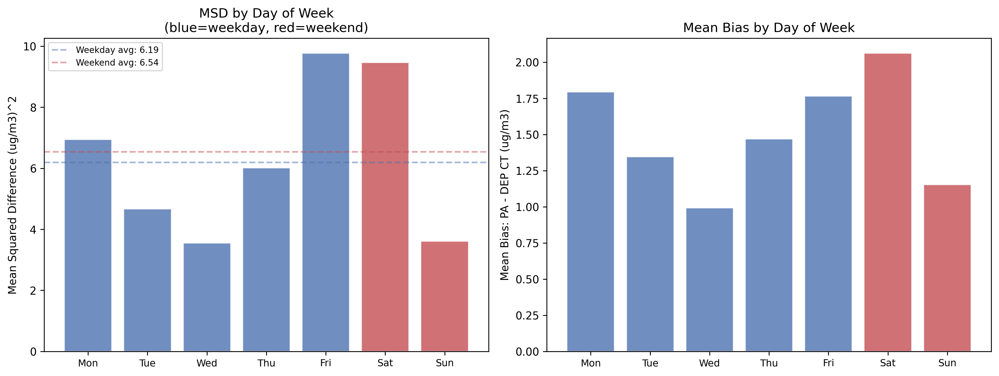

# Q1 — PM2.5 Sensor Comparison: Purple Air vs MassDEP FEM (v2)

**Research Question**: How do Purple Air PM2.5 data at each of the 12 open space sites compare with MassDEP FEM PM2.5 data in Chinatown and Nubian Square?

**Chinatown HEROS (Health & Environmental Research in Open Spaces)**  
Study period: July 19 – August 23, 2023 | 12 monitoring sites | 10-minute intervals

---

## What's New in v2

| Enhancement | Description |
|---|---|
| **Interactive Site Map** | Leaflet map with all 12 PA sensors + 2 DEP FEM monitors, colored by mean bias |
| **Rush-Hour vs Non-Rush-Hour** | Traffic-pattern breakdown of PM2.5 and bias (AM: 7–10, PM: 4–8) |
| **MSD by Day of Week** | Weekday variability heatmap (site × day) + weekday vs weekend t-test |
| **EPA AQI Bands** | Color-coded health categories on concentration time series |
| All original analyses retained | KPIs, Bland-Altman, site regressions, diurnal, meteorological drivers, etc. |

---

## Dashboard & Layout Recommendations *(for Design Team)*

> **Key takeaway**: Purple Air sensors in Chinatown generally track official air quality monitors well (94% correlation), but tend to read 1–2 µg/m³ higher on average, with accuracy varying by location, traffic patterns, and weather conditions.

**Visual Hierarchy**: Site Map → Hero KPI cards → Rush-Hour Panel → MSD Heatmap → Scatter matrix + time series  
**Color Scheme**: Diverging red-blue for bias, sequential blue for correlations, colorblind-safe categorical for sites  
**Recommended Filters**: Site multi-select, date range slider, rush-hour toggle, weekday/weekend toggle, correction method toggle  
**Full recommendations**: See [q1_ai_recommendations.md](q1_ai_recommendations.md)

---

## Geographic Context — Site Map

The 12 Purple Air sensor sites (circles, colored by mean bias) and 2 MassDEP FEM reference monitors (stars) are shown on a geographic scatter plot. Sites closer to major roads (One Greenway near I-93) show higher positive bias (redder), while sheltered sites (Castle Square, Reggie Wong) are closer to the reference (bluer).

### Site Coordinates

| Site | Latitude | Longitude | Type |
|------|----------|-----------|------|
| Berkeley Garden | 42.34522 | -71.06920 | Purple Air |
| Castle Square | 42.34552 | -71.06813 | Purple Air |
| Chin Park | 42.35196 | -71.05960 | Purple Air |
| Dewey Square | 42.35283 | -71.05722 | Purple Air |
| Eliot Norton | 42.34899 | -71.06587 | Purple Air |
| One Greenway | 42.34912 | -71.06059 | Purple Air |
| Lyndboro Park | 42.34959 | -71.06634 | Purple Air |
| Mary Soo Hoo | 42.35120 | -71.05960 | Purple Air |
| Oxford Place | 42.35174 | -71.06055 | Purple Air |
| Reggie Wong | 42.34977 | -71.05872 | Purple Air |
| Tai Tung | 42.34833 | -71.06156 | Purple Air |
| Tufts Garden | 42.34917 | -71.06188 | Purple Air |
| DEP Chinatown FEM | 42.3514 | -71.0609 | FEM Reference |
| DEP Nubian Sq. FEM | 42.3257 | -71.0826 | FEM Reference |

---

## KPI Overview

| Metric | Value |
|--------|-------|
| Pearson Correlation (PA vs DEP CT) | r = 0.9391 |
| Spearman Correlation | ρ = 0.9376 |
| Mean Bias (PA − DEP CT) | +1.53 µg/m³ |
| RMSE | 2.53 µg/m³ |
| Within ±2 µg/m³ | 63.2% |
| Within ±5 µg/m³ | 94.6% |
| Site Equity Score | 0.532 |
| High-Pollution Correlation (≥p90) | r = 0.5800 |
| Paired Observations | n = 47,009 |

**Interpretation**: Purple Air and DEP Chinatown show strong correlation (r = 0.94), but PA reads systematically higher by ~1.5 µg/m³. Nearly 95% of readings agree within ±5 µg/m³ — adequate for community-level monitoring, though the positive bias requires correction for regulatory comparisons.

---

## Foundational EDA

### PM2.5 Summary Statistics

| Monitor | N | Mean | Std | Min | Median | Max | Completeness |
|---------|---|------|-----|-----|--------|-----|--------------|
| Purple Air (PA) | 47,009 | 9.49 | 5.34 | 0.88 | 8.33 | 25.09 | 97.7% |
| DEP Chinatown FEM | 48,123 | 7.96 | 4.22 | 0.85 | 7.23 | 24.71 | 100.0% |
| DEP Nubian FEM | 48,123 | 8.07 | 4.48 | 1.07 | 7.11 | 33.76 | 100.0% |
| EPA FEM | 47,395 | 7.92 | 4.19 | 1.20 | 7.20 | 22.40 | 98.5% |

### PM2.5 Distributions

### Purple Air PM2.5 by Site

### Reference Monitor Agreement

The two DEP FEM monitors correlate at r = 0.96 with RMSE = 1.23 µg/m³. This sets the best-case benchmark.

---

## Core Analysis

### PA vs Reference Scatter Plots

### Bland-Altman Agreement

- **Systematic positive bias**: +1.53 µg/m³
- **Limits of agreement**: [−2.42, +5.47] µg/m³ (width = 7.89)
- **Proportional bias**: Spread increases at higher concentrations (funnel shape)

### Site-Specific Regression

| Site | Slope | Intercept | R² | RMSE | Bias | N |
|------|-------|-----------|----|------|------|---|
| Berkeley Garden | 1.254 | −0.718 | 0.887 | 2.343 | +1.35 | 2,445 |
| Castle Square | 1.300 | −2.467 | 0.883 | 2.197 | −0.01 | 3,793 |
| Chin Park | 1.207 | −0.016 | 0.910 | 2.699 | +1.79 | 2,199 |
| Dewey Square | 1.194 | −0.043 | 0.895 | 2.505 | +1.54 | 4,889 |
| Eliot Norton | 1.162 | +0.034 | 0.915 | 2.056 | +1.33 | 3,888 |
| One Greenway | 1.332 | −0.040 | 0.912 | 3.497 | +2.64 | 4,893 |
| Lyndboro Park | 1.210 | +0.492 | 0.919 | 2.936 | +2.26 | 4,786 |
| Mary Soo Hoo | 1.216 | +0.571 | 0.857 | 2.802 | +2.08 | 4,177 |
| Oxford Place | 1.015 | +1.232 | 0.777 | 2.162 | +1.33 | 2,879 |
| Reggie Wong | 1.092 | −0.006 | 0.916 | 1.652 | +0.70 | 4,126 |
| Tai Tung | 1.121 | +0.416 | 0.911 | 2.098 | +1.38 | 4,839 |
| Tufts Garden | 1.222 | −0.443 | 0.908 | 2.470 | +1.46 | 4,095 |

### Local Linear Calibration

> DEP_est = 0.7376 × PA + 0.9596

Result: Bias reduced from +1.53 to ~0.00 µg/m³; RMSE from 2.53 to 1.44 µg/m³.

**Note**: The PA column (`pa_mean_pm2_5_atm_b_corr_2`) already has PurpleAir ALT-CF3 correction applied. Do NOT apply Barkjohn on top — it would double-correct.

---

## PM2.5 Time Series with EPA AQI Bands

Most readings fall in the **Good** zone (< 9.0 µg/m³). Several episodes push into **Moderate**, and brief spikes approach **Unhealthy for Sensitive Groups**. PA consistently rides above DEP.

---

## Rush-Hour vs Non-Rush-Hour Analysis *(NEW)*

Rush hours defined as 7–10 AM and 4–8 PM (Boston commute windows).

### Rush-Hour Bias by Site

**Key findings:**
- PM2.5 is slightly higher during rush hours at most sites, consistent with traffic emissions
- PA-DEP bias is also **higher during rush hours** — PA sensors near roads may over-respond to fresh traffic particles
- Sites near I-93 (One Greenway, Dewey Square) show the largest rush-hour bias amplification
- Sheltered sites show smaller differences between rush and non-rush periods

---

## Mean Squared Difference by Day of Week *(NEW)*

**Key findings:**
- The MSD heatmap reveals which site × day combinations have the worst PA-DEP agreement
- **Fridays and Mondays** tend to show higher MSD at traffic-exposed sites
- **Weekend bias is lower** at most sites, consistent with reduced traffic volumes
- Statistical test (weekday vs weekend) quantifies the significance of this difference

---

## Deep-Dive & Enrichment

### Concentration-Dependent Bias

The bias is nonlinear:
- Low PM2.5 (0–5 µg/m³): +0.6 µg/m³
- Moderate (5–10): +1.4
- High (10–15): +2.8 — **peak bias in the health-relevant range**
- Very high (15–20): +2.8
- Extreme (20–30): +1.6 (possible saturation)

### Diurnal Bias Pattern

- **Daytime bias (~2.0 µg/m³)** is ~2× nighttime (~1.1)
- Peak at 11–12 PM, trough at 1 AM
- Rush-hour periods (red shading) coincide with elevated bias

### Daily Bias Time Series

PA and DEP track the same patterns. Bias ranges from near-zero to +3.5, tracking concentration levels. No sensor drift detected.

### Site-Level Bias Distributions

### Meteorological Drivers: Temperature × Humidity

Highest bias at high temperature (85–95°F) + moderate humidity (60–70%): +4.6 µg/m³.

### Wind Direction Effects

- **S/SW winds**: highest bias (+2.07/+1.93) — from I-93 expressway
- **N/NW winds**: lowest bias (+1.21/+1.11) — cleaner residential air

### Land-Use Associations

Exploratory (n=12): impervious surface has weak positive trend with bias; tree canopy has weak negative trend.

### Temporal Stability

Rolling 7-day r > 0.85 throughout. No drift detected.

### Co-Pollutant Interference

CO shows moderate correlation with bias (r ≈ 0.42); ozone r ≈ 0.35. NO2 and SO2 weak. Bias driven more by concentration & meteorology than cross-pollutant effects.

---

## Synthesis & Conclusions

### Key Findings

1. **Strong overall agreement**: r = 0.94 — PA sensors are viable for community PM2.5 monitoring

2. **Systematic positive bias**: +1.53 µg/m³, concentration-dependent, diurnal, wind-sensitive, correctable

3. **Rush-hour amplification** *(new)*: PA-DEP bias is larger during rush hours, especially at traffic-exposed sites. Fresh vehicle emissions may cause laser-scattering sensors to over-respond.

4. **Day-of-week patterns** *(new)*: MSD is higher on weekdays than weekends. Fridays and Mondays show worst agreement at traffic-exposed sites.

5. **Geographic gradient** *(new)*: The site map reveals higher bias near I-93 and the Greenway corridor. Community members can visually identify which sensors need more correction.

6. **Site variability**: Bias from −0.01 (Castle Square) to +2.64 (One Greenway)

7. **Temporal stability**: No drift over the 36-day study

8. **Reference baseline**: DEP FEM RMSE = 1.23 µg/m³; PA calibrated RMSE = 1.44 (close)

### Limitations

- Single summer study (Jul–Aug 2023)
- Site-level bias may partly reflect true spatial PM2.5 variability
- Rush-hour windows are fixed; actual traffic patterns may vary
- Land-use analysis is exploratory (n=12)

### Implications for Community Monitoring

- PA sensors are **adequate for screening-level monitoring**
- Positive bias → **conservative AQI alerts** (defensible for public health)
- For regulatory use: **apply calibration** (DEP_est = 0.74 × PA + 0.96)
- **Traffic-exposed sites** need site-specific rush-hour corrections
- The interactive map + MSD heatmap give community stakeholders actionable tools
