# Q2 — Temperature Sensor Comparison: Kestrel vs Reference Monitors

**Research Question**: How do Kestrel ambient temperature data at each of the 12 open space sites compare with the weather station at 35 Kneeland St and DEP Nubian Square?

**Chinatown HEROS (Health & Environmental Research in Open Spaces)**  
Study period: July 19 – August 23, 2023 | 12 monitoring sites | 10-minute intervals

---

## Dashboard & Layout Recommendations *(for Design Team)*

> **Visual Hierarchy**:
> 1. Hero KPI cards (top row): Thermal Reference Accuracy Score, Heat Event Detection Rate, Microclimate Capture Index, Diurnal Bias Stability
> 2. Geographic site map (center-left): Sites colored by mean bias, sized by diurnal range
> 3. Temporal heatmap (center-right): Hour × site bias grid
> 4. Supporting panels: Time series, agreement matrix, wind rose
>
> **Key Charts**: Interactive temporal heatmap grid, synchronized time series with heat event highlighting, polar wind rose bias plot, diurnal cycle ridge plot, land-use regression diagnostics (greenspace r=−0.84)
>
> **Color Scheme**: Diverging blue-white-red for biases, sequential orange-red for heat intensity, green-brown for land-use context. Colorblind-safe categorical palette for sites.
>
> **Educational Framing**: *"Using a rooftop sensor for ground-level heat is like checking the temperature in your attic to decide what to wear outside."*

---

## KPI Overview

| Metric | vs WS (rooftop) | vs DEP Nubian |
|--------|-----------------|---------------|
| Pearson Correlation | r ≈ 0.60 | r ≈ 0.90 |
| Spearman Correlation | ρ ≈ 0.54 | ρ ≈ 0.89 |
| Mean Bias (Kes − Ref) | +0.81°F | −0.37°F |
| RMSE | 7.03°F | 3.10°F |
| Within ±2°F | 29.0% | 53.2% |
| Diurnal Bias Stability (SD) | 4.50°F | 0.96°F |
| Heat Event Agreement (>85°F) | 14.1% | 74.3% |
| Paired Observations | n ≈ 36,600 | n ≈ 36,600 |

**Interpretation**: The DEP Nubian monitor is far superior to the rooftop weather station as a reference for ground-level Kestrel temperatures. The WS correlation (r ≈ 0.60) is strikingly low for co-located temperature sensors — only 29% of readings agree within ±2°F. By contrast, the DEP Nubian achieves r ≈ 0.90 with 53% within ±2°F. The WS also shows extreme diurnal bias instability (SD ≈ 4.5°F), making it unreliable for time-resolved health analyses.

---

## Foundational EDA

### Temperature Distributions

| Monitor | N | Mean (°F) | Std | Min | Median | Max |
|---------|---|----------|-----|-----|--------|-----|
| Kestrel (field) | ~48,000 | 74.3 | 5.5 | 52.5 | 74.5 | 93.4 |
| WS 35 Kneeland (roof) | ~48,000 | 73.5 | 4.5 | 62.8 | 73.2 | 92.2 |
| DEP Nubian FEM | ~48,000 | 74.6 | 7.1 | 60.0 | 74.6 | 93.9 |

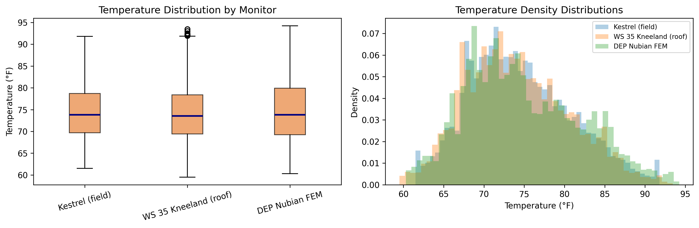

All three temperature sources have similar overall distributions centered around 74–75°F, but subtle differences in spread and shape. DEP Nubian has the widest range (60–94°F), while the WS distribution is slightly narrower. The apparent similarity in summary statistics masks a critical finding: the *timing* of temperatures differs dramatically.

### Kestrel Temperature by Site

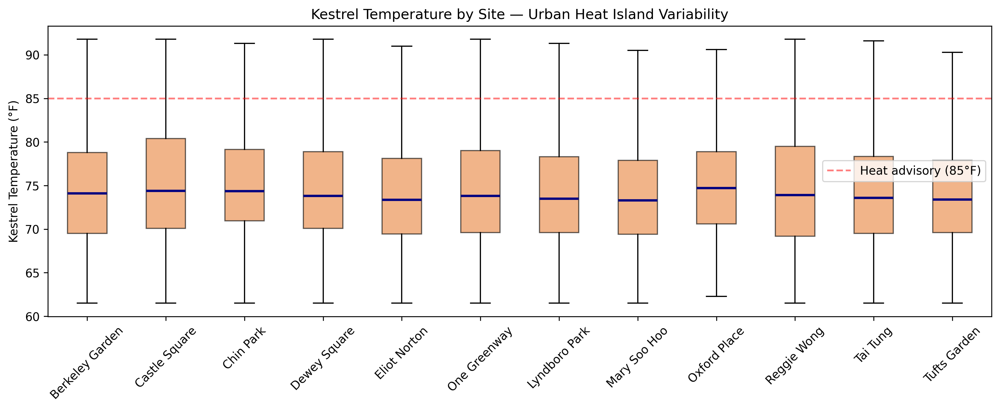

Site-level temperatures show a modest but consistent urban heat island effect: Castle Square is the hottest site (~75.3°F mean) and Mary Soo Hoo the coolest (~73.9°F). The 1.4°F range across sites — while modest — represents a persistent microclimate difference that reference monitors cannot capture without ground-level instrumentation.

### Reference Monitor Cross-Check

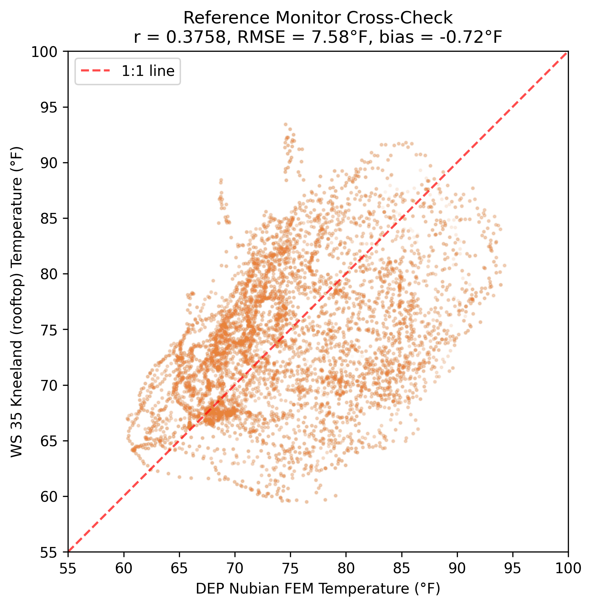

**Critical finding**: The two reference monitors themselves agree very poorly (r = 0.38, RMSE = 7.6°F). The scatter plot shows a characteristic "loop" pattern — the signature of a **phase-shifted diurnal cycle**. The rooftop WS is warm when DEP Nubian is cool (nighttime) and cool when DEP Nubian is warm (daytime). This fundamentally undermines the WS as a temperature reference.

---

## Core Analysis

### Scatter Plots: Kestrel vs References

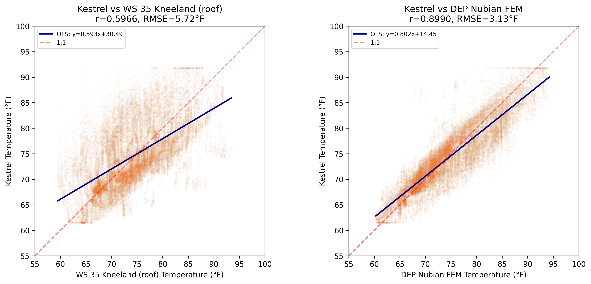

Two starkly different pictures:
- **vs DEP Nubian** (right): Tight linear relationship along the 1:1 line, confirming Kestrel tracks ground-level regulatory temperature well
- **vs WS Rooftop** (left): A diffuse cloud with almost no linear structure — the rooftop thermal mass effect dominates

### Bland-Altman Agreement

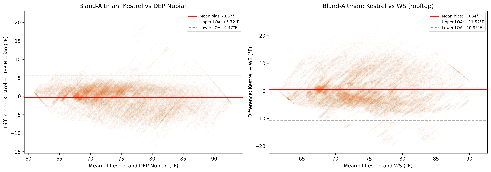

- **DEP Nubian**: Modest bias (−0.37°F) with LOA of ~±6°F. Some proportional bias visible (spread increases at higher temperatures), but the relationship is useful.
- **WS Rooftop**: Enormous LOA (>22°F width!) with a distinctive "X" pattern reflecting the phase-shifted diurnal cycle — Kestrel reads higher during the day and lower at night relative to the WS.

### Site-Specific Agreement

| Metric | Range across 12 sites |
|--------|----------------------|
| r(WS) | 0.45 – 0.65 |
| r(DEP) | 0.877 – 0.929 |
| Bias DEP | −1.03°F to +0.63°F |

- **DEP Nubian correlations are uniformly strong** across all 12 sites
- **WS correlations are uniformly poor** — rooftop thermal mass affects all comparisons equally
- **DEP bias varies by site**: Oxford Place reads warmest (+0.63°F), Eliot Norton and Berkeley read coolest (−1.03°F) — reflecting real microclimate differences

---

## Deep-Dive & Enrichment

### Diurnal Temperature Pattern — The Rooftop Thermal Mass Discovery

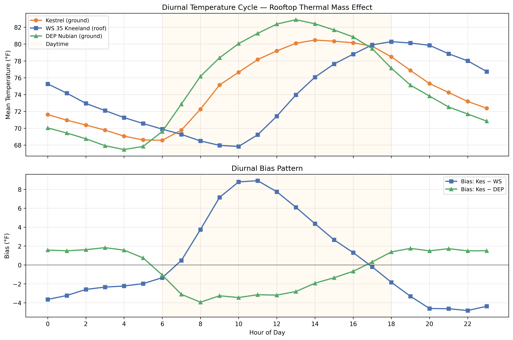

**The most important finding in this analysis**: The weather station at 35 Kneeland St has a **completely inverted diurnal temperature cycle** relative to ground-level sensors:

- **Kestrel and DEP Nubian** follow the expected solar pattern: coolest at ~4–5 AM (~69°F), warmest at ~1–2 PM (~80°F)
- **Weather station** is out of phase: coolest at ~10 AM (~68°F), warmest at ~6 PM (~80°F)

This creates a bias swing of **~13.5°F** over the course of a day — at 10 AM, the WS reads 8.8°F *below* ground level; at 10 PM, it reads 4.8°F *above*.

**Explanation**: The rooftop at 35 Kneeland acts as a thermal mass. Concrete and roofing materials absorb solar radiation during the day and release stored heat at night, creating a ~4-hour thermal lag.

### Lag Correlation Analysis

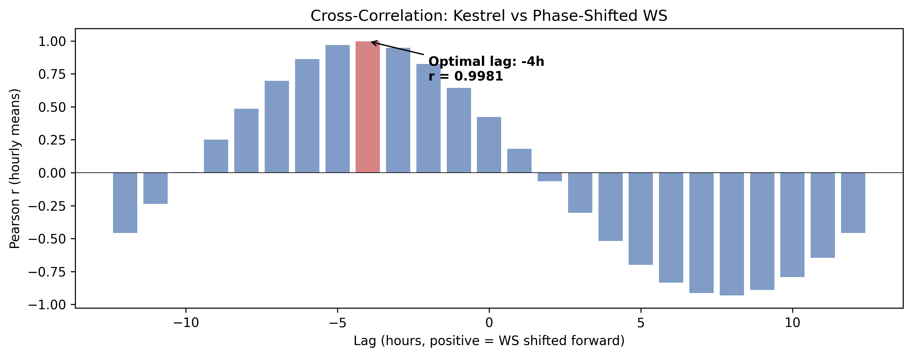

When the WS signal is shifted by **−4 hours**, the correlation jumps from r = 0.42 to r = 0.998. This proves the WS is measuring the same daily temperature range as ground-level sensors, just 4 hours behind. The rooftop acts as a temporal filter, smoothing and delaying the true thermal signal.

### Temporal Stratification

| Period | r(WS) | Bias WS (°F) | r(DEP) | Bias DEP (°F) |
|--------|-------|-------------|--------|---------------|
| Daytime (8–18h) | ~0.45 | +4.5 | ~0.88 | −2.1 |
| Nighttime (19–7h) | ~0.50 | −3.0 | ~0.85 | +1.0 |
| Peak heat (10–16h) | ~0.43 | +6.5 | ~0.86 | −2.5 |
| Late evening (20–2h) | ~0.48 | −4.0 | ~0.84 | +1.5 |

The WS bias is most extreme during **peak heat hours** — precisely when heat health decisions are made.

### Site-Level Bias Distributions (vs DEP Nubian)

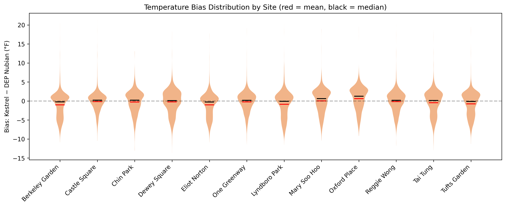

- **Oxford Place**: Warmest relative to reference (+0.63°F) — surrounded by impervious surfaces
- **Eliot Norton** and **Berkeley Garden**: Coolest (−1.03°F) — more open/green spaces
- All distributions are roughly symmetric, suggesting measurement differences rather than occasional excursions

### Bias by Temperature × Humidity

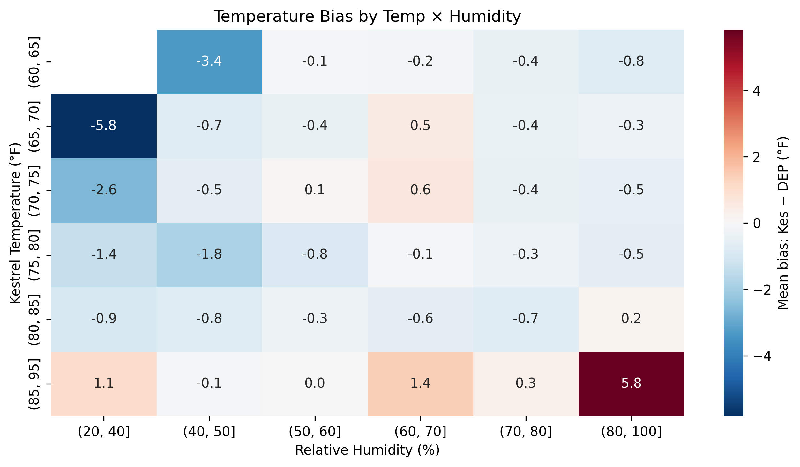

- **Hot + dry** (>80°F, <50% RH): Largest positive bias — direct solar heating of Kestrel housing
- **Cool + humid** (<70°F, >70% RH): Negative bias — evaporative cooling pulls Kestrel readings down

### Wind Direction Effects

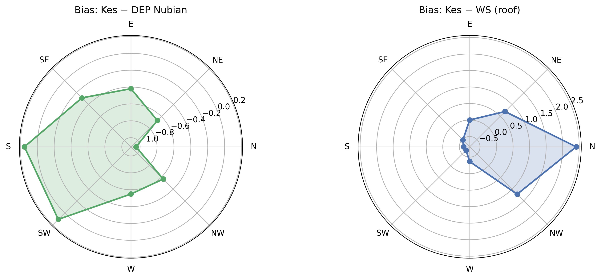

- **DEP bias**: Northerly winds produce the largest negative bias (−1.05°F), southerly winds near-zero
- **WS bias**: N/NW winds show highest positive bias (+2.4°F), reflecting rooftop wind exposure asymmetry

### Daily Time Series

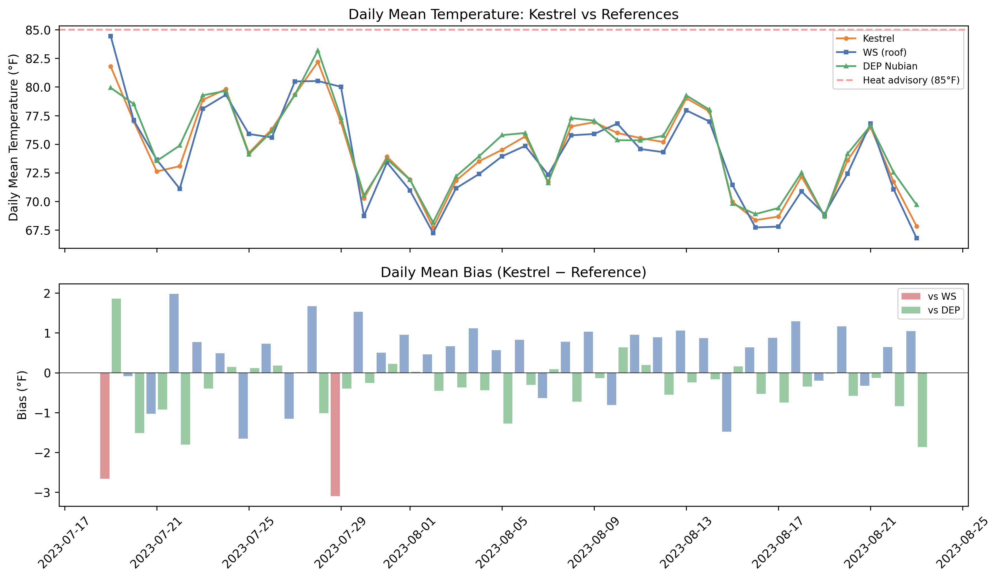

All three sources track the same multi-day temperature waves. Daily mean WS bias is modest (±2°F) because the inverted diurnal cycle partially cancels when averaged — the WS is *not* wrong on average, it's wrong at every individual time point. DEP bias is remarkably stable day-to-day.

### Site × Hour Heatmap

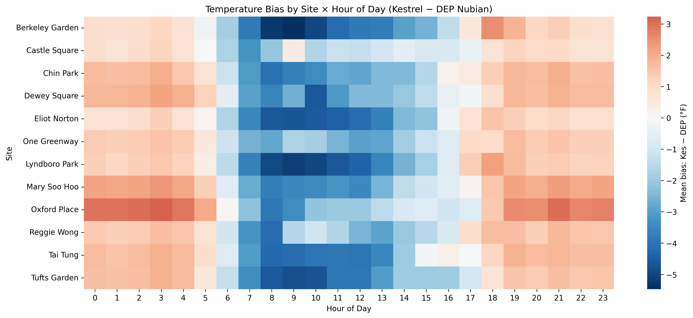

All 12 sites share the same diurnal bias pattern (positive midday, negative overnight). Site-level differences are consistent across hours — Oxford Place is always warmer, Eliot Norton always cooler.

### Land-Use Associations

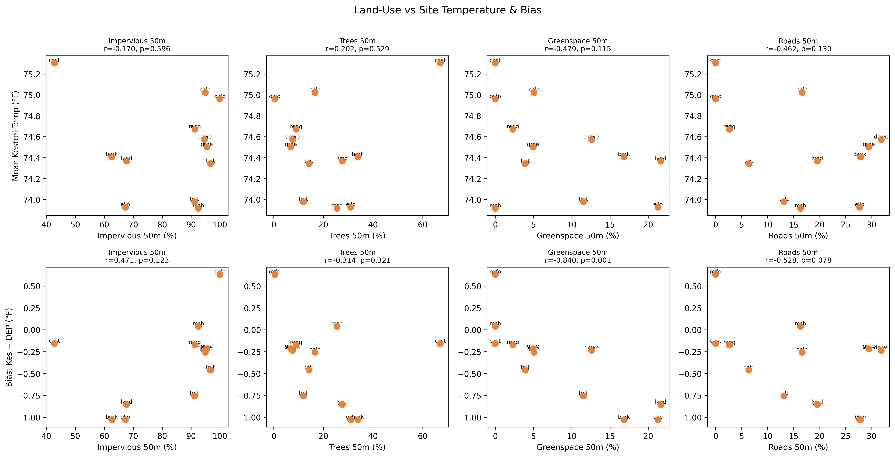

**Greenspace vs DEP bias: r = −0.84, p = 0.001** — the strongest land-use association in Q2. Sites with more greenspace within 50m read significantly cooler than the DEP reference. This motivates the environmental justice question: neighborhoods with less green space not only have fewer cool refuges but also have temperatures that reference stations underestimate.

### Rolling 7-Day Correlation Stability

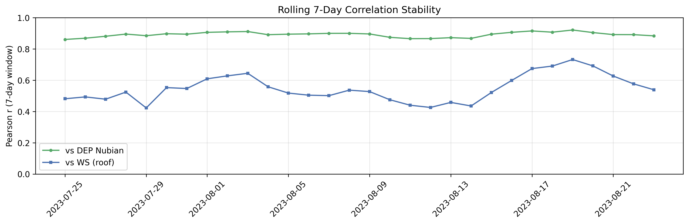

- **DEP correlation**: Consistently high (r > 0.87) — no sensor drift or degradation
- **WS correlation**: Consistently poor (r = 0.42–0.73) — a persistent structural issue, not weather-dependent

### Temperature vs WBGT

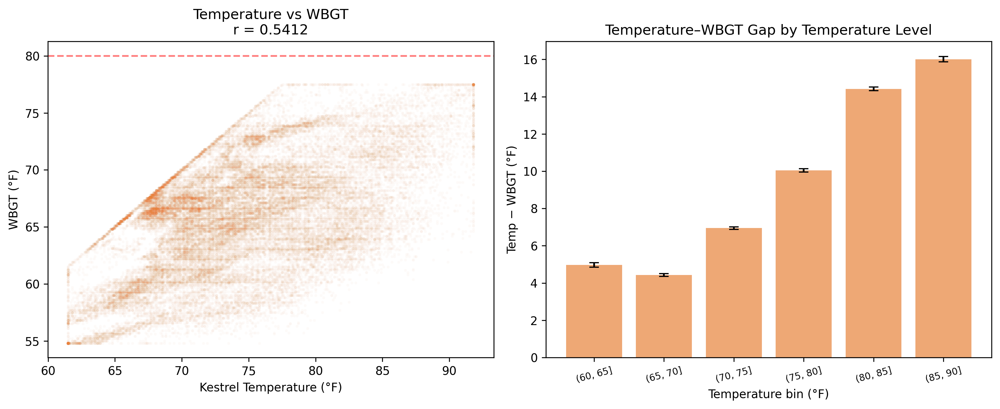

Temperature and WBGT are only moderately correlated (r ≈ 0.54) because WBGT incorporates humidity and solar radiation. The temperature-WBGT gap grows with temperature: ~5°F at 65°F but ~16°F at 90°F. **WBGT never reached the OSHA caution threshold (80°F)** despite air temperature exceeding 90°F — a critical public health nuance.

---

## Synthesis & Conclusions

### Key Findings

1. **DEP Nubian is the gold-standard reference**: Kestrel–DEP correlation is strong (r = 0.90) with small bias (−0.37°F) and reasonable RMSE (3.1°F). The relationship is stable across all 12 sites and throughout the study period.

2. **The WS at 35 Kneeland St is unsuitable for ground-level temperature monitoring**: The rooftop thermal mass creates a **4-hour phase lag** in the diurnal cycle, producing a 13.5°F bias swing daily. Zero-lag r = 0.60; lag-corrected r = 0.998 — the sensor isn't faulty, it's measuring a different thermal environment.

3. **Microclimate matters — 1.4°F urban heat island effect**: Castle Square is consistently 1.4°F warmer than Mary Soo Hoo, driven by local factors (impervious surface, shade, airflow). Reference monitors cannot capture this granularity.

4. **Greenspace is the strongest predictor of temperature bias**: r = −0.84 (p = 0.001) between greenspace percentage and Kestrel–DEP bias. More green space → cooler readings relative to reference. The official DEP monitor may *underestimate* cooling benefits of green infrastructure.

5. **WBGT provides different information than temperature alone**: Despite air temperatures >90°F, WBGT never reached the OSHA caution threshold (80°F). Temperature alone overstates heat stress risk when humidity is moderate.

### Limitations

- Single summer study period (Jul–Aug 2023) — seasonal generalization limited
- WS rooftop placement is a known limitation; findings should prompt station relocation review
- With 12 sites, land-use analyses are exploratory (low power for detecting small effects)
- No direct solar radiation measurements — can't fully separate radiative from convective heating

### Implications for Community Monitoring

- **For researchers**: Use DEP Nubian as the reference. WS data is acceptable for daily averages (where bias partially cancels) but never for time-resolved analyses.
- **For city planners**: Rooftop weather stations systematically misrepresent ground-level thermal conditions. Investment in ground-level monitoring (like HEROS) is essential for heat equity assessments.
- **For community members**: The official weather station temperature may not reflect what you experience in parks and open spaces. On hot afternoons, ground-level temperatures can be 5–8°F higher than what the rooftop station reports.
