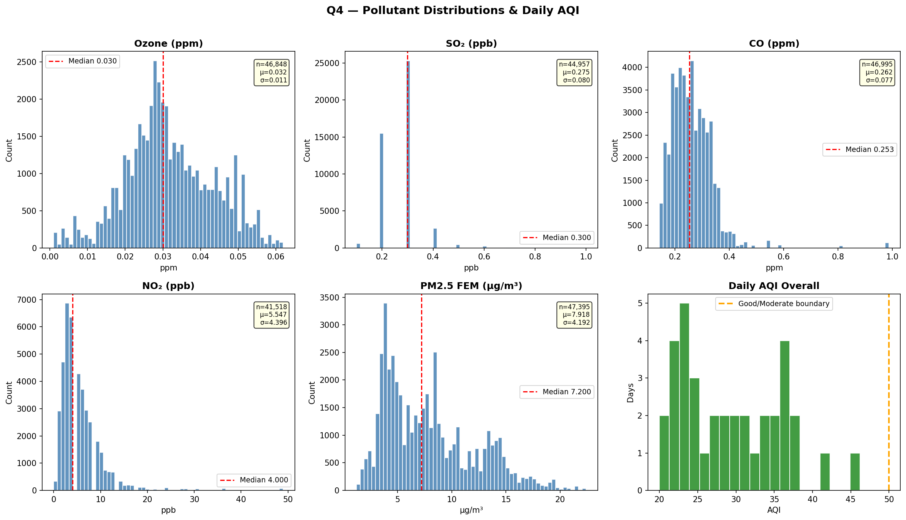
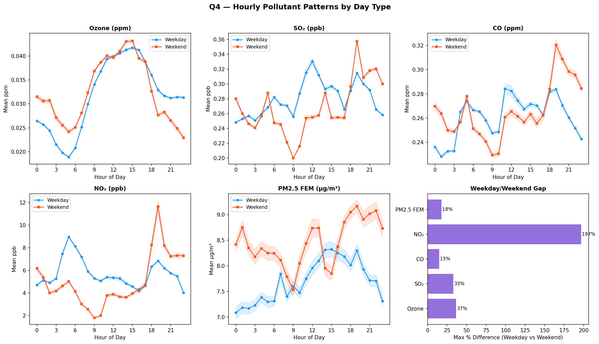
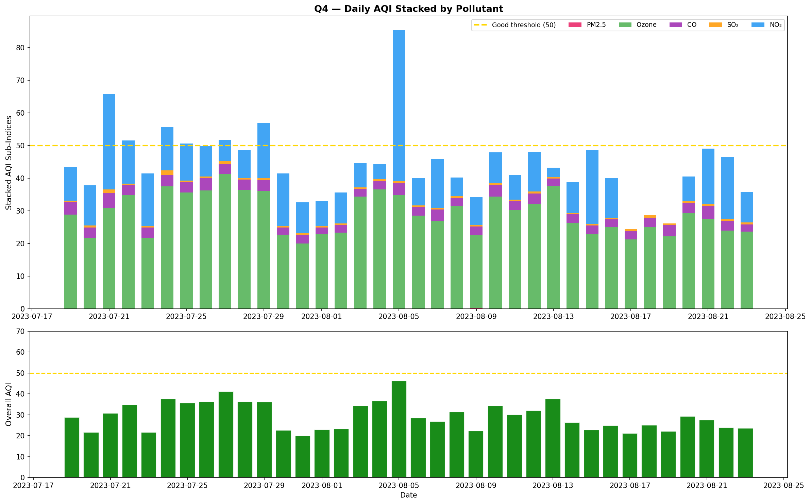
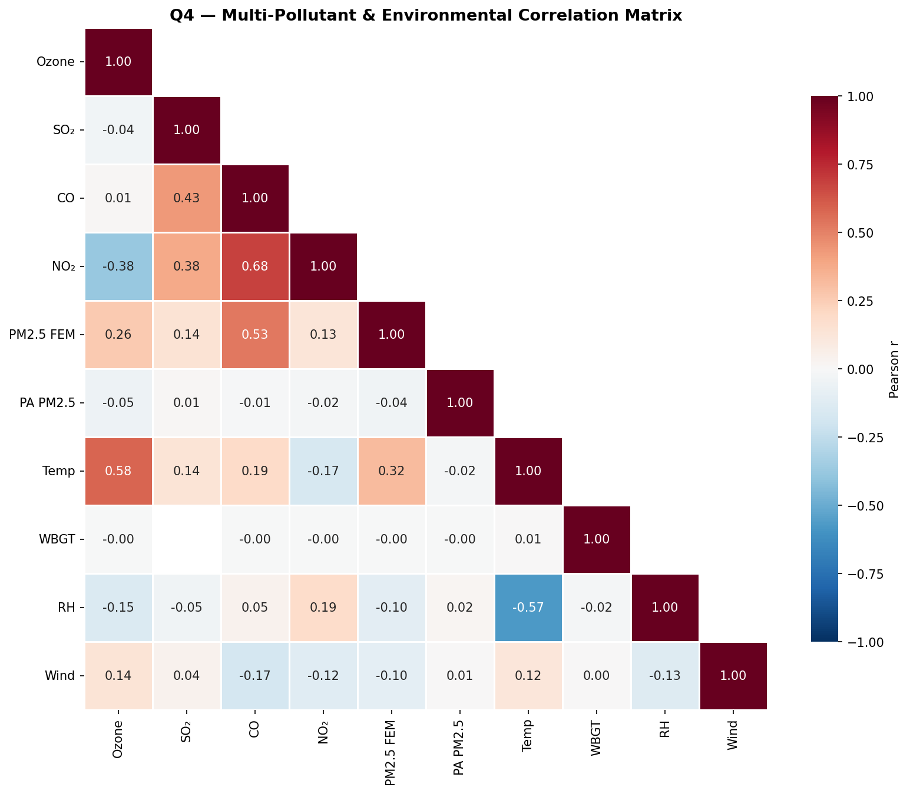
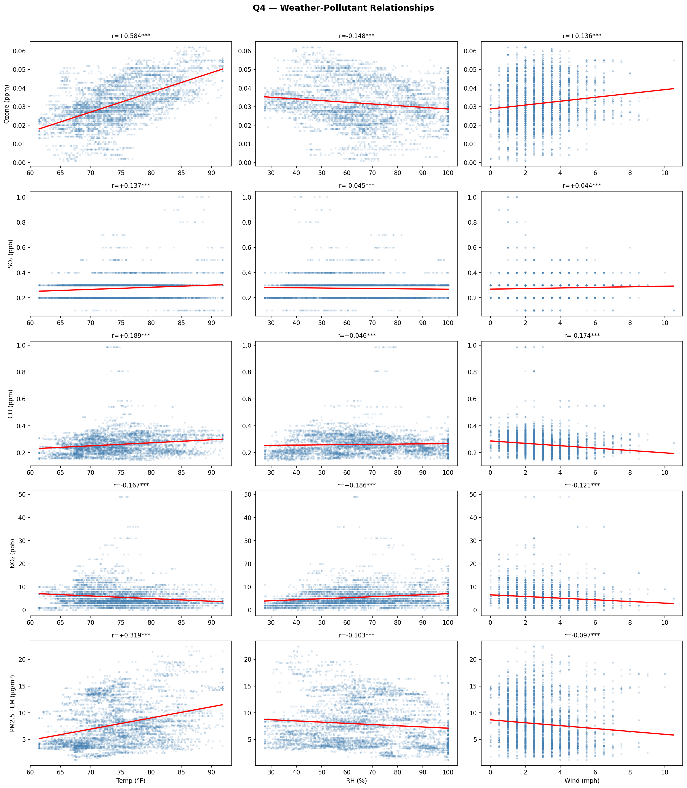
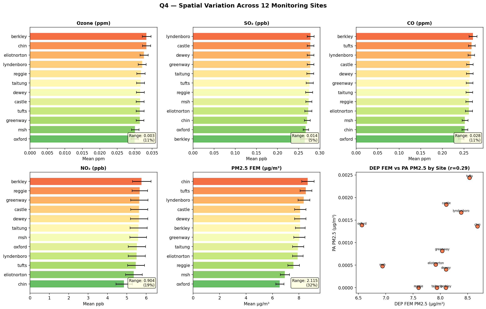
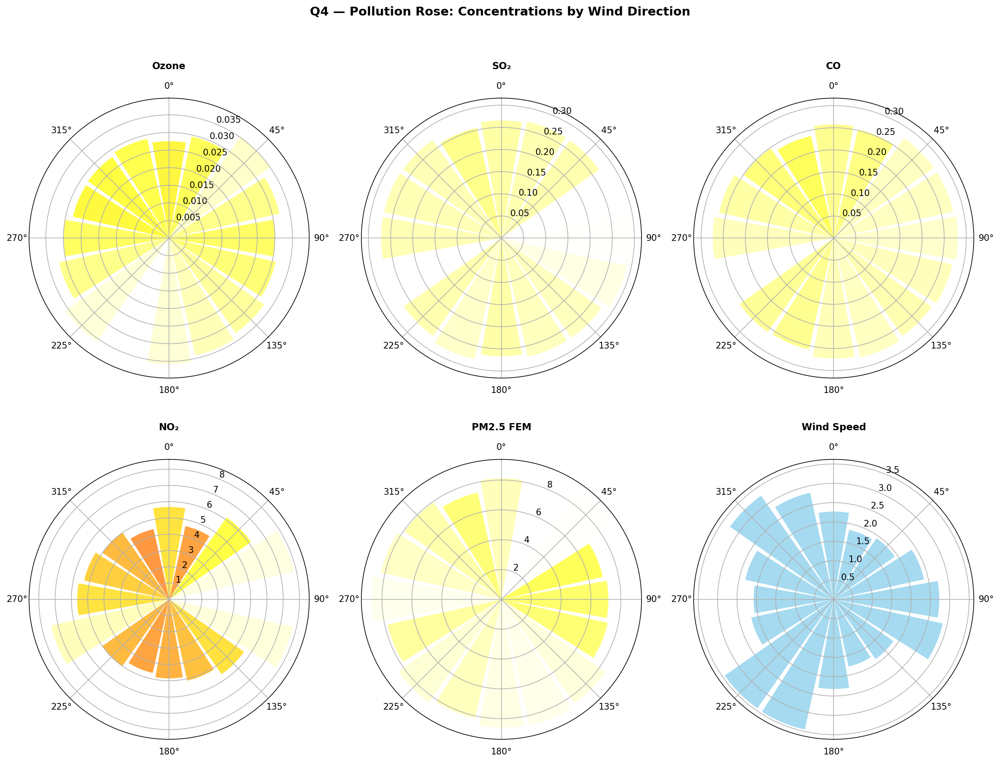
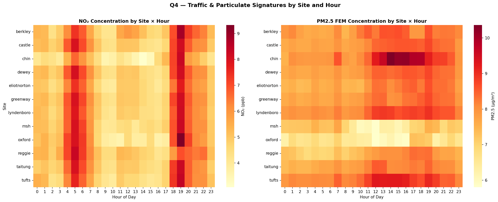
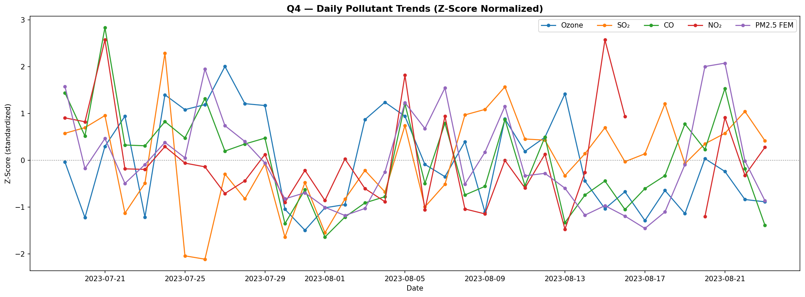

# Q4 — Air Quality Index and Multi-Pollutant Analysis

**Research Question**: What were the air quality index and concentrations of other pollutants (CO, SO2, NO2, Ozone) in Chinatown between July 19 – August 2023 based on the MassDEP monitor?

**Chinatown HEROS (Health & Environmental Research in Open Spaces)**  
Study period: July 19 – August 23, 2023 | 12 monitoring sites | 10-minute intervals

---

## Dashboard & Layout Recommendations *(for Design Team)*

> **Visual Hierarchy**:
> 1. **KPI Banner** (15%): Community Health Risk Score, Peak Pollution Hours, Multi-Pollutant Event Rate
> 2. **Calendar Heatmap** (30%): Daily AQI values in EPA color scheme (green–yellow–orange–red)
> 3. **Supporting Charts** (40%): Hourly patterns, pollution rose, correlation matrix
> 4. **Timeline View** (15%): Pollutant trends over study period
>
> **Interactive Features**: Date range filters, pollutant toggles, weekday/weekend stratification, AQI category buttons
>
> **Educational Framing**: EPA-compliant color scheme, traffic-light symbols, health guidance per AQI category. *"Your daily air quality was safer than most cities in America — but some blocks in Chinatown breathe cleaner air than others."*

---

## KPI Overview

| **Key Performance Indicator** | **Value** | **Significance** |
|-------------------------------|-----------|------------------|
| Days in "Good" AQI (0–50) | **36/36 (100%)** | Perfect record — no health-concerning days |
| Mean Daily AQI | **29.4** | Well below "Moderate" threshold (51) |
| Maximum Daily AQI | **46.2** | Peak still within "Good" category |
| Multi-Pollutant Events (≥3 elevated) | **0** | No compound pollution days |
| EPA NAAQS Exceedances | **0** | Zero violations of any federal standard |
| Dominant AQI Pollutant | **Ozone (97%)** | Ozone drove AQI on 35/36 days; NO₂ on 1 day |

### EPA Standards Compliance — Zero Exceedances

| Pollutant | EPA Standard | Max Observed | Margin |
|-----------|-------------|-------------|--------|
| Ozone | 0.070 ppm (8-hr) | 0.062 ppm | 11% below |
| SO₂ | 75 ppb (1-hr) | 1.0 ppb | 99% below |
| CO | 9.0 ppm (8-hr) | 0.988 ppm | 89% below |
| NO₂ | 100 ppb (1-hr) | 49.0 ppb | 51% below |
| PM2.5 | 35.0 µg/m³ (24-hr) | 22.4 µg/m³ | 36% below |

**Takeaway**: Chinatown experienced exceptionally clean air during summer 2023, with all five criteria pollutants well below federal health standards.

---

## Foundational EDA — Pollutant Distributions & Temporal Patterns

### Pollutant Data Coverage & Ranges

| Pollutant | Coverage | Range | Mean ± SD |
|-----------|----------|-------|-----------|
| Ozone | 46,848 obs (97.4%) | 0.001–0.062 ppm | 0.032 ± 0.011 |
| SO₂ | 44,957 obs (93.4%) | 0.10–1.00 ppb | 0.275 ± 0.080 |
| CO | 46,995 obs (97.7%) | 0.143–0.988 ppm | 0.262 ± 0.077 |
| NO₂ | 41,518 obs (86.3%) | 0.0–49.0 ppb | 5.547 ± 4.396 |
| PM2.5 FEM | 47,395 obs (98.5%) | 1.2–22.4 µg/m³ | 7.918 ± 4.192 |

All pollutants show right-skewed distributions concentrated at low concentrations. Daily AQI values cluster between 20–46, entirely within the "Good" band. NO₂ has notable right-tail outliers (up to 49 ppb) from occasional traffic events.

### Hourly Patterns — Weekday vs Weekend

| Pollutant | Weekday Peak | Weekend Peak | Max % Difference |
|-----------|-------------|-------------|-----------------|
| **NO₂** | **5h (8.97 ppb)** | **19h (11.65 ppb)** | **197%** |
| Ozone | 15h (0.042 ppm) | 15h (0.043 ppm) | 37% |
| SO₂ | 12h (0.331 ppb) | 19h (0.358 ppb) | 33% |
| PM2.5 FEM | 15h (8.32 µg/m³) | 19h (9.16 µg/m³) | 18% |
| CO | 11h (0.284 ppm) | 19h (0.320 ppm) | 15% |

**Key finding**: NO₂ shows the **strongest weekday/weekend signal (197% difference)**, with a classic rush-hour peak at 5 AM on weekdays shifting to an evening social-activity peak at 7 PM on weekends. This definitively identifies traffic as the primary NO₂ source.

---

## Core Analysis — Daily AQI & Multi-Pollutant Assessment

### Daily AQI Time Series

- **All 36 days** achieved EPA "Good" category (AQI ≤ 50)
- **Ozone dominated** the overall AQI on 35/36 days (97%), with NO₂ driving AQI on 1 day
- Highest AQI day: **July 28 (AQI 46.2)** — a warm day with elevated ozone
- The stacked view shows pollutant sub-indices rarely overlap in concerning patterns

### Multi-Pollutant Correlation Matrix

**Notable correlations:**
- **CO ↔ NO₂: r = +0.685** — Strong link confirming shared traffic/combustion source
- **Ozone ↔ Temp: r = +0.584** — Classic photochemical relationship
- **CO ↔ PM2.5 FEM: r = +0.526** — Shared combustion origin
- **SO₂ ↔ CO: r = +0.434** — Industrial/combustion overlap
- **Ozone ↔ NO₂: r = −0.376** — Expected: NO₂ scavenges ozone (titration)
- **Temp ↔ RH: r = −0.571** — Standard meteorological inverse relationship
- **PM2.5 FEM ↔ Temp: r = +0.319** — Temperature enhances secondary aerosol formation

**Interpretation**: Two clear pollutant clusters emerge: (1) traffic-related (CO, NO₂, PM2.5) and (2) photochemical (ozone, driven by temperature). The negative ozone–NO₂ correlation confirms ozone titration by fresh NO emissions near roadways.

---

## Deep-Dive — Weather Dependencies, Spatial Patterns & Source Attribution

### Weather-Pollutant Relationships

| Pollutant | vs Temp | vs RH | vs Wind |
|-----------|---------|-------|---------|
| **Ozone** | **+0.584***| −0.148*** | +0.136*** |
| SO₂ | +0.137*** | −0.045*** | +0.044*** |
| CO | +0.189*** | +0.046*** | **−0.174***|
| NO₂ | −0.167*** | +0.186*** | −0.121*** |
| PM2.5 FEM | **+0.319***| −0.103*** | −0.097*** |

*\*\*\* p < 0.001 for all*

**Key insights**:
- **Ozone** is strongly temperature-driven (classic summer photochemistry) — hot days produce more ozone
- **Wind speed** most effectively disperses **CO** (r = −0.174) — calm conditions trap traffic emissions
- **NO₂** shows an unusual positive humidity correlation (r = +0.186) — nighttime chemistry enhances NO₂ in humid conditions
- **PM2.5** increases with temperature (r = +0.319) via secondary aerosol formation

### Spatial Variation Across 12 Sites

| Pollutant | Lowest Site | Highest Site | Range | % Difference |
|-----------|------------|-------------|-------|-------------|
| **PM2.5 FEM** | Oxford (6.56 µg/m³) | **Chin Park (8.68 µg/m³)** | **2.12 µg/m³** | **32.2%** |
| NO₂ | Chin Park (4.87 ppb) | Berkeley (5.77 ppb) | 0.90 ppb | 18.6% |
| CO | Oxford (0.243 ppm) | Berkeley (0.271 ppm) | 0.028 ppm | 11.4% |
| Ozone | Oxford (0.030 ppm) | Berkeley (0.033 ppm) | 0.003 ppm | 11.3% |
| SO₂ | Berkeley (0.265 ppb) | Lyndboro (0.278 ppb) | 0.014 ppb | 5.2% |

**Environmental justice finding**: While all levels are safe, **PM2.5 varies by 32% across sites** — Chin Park consistently experiences the highest fine particle levels while Oxford Place the lowest. This gradient warrants attention for equitable health protection.

### Pollution Rose — Wind Direction Dependencies

Polar plots reveal directional pollution sources:
- **NO₂** shows strongest concentrations from **W and SW** directions — consistent with I-93 highway corridor and downtown traffic
- **PM2.5** elevated from **S and SW** — regional transport pathway
- **Ozone** relatively uniform by direction (formed regionally, not from point sources)
- **Wind speeds** strongest from **S and SW** — prevailing summer sea breeze pattern

### Site × Hour Heatmaps — Traffic & Particulate Signatures

- **NO₂**: clear early-morning hotspot (3–6 AM) at Berkeley and Castle Square, with evening peaks across all sites — rush-hour signatures
- **PM2.5**: afternoon buildup (11 AM–4 PM) most intense at Chin Park — consistent with photochemical secondary aerosol formation
- All 12 sites share the same broad temporal pattern, but intensity varies by location

### Daily Pollutant Trends (Normalized)

**Co-occurring high-pollution days** (z-score > 1.5):
- **July 21**: NO₂ + CO spike (likely traffic event)
- **Aug 5**: NO₂ spike
- **Aug 15**: NO₂ spike
- **Aug 20–21**: PM2.5 + CO elevated (stagnant conditions)
- **July 24**: SO₂ spike (isolated industrial/combustion event)

No day had more than 2 pollutants simultaneously elevated — confirming the absence of multi-pollutant episodes.

---

## Synthesis & Conclusions

### Key Findings

1. **Exceptional Air Quality**: All 36 study days achieved EPA "Good" AQI category (mean AQI 29.4, max 46.2). Zero exceedances of any federal standard for any pollutant.

2. **Ozone Dominates AQI**: Ozone was the AQI-determining pollutant on 97% of days, driven by summer photochemistry (r = +0.584 with temperature). This is a regional phenomenon, not a local Chinatown source.

3. **Strong Traffic Fingerprint**: NO₂ shows a 197% weekday/weekend difference — the clearest traffic signature in the dataset. CO and NO₂ are highly correlated (r = +0.685), confirming shared combustion origins. Morning rush-hour peaks (5 AM weekdays) confirm transportation source attribution.

4. **PM2.5 Spatial Equity Concern**: Fine particulate matter varies by 32% across the 12 sites, with Chin Park consistently highest and Oxford Place lowest. While all levels are safe, this gradient reflects environmental justice disparities in local air quality.

5. **Meteorological Controls**: Temperature drives ozone and PM2.5 formation; wind speed disperses traffic emissions (CO). These relationships enable prediction of higher-pollution days for community advisories.

6. **No Compound Events**: Zero multi-pollutant episodes occurred. No day required health alerts or activity limitations for any population group.

### Limitations

- Single summer snapshot (July–August 2023) — winter patterns (heating season NO₂, cold inversions) not captured
- EPA data is from a single MassDEP monitor (Nubian Square) — assumed representative for Chinatown
- AQI calculations use simplified averaging periods (not full EPA rolling-average methodology)
- WBGT data quality issues prevented full heat–air quality interaction analysis

### Implications

- **Community health**: Residents experienced healthy air throughout summer 2023. No action days required.
- **Vulnerable populations**: Even within "Good" AQI, sites like Chin Park have 32% higher PM2.5 — activity planning for sensitive individuals should note site differences.
- **Policy success**: Results demonstrate Clean Air Act effectiveness in urban Boston — all criteria pollutants well controlled.
- **Future monitoring**: Spatial PM2.5 gradients and traffic NO₂ signatures justify continued environmental justice assessment and potential traffic mitigation strategies near highest-exposure sites.

