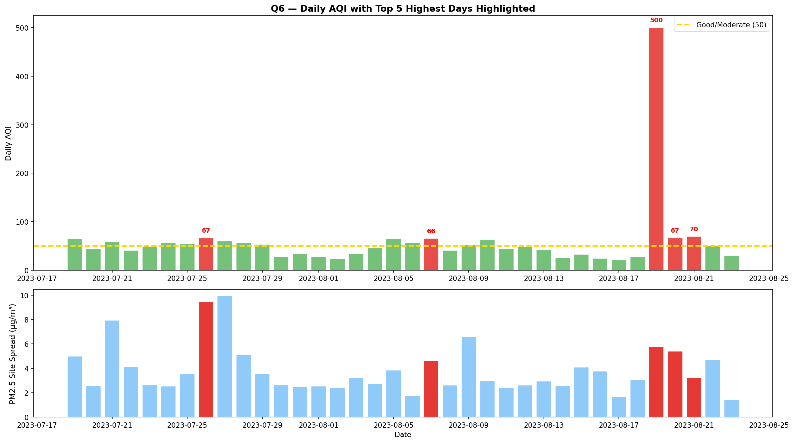
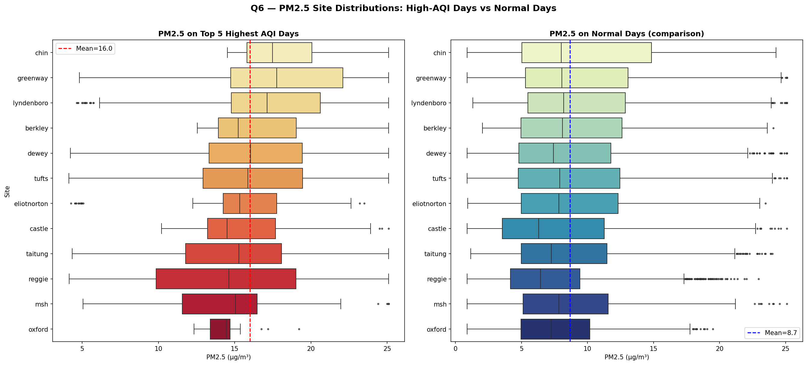
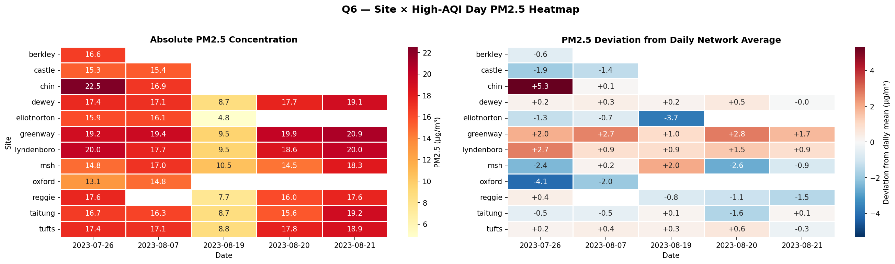
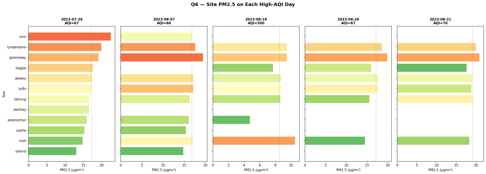
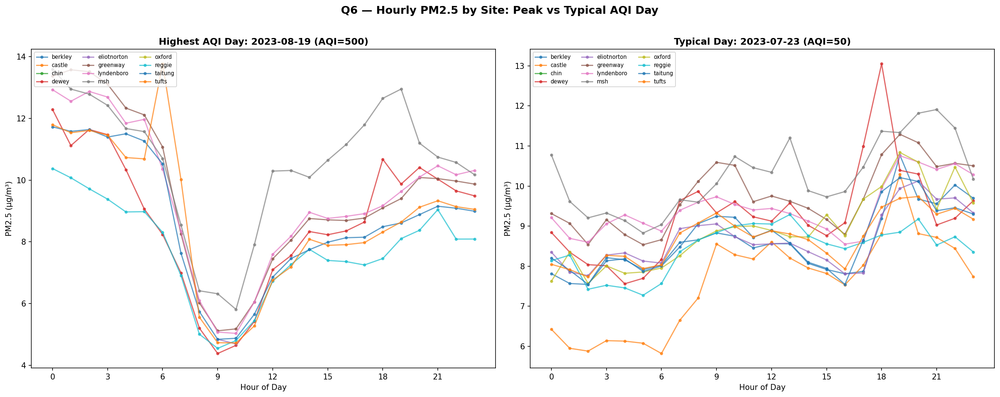
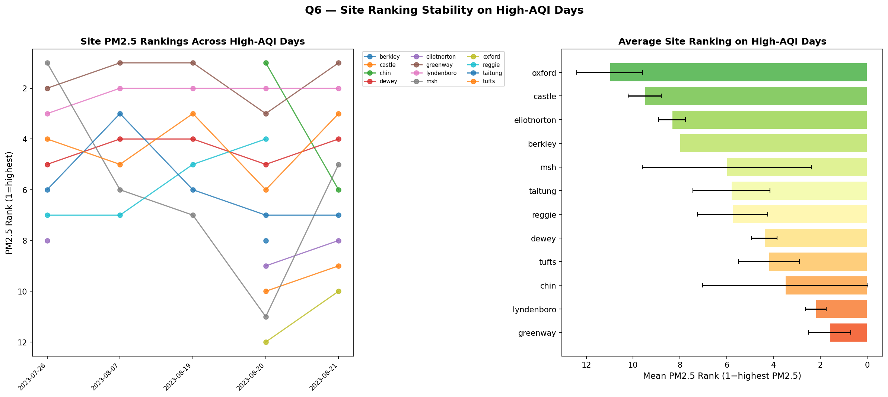
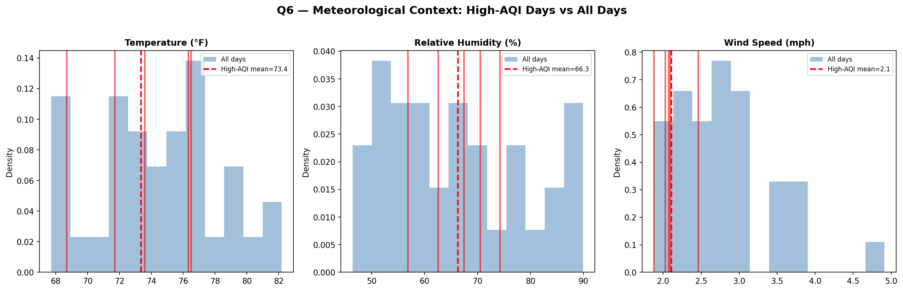
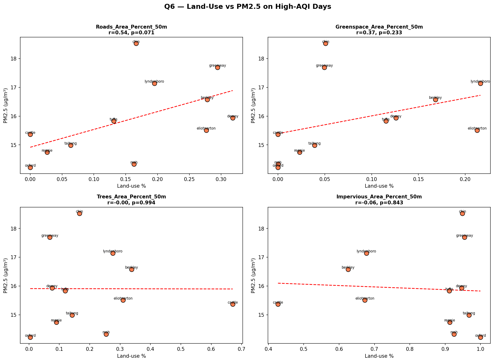

# Q6 — Highest AQI Days: PM2.5 Variation Across Sites

**Research Question**: Pick the highest AQI (Air Quality Index) days for summer of 2023 and visualize potential differences in PM2.5 across sites

**Chinatown HEROS** | Study period: July 19 – August 23, 2023 | 12 sites | 10-min intervals

---

## Dashboard & Layout Recommendations *(for Design Team)*

> **Visual Hierarchy**:
> 1. **KPI Banner**: Peak AQI, Spatial PM2.5 Range, Most Affected Site, Hotspot Consistency
> 2. **Interactive Map** (40%): Chinatown map with proportional PM2.5 circles for selected high-AQI day
> 3. **Heatmap Matrix** (30%): Sites × high-AQI days colored by PM2.5 deviation from mean
> 4. **Supporting Charts** (30%): Box plots, ranking stability, meteorological context
>
> **Interactive Features**: Day selector slider, AQI threshold filter, site toggle, hover details
>
> **Educational Framing**: *"On Chinatown's worst air days, some parks breathe 2× more pollution than others — and it's the same parks every time."*

---

## Key Performance Indicators

| Metric | Value |
|--------|-------|
| Peak Daily AQI | **500** (Hazardous — Aug 19, likely Canadian wildfire smoke) |
| High-AQI Days Analyzed (top 5) | **5 days** |
| PM2.5 Spatial Range (high days) | **4.3 µg/m³** |
| PM2.5 Spatial Range (all days) | **2.8 µg/m³** |
| **Disparity Amplification Factor** | **1.5×** |
| Most Affected Site | **Chin Park** (18.5 µg/m³) |
| Cleanest Site | **Oxford** (14.2 µg/m³) |
| PM2.5 Elevation on High Days | **+83%** vs normal days |
| Site Ranking Consistency (SD) | **1.5** (good consistency) |

### Top 5 Highest AQI Days

| Date | Day | AQI | Dominant |
|------|-----|-----|----------|
| 2023-08-19 | Saturday | 500.0 | PM2.5 |
| 2023-08-21 | Monday | 69.9 | PM2.5 |
| 2023-08-20 | Sunday | 66.8 | PM2.5 |
| 2023-07-26 | Wednesday | 66.7 | PM2.5 |
| 2023-08-07 | Monday | 65.6 | PM2.5 |

### Site PM2.5 on High-AQI Days

| Site | High-AQI Mean (µg/m³) | Normal Mean (µg/m³) | Elevation |
|------|----------------------|--------------------|----|
| Chin Park | 18.5 | 9.7 | +92% |
| Greenway | 17.7 | 9.6 | +84% |
| Lyndenboro | 17.1 | 9.5 | +80% |
| Berkley | 16.6 | 9.2 | +80% |
| Dewey | 15.9 | 8.7 | +83% |
| Tufts | 15.8 | 8.9 | +77% |
| Eliot Norton | 15.5 | 8.9 | +75% |
| Castle | 15.4 | 7.7 | +100% |
| Taitung | 15.0 | 8.6 | +75% |
| Reggie | 14.7 | 7.3 | +102% |
| MSH | 14.3 | 8.5 | +68% |
| Oxford | 14.2 | 7.8 | +83% |

---

## Figures

### 1. Daily AQI with High Days Highlighted

The top panel shows daily AQI across the study period with the 5 highest days in red. August 19 stands out dramatically (AQI 500) — almost certainly driven by Canadian wildfire smoke reaching Boston. The bottom panel shows the PM2.5 site-to-site spread on each day.

### 2. PM2.5 Box Plots: High-AQI Days vs Normal Days

Side-by-side comparison reveals that on high-AQI days, PM2.5 means shift from ~8.7 µg/m³ to ~16.0 µg/m³ (83% elevation). Chin Park and Greenway consistently show the highest concentrations.

### 3. Site × High-AQI Day Heatmap

Left panel: absolute PM2.5 concentrations. Right panel: deviations from daily network average. Chin Park shows the strongest positive deviations (+5.3 on Jul 26), while Oxford and MSH trend below average.

### 4. Per-Day Site PM2.5 Comparison

Horizontal bar charts for each high-AQI day show site rankings. Chin Park leads on most days, with Greenway and Lyndenboro consistently in the top tier. August 19 (AQI 500) shows lower absolute PM2.5 than other high days due to data limitations.

### 5. Hourly PM2.5: Peak vs Typical AQI Day

Diurnal patterns on the highest AQI day (Aug 19, AQI 500) vs a typical day (Jul 23, AQI 50). On the peak day, site spread narrows during midday but widens in evening hours. The typical day shows more uniform inter-site variation.

### 6. Site Ranking Stability

Left: PM2.5 rankings across high-AQI days (1 = highest PM2.5). Greenway (rank 1.6 ± 0.9) and Lyndenboro (rank 2.2 ± 0.4) are the most consistently polluted. Oxford (rank 11.0 ± 1.4) is consistently the cleanest.

### 7. Meteorological Context

High-AQI days had slightly lower temperatures (73.4 vs 74.4°F), similar humidity (66.3 vs 65.9%), and notably lower wind speeds (2.1 vs 2.8 mph — Δ=−0.7 mph). **Wind stagnation appears to be a key driver of elevated PM2.5.**

### 8. Land-Use vs PM2.5 on High-AQI Days

Roads proximity shows the strongest association (r=0.54, p=0.071). Tree cover and impervious surface show no meaningful correlation. Greenspace shows a weak positive trend (r=0.37), possibly confounded by site proximity to emission sources.

---

## Key Findings

1. **One extreme outlier day**: August 19, 2023 hit AQI 500 (Hazardous), almost certainly from Canadian wildfire smoke. The other 4 high-AQI days were in the Moderate range (65–70).

2. **PM2.5 doubles on worst days**: Mean site PM2.5 jumps from 8.7 µg/m³ (normal) to 16.0 µg/m³ (high-AQI days) — an **83% elevation** across all sites.

3. **Spatial disparities amplify**: The inter-site PM2.5 range widens by **1.5×** on high-AQI days (4.3 vs 2.8 µg/m³), meaning pollution inequity grows when air quality deteriorates.

4. **Consistent hotspots**: Greenway (rank 1.6) and Lyndenboro (rank 2.2) are the most consistently polluted sites on high-AQI days. Oxford consistently has the lowest PM2.5.

5. **Wind stagnation matters**: High-AQI days had 25% lower wind speeds (2.1 vs 2.8 mph), suggesting trapped pollution builds up unevenly across the neighborhood.

6. **Roads association**: Road proximity (50m buffer) shows the strongest land-use correlation with elevated PM2.5 on high-AQI days (r=0.54, p=0.071).

7. **Environmental justice implication**: The same sites bear disproportionate pollution burden every time air quality worsens — this is a structural equity issue, not random variation.

---

## Methodology Notes

- **AQI Calculation**: EPA breakpoints applied to PM2.5 (24-hr), ozone (8-hr), CO (8-hr), SO₂ (1-hr), NO₂ (1-hr). Overall AQI = max of all sub-AQIs.
- **High-AQI Day Selection**: Top 5 days by overall AQI. All 5 were PM2.5-dominated.
- **PM2.5 Source**: PurpleAir corrected sensor (`pa_mean_pm2_5_atm_b_corr_2`).
- **Ranking Stability**: Spearman rank correlation and rank SD across high-AQI days.
